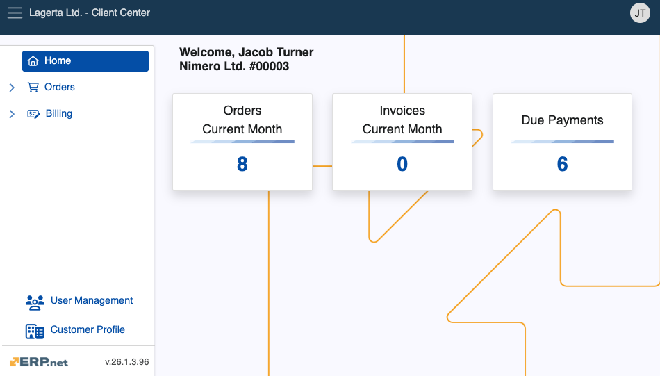
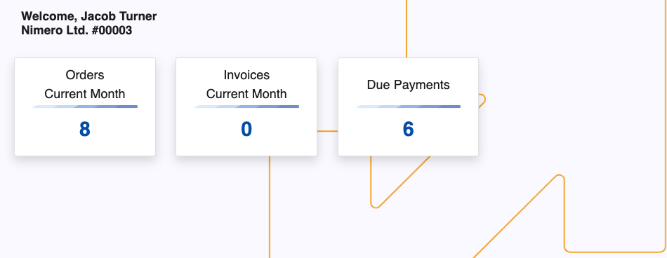
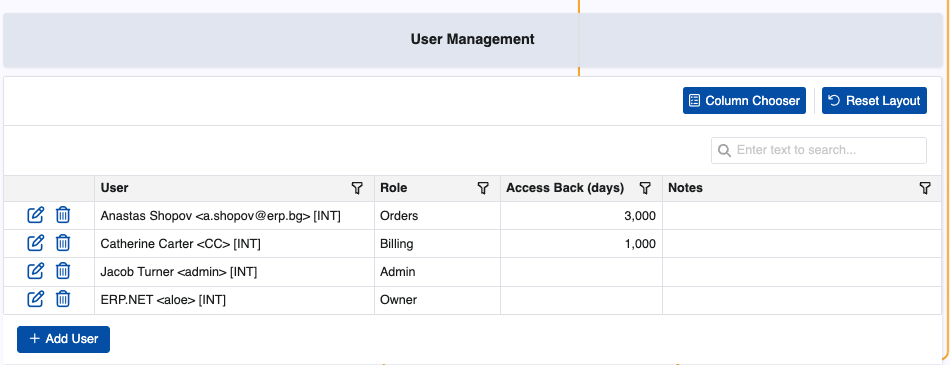
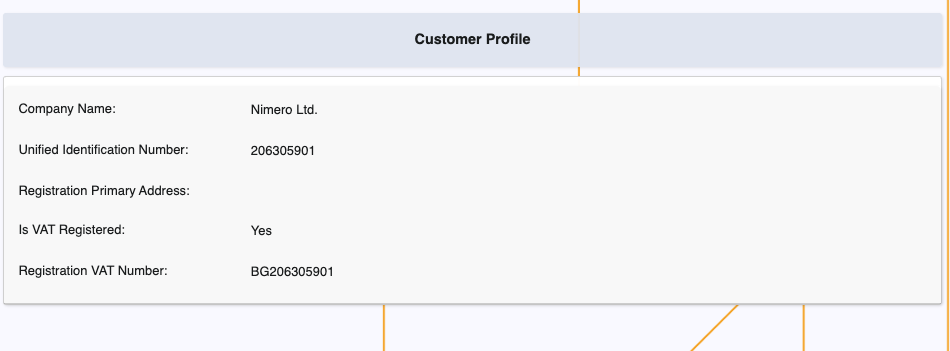

# Client Center

The Client Center allows Erp.Net clients to assist their customers by allowing them to see and create sales orders, review due payments, as well as access and download invoices. It’s best used to provide faster support and increased speed of new orders. 

You can **[build and host](how-to/define-a-new-cc.md)** a CC instance from your global website environment, and access it using a custom relative url.

## Structure

The Client Center has a hierarchical menu structure consisting of several **sections** and **pages**. Each works with accurate and simplified data to implement a seamless platform experience, allowing customers to look at documents important to them **on-demand**.

### Home

This is the default landing page of the Client Center, offering quick access to all **orders**, **invoices**, and **due payments**.

It also keeps a real-time metric of how many orders and invoices were produced for the current month.

> [!Warning]
> 
> As of v.26, the Chat integration is **no longer available**.

### Orders

This section is responsible for storing existing orders and facilitating the creation of new ones. 

It is comprised of two pages:

* **Orders**
* **New Order**

> [!NOTE]
> 
> The New Order page is **disabled** by default for security reasons.  
> For more information on how to enable it, please refer to our **[step-by-step guides](how-to/index.md)** and the **[Settings and error reference](reference.md)**

### Billing

This section keeps a log of billing-related documents and allows for their close inspection.

It is comprised of three pages:

* **Invoices**
* **DuePayments**
* **Payment History**

### User Management

This page is for managing the customer's existing users by determining the level of access they have to the Client Center.

It further allows the removal of existing users and addition of new ones.

### Customer Profile

This page is where customers can see more information about their registered company, including UIN and VAT number.

> [!NOTE]
>
> Depending on your business' size and reach, you can create and manage **multiple** Client Centers.     This could be useful for departments dealing with unique sets of tasks and issues, as their customized version of the Client Center will remain completely tailored to the users they’re serving.

## Role-based access 

Individual access to Client Center sections is determined strictly based on the **[external access role](../sales/customers/external-access.md)** a user is assigned:

1. **L10 - Basic** - Allows basic rights. All sections and pages are hidden except for **Home** and **Customer Information**.
2. **L20 - Orders** - Grants access to the **Orders** page where sales orders are stored. Excludes price data.
3. **L30 - Orders with Prices** - Provides access to the **Orders** page where sales orders are stored. Includes all of their details.
4. **L40 - Billing** - Gives access to billing-related pages like **Invoices**, **DuePayments** and **Payment History**.
5. **L80 - Admin** - Ensures full access to all customer data, including the **User Management** page.
6. **L90 - Owner** - The same as Admin. However, once assigned, Owner access **cannot** be revoked by anyone, including Admins.

## Features

Users can perform a couple of actions from within the Client Center:

- Customize a page's layout by adding additional columns or hiding existing ones through the **Column Chooser**.

- **Cancel** already issued sales orders before they're finalized.

- **Download** invoices to preview them outside of the Client Center.

> [!NOTE]
> 
> The screenshots taken for this article are from v.26 of the platform.
