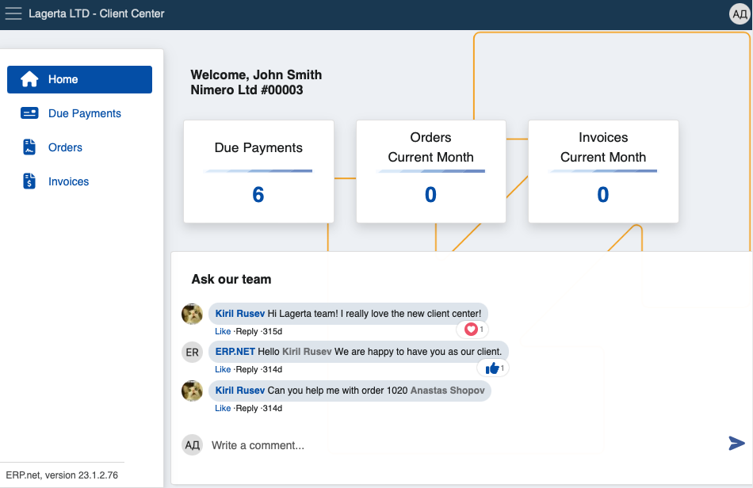

# Client Center

The Client Center allows Erp.Net clients to assist their own clients by allowing them to chat with Customer Support, review due payments, access and download invoices, and create sales orders. It’s best used to provide faster support and increase speed of new orders.

Currently, Client Center platforms are more suitable for businesses rather than individual users. 

You can build and host a CC instance from your global website environment, and access it using a custom relative url.

## Features and structure

Within the Client Center, users with appropriate permissions can see and interact with four different **panels**. 

**Home** offers a direct communication channel, while **Due Payments**, **Orders** and **Invoices** act as shortcuts to pages containing personal and company documents.

Using the chat within **Home**, clients can reach out to a representative regarding any issue or question they're having.

Depending on your business' size and reach, you can create and manage **multiple** Client Centers. 

This could be useful for departments dealing with unique sets of tasks and issues, as their customized version of the Client Center will remain completely tailored to the users they’re serving.

### Pages

Each Client Center page works with accurate and simplified data to implement a pleasant and up-to-date platform experience. 

Whether they use the shortcuts or the expandable menu on the left side of the screen, clients are able to look at all of their due payments, sales orders and invoices **on-demand**.

### Creating sales orders

The Client Center gives users the ability to **[create new sales orders](how-to/create-new-order.md)** with just the click of a button.

This feature is **disabled** by default for security reasons. Access should be granted only when it's necessary.

For more information on how to set up Client Center settings, please refer to **[this guide](how-to/apply-platform-settings.md)** and the **[reference](reference.md)**

### Actions

Users are able to perform a couple of **actions** from within the Client Center to enhance their experience.

- **Additional columns** can be added to provide more information for **due payments**, **past orders** and **invoices**.

- In the **Orders** page, already issued sales orders from the Client Center can be **cancelled** before they're finalized.

- Generated invoices for any orders can be **downloaded** and **previewed** outside of the platform.
