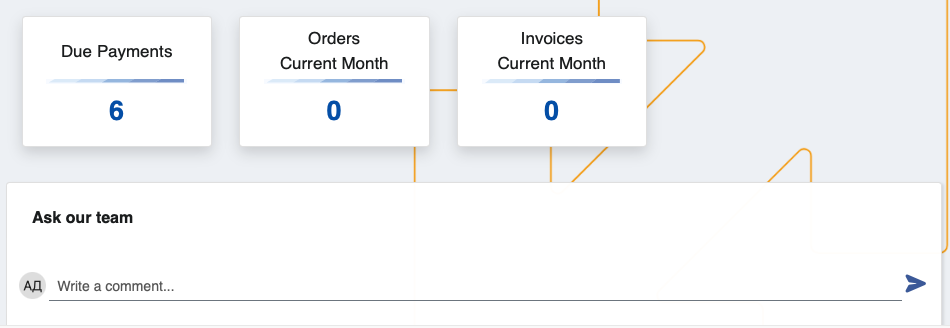

# Client Center

The Client Center is a space which allows Erp.Net clients to assist their own enterprise clients by allowing them to chat with Customer Support, review due payments, access and download invoices, and create sales orders. It’s best used to increase the collaboration and exchange of valuable information between employees, suppliers and customers.

Currently, Client Center usage is more suitable for businesses rather than individual users. 

You can build and host your own CC instance from the main website environment, and access it using a custom relative url.

Within the Client Center, users with appropriate permissions can see and interact with four different **panels**. 

One of them offers a direct **communication network**, while the rest act as **shortcuts** to pages containing personal documents.

## Pages

Each page works with accurate and simplified data to implement a pleasant and up-to-date platform experience. 

Clients are able to look at all of their due payments, sales orders and invoices **on-demand**.

### Features

- Depending on its size and reach, you can create and manage multiple Client Centers. 

This could be useful for departments dealing with unique sets of tasks and issues, as their customized version of the Client Center will remain completely tailored to the users they’re serving.   

- **Additional columns** can be added to provide more information for due payments, past orders and invoices.

- In the **Orders** page, already issued sales orders can be **cancelled** by a customer before they're finalized.

- In the **Invoices** page, generated invoices for completed orders can be **downloaded** and **previewed** outside of the platform.

### Create sales orders

The Client Center provides users with the ability to start adding a new sales order just with the click of a button.

However, this feature is **disabled** by default for security reasons. It's recommended that access be granted only to trusted and trained individuals.

For more information on how to set up Client Center settings, please refer to [Platform settings](https://docs.erp.net/tech/modules/crm/clientcenter/platform-settings.html).

