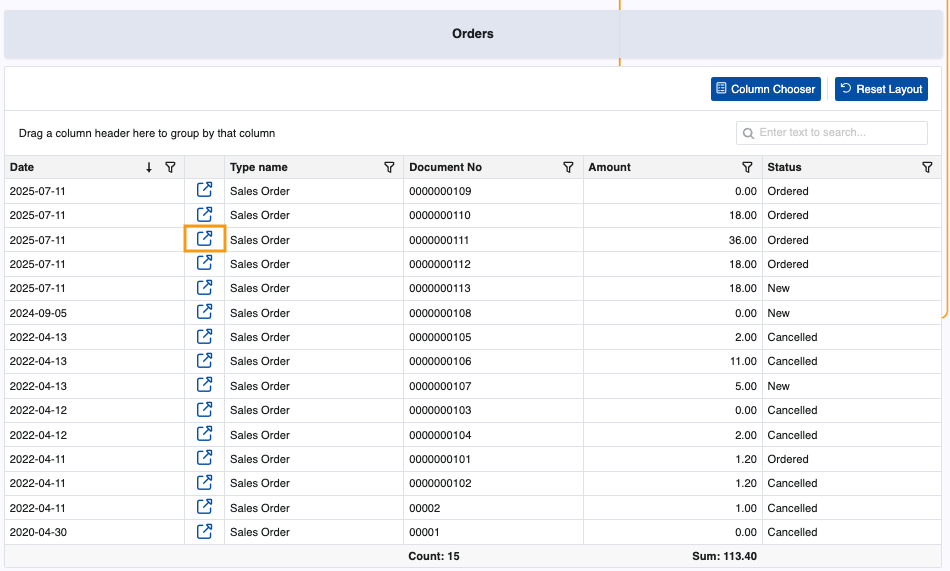
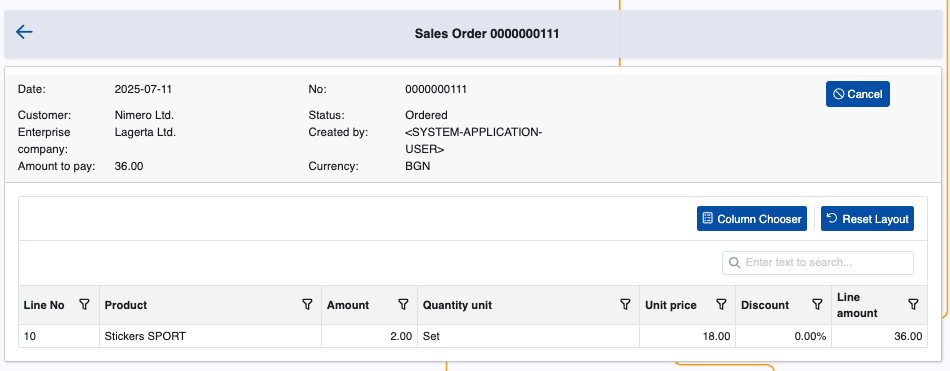

# Orders

The Orders page is home to all sales orders linked to a customer.

It is visible to all Client Center users accessing this customers's data with an **[external role](/modules/crm/sales/customers/external-access.md)** **L20 - Orders** and above.

### Details

You can find the following information about each sales order in the table:

- **Date** - Date of submission (or registration) of the document.
- **Type name** - Type of the document, Sales Order by default.
- **Document No** - The document number.
- **Amount** - The amount of the sales order. 
- **Status** - Current state of the order (e.g. New, Ordered, Cancelled).

> [!Important]
>
> Pricing data like Amount is visible ONLY to users with an external role **L30 - Orders with Prices** and above.

> [!NOTE]
>
> Orders that are started but not placed are automatically saved and registered with status **New**.

### Expanded view

If you click the **blue arrow button** on the leftmost portion of a row, you can reveal more details about a sales order.

This includes customer and enterprise company data, as well as individual document lines breakdown.

Here, it is also possible to **cancel** the submitted order before it is released.

> [!NOTE]
> 
> The screenshots taken for this article are from v.26 of the platform.
