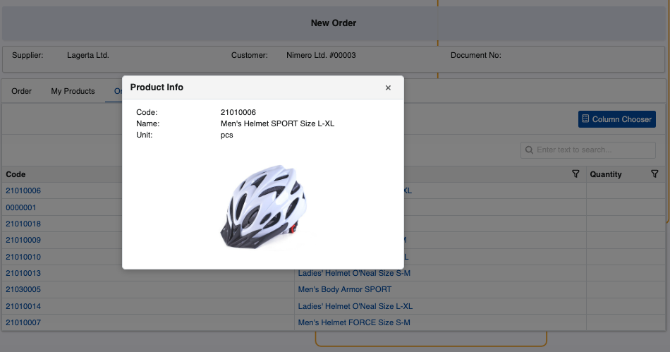

# New Order

Order creation through the Client Center is disabled by default. You need to **enable** the respective **[global JSON settings first](../reference.md#isneworderenabled-setting)**.

Once that's done, users with **[external role](https://docs.erp.net/tech/modules/crm/sales/customers/external-access.html#roles)** **L20 - Orders** and above will get access to the **New Order** page.

This is a multi-tab interface designed to handle the filling out and placement of new sales orders.

## Structure

New Order consists of one primary tab, but it can be configured to include more:

1. **Order** - This is where the order is built. You can add products manually by entering their **code** and **quantity**.

   Product quantities specified in other tabs will automatically appear here.

   
   
2. **My Products** - All available **[customer products](https://docs.erp.net/tech/modules/crm/sales/definitions/define-customers.html#customer-products)** are stored here. This tab can be hidden or enabled with an appropriate **[JSON setting](../reference.md#hidecustomerproducts-setting)**.
  
   You can add customer products to the order simply by specifying their quantities in the **Quantity** field. Once a quantity is set, the respective product will appear in the **Order** tab.

   
   
3. A tab listing products linked to the **customer's default distribution channel** - It can be optionally revealed with a **[JSON setting](../reference.md#hidedistributionchannel-setting)** and always carries the name of that channel.

   You can specify product quantities in the **Quantity** field to add them to the order. Once a quantity is set, the respective product will appear in the **Order** tab.

   

4. A tab listing products linked to the **Client Center's distribution channel** - It can be optionally enabled with a **[JSON setting](../reference.md#sitechannel-setting)** and always carries the name of that channel.

   Like in all other tabs, you can specify product quantities in the **Quantity** field to add them to the order.

   

> [!TIP]
>
> You can see details about a product if you click on either its **code** or **name**.    
> This will trigger a pop-up containing more information, including a product picture, if available.
   
   

## Create a new order

To begin, add products to the order. There are several ways to do this:
   
    1. From the **Order** tab, click the **Add** button. This will reveal the **Code** and **Qty** fields, where you can respectively provide the code of the product and how many instances of it you need ordered.

   
   
   When you click **Save**, the product will be added with all the respective information about it, like **Unit**, **Price**, and **Discount**.

   

   2. From the **My Products** tab, click on the **Quantity** field of a **[customer product](https://docs.erp.net/tech/modules/crm/sales/definitions/define-customers.html#customer-products)** row and specify the exact quantity you need ordered. 

   This will automatically add it in the **Order** tab with the respective information.

   

   3. Depending on how the Client Center is configured, users may add products linked to their customer's **[default distribution channel](https://docs.erp.net/tech/modules/crm/sales/definitions/define-customers.html#new-customer-details)**.

      The process to add them is identical to the **My Products** tab.

   

   4. If the Client Center's **distribution channel** has products linked to it, they will be available for selection as well.

   

#### Default store and product availability 

All sales orders in the Client Center can have a **store** automatically set for them after they are created. Administrators can define it with the respective **[JSON setting](https://docs.erp.net/tech/modules/crm/clientcenter/reference.html?q=defaultstore#defaultstore-setting)**. If not defined, the **Store** field will remain empty.

Provided a store is specified and a **[maximum availability threshold](https://docs.erp.net/tech/modules/crm/clientcenter/reference.html?q=defaultstore#availabilitymax-setting)** is in place, you will be able to see the **availability** of all products you wish to include in the order.

The **Availability** column can be optionally revealed through the **[Column Chooser](https://docs.erp.net/tech/modules/crm/clientcenter/grid-control.html#column-chooser)**, and it can have one of the following values:

- If the specified quantity of the product is less than or equal to the available quantity, a **green** **"Yes"** **label** will be shown (e.g. 12pcs are requested, but there are 15 in total)
  
- If the specified quantity of the product is more than what is available, the **actual available quantity** will be shown in **red** (e.g. 2pcs are requested, but only 1 is present in reality)
  
- If the specified quantity of the product is more than what is possible to be revealed in the **Availability** column (as per the **[AvailabilityMax setting](https://docs.erp.net/tech/modules/crm/clientcenter/reference.html?q=defaultstore#availabilitymax-setting)**), a **"Call" message** will be shown, indicating the need to contact a sales representative to confirm if the requested quantity is actually available.

  This is necessary regardless of whether the real availabilty is smaller or larger than the one requested.

#### Modify or delete quantities

When you're done adding the quantities of the desired products, you can always **edit** or **delete** some of them if needed.

Alternatively, you may remove all of them with the **Delete All** button.

#### Finish order

To conclude the order, click **Place Order**. You'll be asked to confirm if all details have been reviewed.

Newly created orders are stored on the **[Orders](index.md)** page.

> [!NOTE]
> 
> You can start an order and switch to a different page or choose to place it later.    
> The latest active user session is retained and the order is **automatically saved** and registered with status **"New"**.
   
