# New Order

Order creation through the Client Center is disabled by default. You need to enable the respective global JSON settings first.

Once that's done, users with **[external role](/modules/crm/sales/customers/external-access.md#roles)** **L20 - Orders** and above will get access to the **New Order** page.

This is a multi-tab interface designed to handle the filling out and placement of new sales orders.

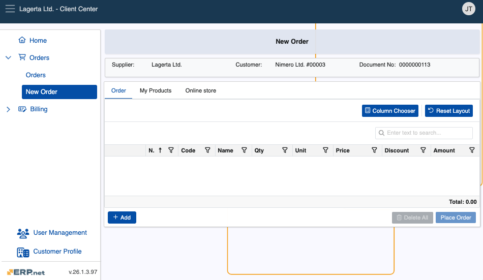

### Structure

New Order consists of two primary tabs, but it can be configured to include more:

1. **Order** - This is where the order is built. You can add products manually by entering their **code** and **quantity**.

   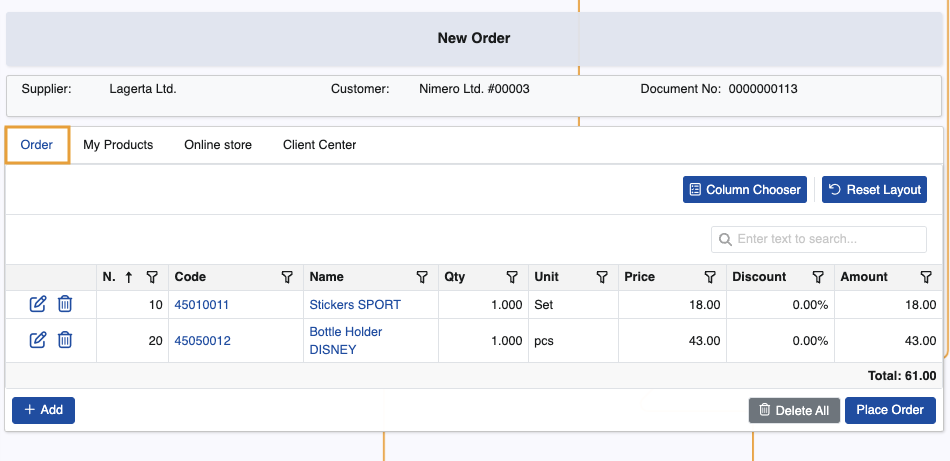
   
2. **My Products** - All **[customer products](/modules/crm/sales/definitions/define-customers.md#customer-products)** will appear here. You can add them to the order simply by specifying their quantities.
  
   They will automatically appear in the **Order** tab.

   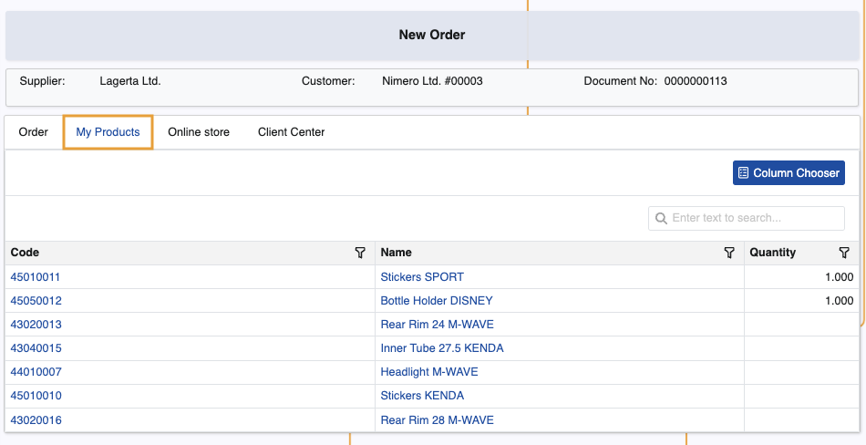
   
3. If the **[JSON setting for hiding the customer's default distribution channel](../reference.md#hidedistributionchannel-setting)** is disabled and that channel has linked products, an extra tab named after the channel will appear. It will display the related products, which you can add to the order.

   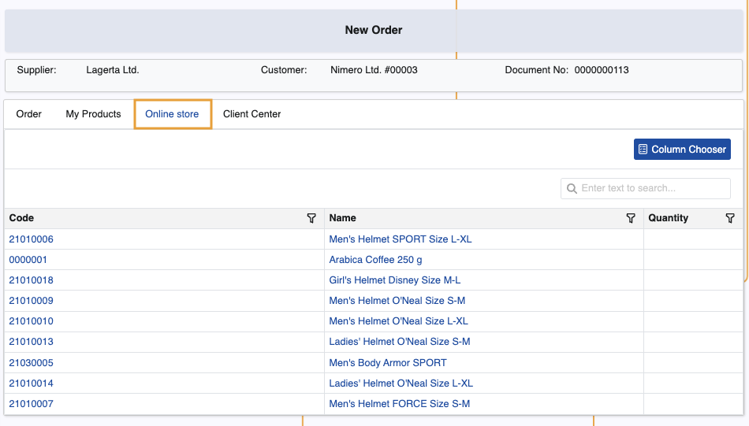

4. If the **[JSON setting for specifying a custom channel for the Client Center](../reference.md#sitechannel-setting)** is configured and that channel has linked products, an extra tab named after that channel will appear. It will display the related products, which you can add to the order.

   In the event where a custom JSON configuration is not set, the system automatically links the sales order to a **[distribution channel](/modules/crm/marketing/distribution-channels/index.md)** with **code "CC"** and **name "Client Center"**. If such channel does not exist, it will be created after the order is placed.

   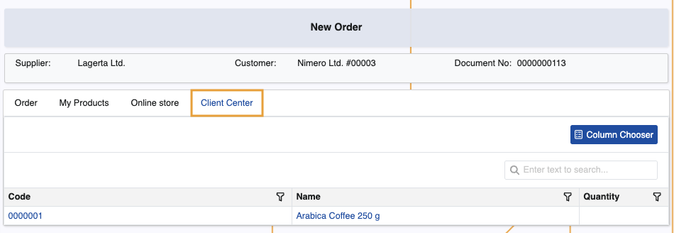

## Create a new order

1. To begin, add products to the order. There are several ways to do this:
   
    1.1.   From the **Order** tab, click the **Add** button. This will reveal the **Code** and **Qty** fields, where you can respectively provide the code of the product and how many instances of it you need ordered.

   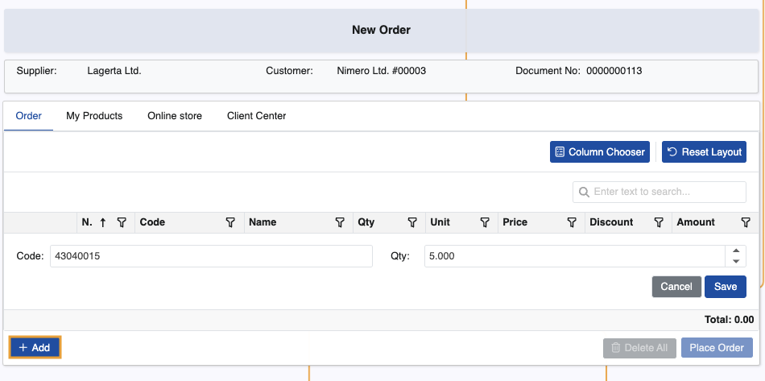
   
   When you click **Save**, the product will be added with all the respective information about it, like **Unit**, **Price**, and **Discount**.

   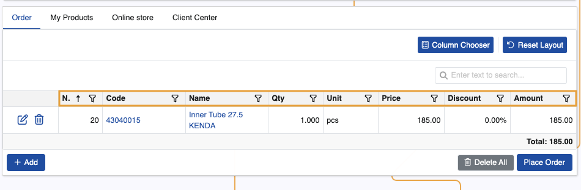

   1.2.   From the **My Products** tab, click on the **Quantity** field of a pre-agreed **[customer product](/modules/crm/sales/definitions/define-customers.md#customer-products)** row and specify the exact quantity you need ordered. 

   This will automatically add it in the **Order** tab with the respective information.

   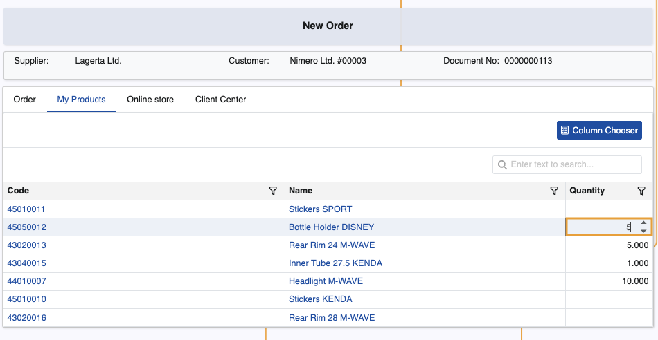

   1.3.   Depending on how the Client Center is configured, users may add products linked to their customer's **[default distribution channel](/modules/crm/sales/definitions/define-customers.md#new-customer-details)**.

      The process to add them is identical to the **My Products** tab.

   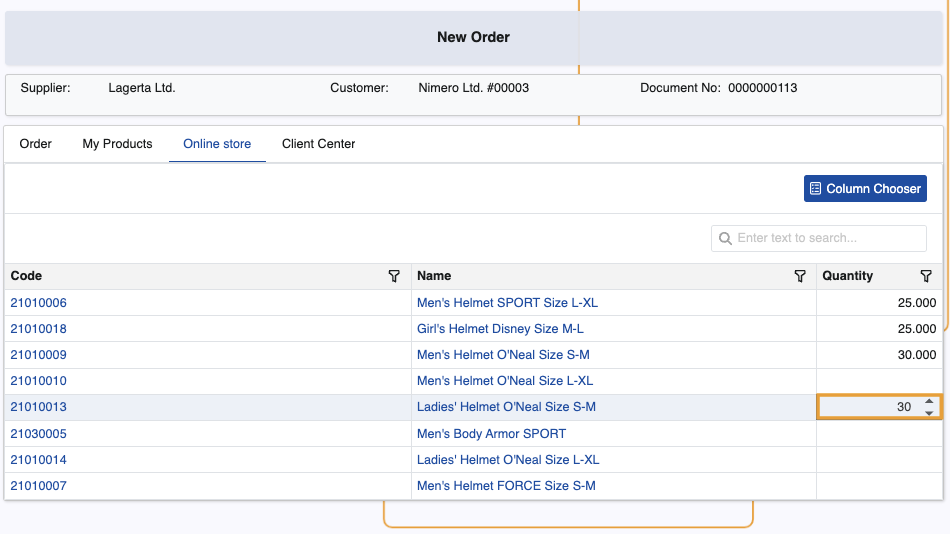

   1.4.  If the Client Center's **distribution channel** has products linked to it, they will be available for selection as well.

   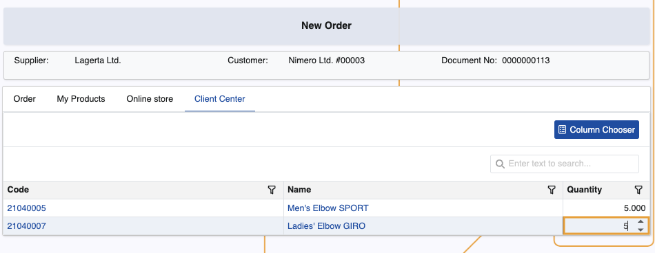

2. When you're done adding the quantities of the desired products, you can always **edit** or **delete** some of them if needed.

   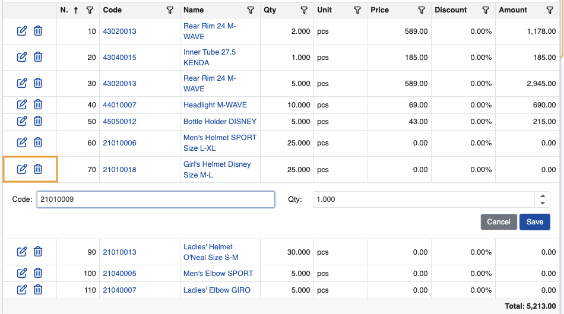

3. To finish the order, click **Place Order**. You'll be asked to confirm if all order details have been reviewed.

   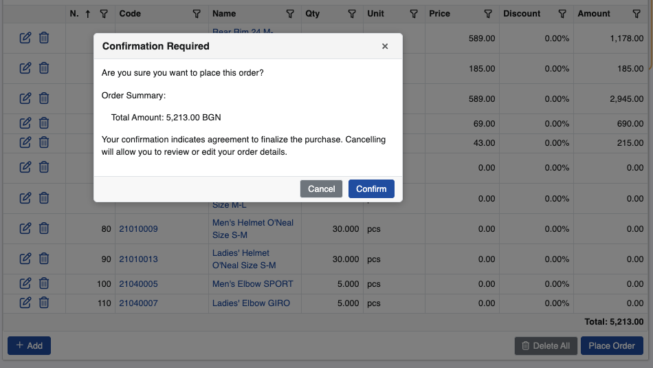

   Newly created orders are stored in the **[Orders](index.md)** page.

> [!NOTE]
> 
> You can start an order and switch to a different page or choose to place it later.    
> The latest active user session is retaind and the order is automatically saved and registered with status **"New"**.
   
