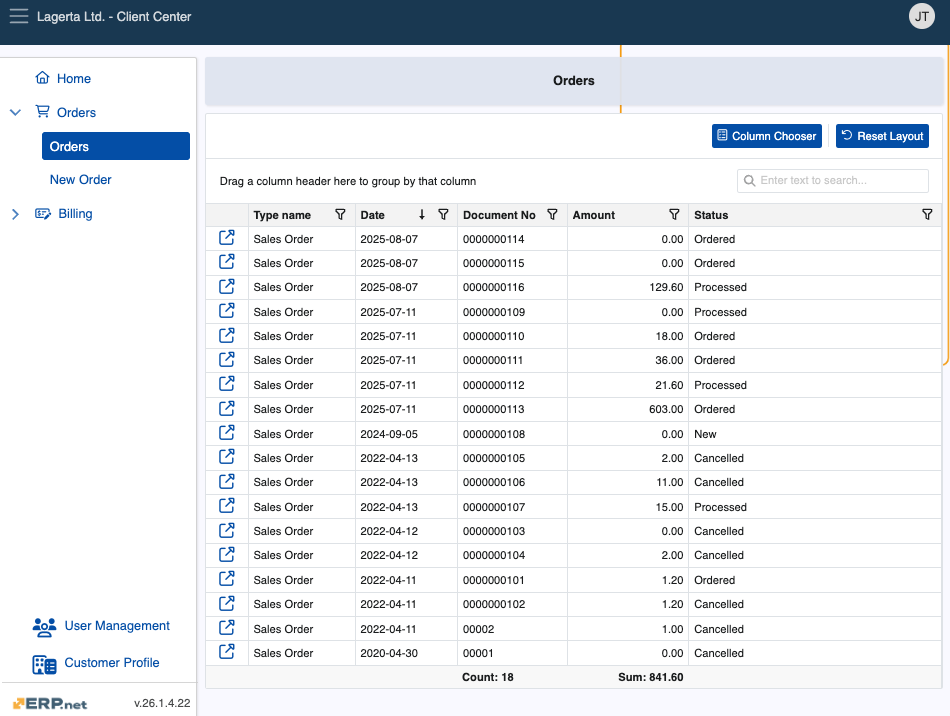
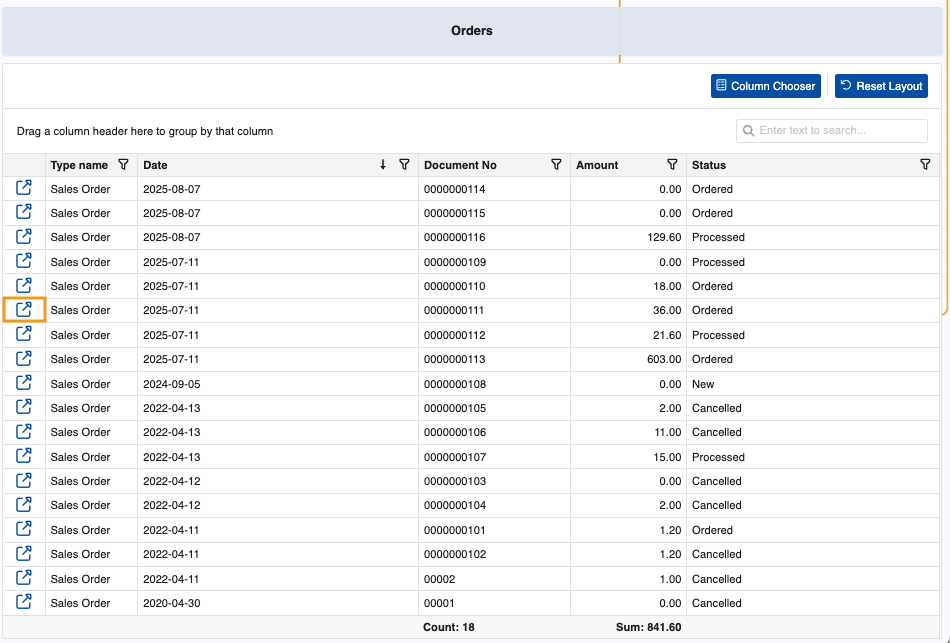
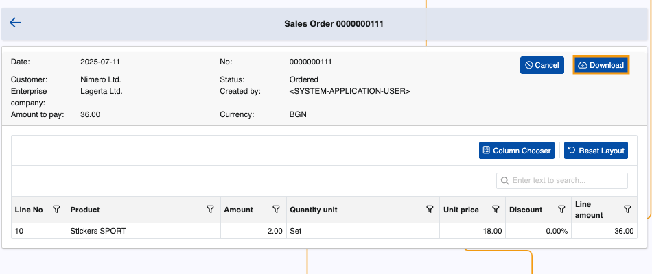
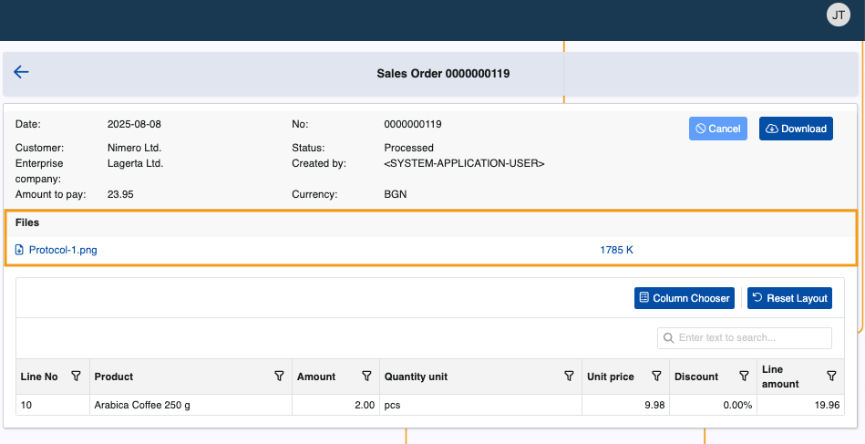
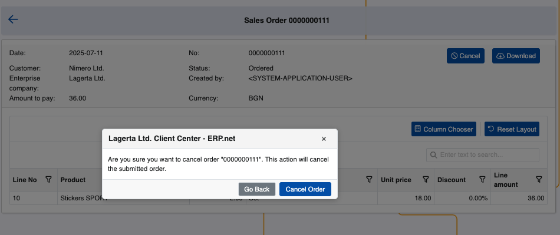

# Orders

The Orders page is home to all orders linked to a customer.

It is visible to all Client Center users accessing this customers's data with an **[external role](https://docs.erp.net/tech/modules/crm/sales/customers/external-access.html#roles)** **L20 - Orders** and above.

### Details

You can find the following information about each order in the table:

- **Date** - Date of submission (or registration) of the document.
- **Type name** - Type of the document, e.g. Sales Order.
- **Document No** - The document number.
- **Amount** - The amount of the order. 
- **Status** - Current state of the order (e.g. New, Ordered, Cancelled).

> [!Important]
>
> Pricing data like **Amount** is visible ONLY to users with an external role **L30 - Orders with Prices** and above.

> [!NOTE]
>
> Orders that are started but not placed are automatically saved and registered with status **New**.

### Document types

By default, the Orders page displays all order documents of all document types.

Administrators can optionally configure it to display only orders of a certain type. 

If set, the **[OrderDocumentTypes JSON setting](https://docs.erp.net/tech/modules/crm/clientcenter/reference.html#orderdocumenttypes-setting)** determines which order document type or types can be shown.

## Order document 

If you click the **blue arrow button** on the leftmost portion of a row, you can open an order document.

Inside, you can find customer and enterprise company data, as well as individual lines breakdown.

### Actions

1. It is possible to **download** an order as a PDF file.

    
   
2. If present, files attached to an order will be displayed in a dedicated section, along with their name, extension and size.

    **Clicking once** on a file's name will trigger its download.

   File attachments whose **[Access Permission](https://docs.erp.net/webclient/introduction/how-to/access-permission-field.html)** field is not set to **"Internal users + external users"** will not appear in the **Files** section.

    If none of the order’s attachments have this setting configured, the **Files** section will not appear at all.

    

3. You can also **cancel** a submitted order before it is released. This will trigger a notification for confirmation.

    

> [!NOTE]
> 
> The screenshots taken for this article are from v.26 of the platform.
