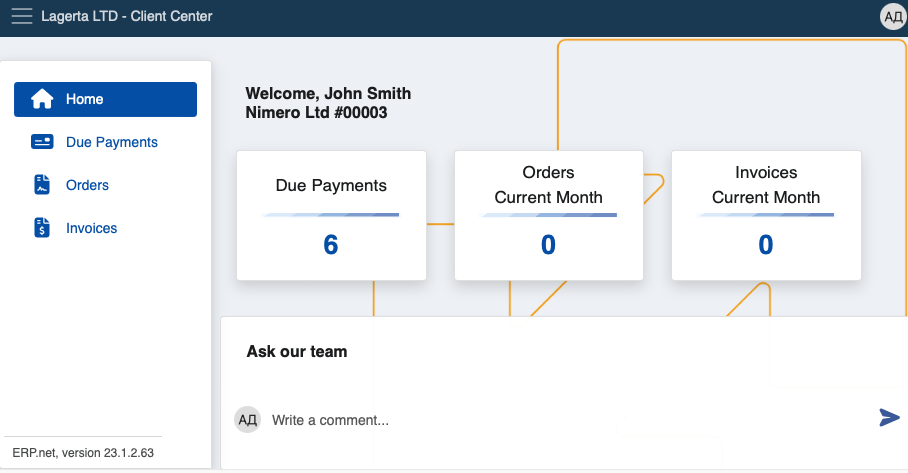
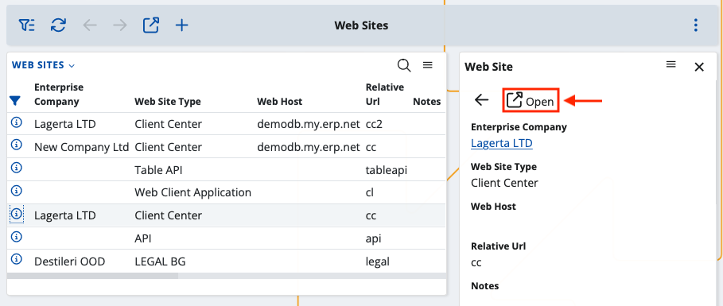
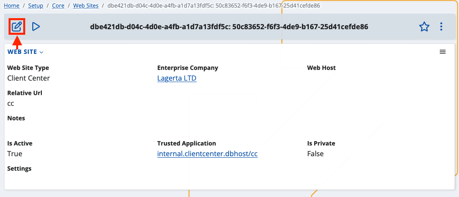

# Platform features

Like all ERP websites, the Client Center can have its settings changed on an individual level. 

This includes precise visual and functional configurations. 

## Configurable settings

Below is a list of settings you can modify to your liking in the Client Center:

- The ability to reveal or hide the **New Order** button, allowing or restricting users to create new orders and decide their access to the order creation module in general.

By default, this button is **hidden** for users so as to prevent potential problems and risks. 



You need to enable the functionality **manually** only when that’s necessary.

- The ability to define the user type of the sales order document in accordance with different users’ needs. 

In the case of sale orders, you must input a **valid** **SalesOrder.DocumentType ID**. 

This could be useful for separating orders made in the Client Center from those made in other places on the platform.
 
- The ability to easily generate **comprehensive business analytics** for orders made only in the Client Center.

## JSON Format Definition

Client Center settings must be configured in a **key-value pair JSON format**. 

1.	From your main model environment, expand the website's details with the circular **info button**.

This will expand a side tab on the right with information just for the particular website (Client Center).

From there, click the **Open** button.



2.	You'll be taken to a separate window displaying the website's settings.

Click the **Edit** button at the top-left corner.



This will make all fields related to the website (such as Type, Enterprise Company and Web Host) **editable**.

Make sure the **Settings** field is visible. If you don’t see it, toggle the respective slider from the **Show/hide fields** button.

3.	Inside the **Settings** field, you need to input the following:

{<br>
    		"NewOrderDocumentType": "DocumentType.Id",<br>
    		"IsNewOrderEnabled": true/false, <br>
}

where _NewOrderDocumentType_ takes the valid ID value of a new (sales) order 

and _IsNewOrderEnabled_ defines if the button for order creation will be shown or hidden to the users when they log into the system (**true** meaning visible, **false** meaning restricted).


4.	**Apply** the new settings.

### Use-cases

Depending on how you define the fields, you can encounter the following scenarios:

1.	Both fields are set:

```
    	"NewOrderDocumentType": "07c7ef2f-abc1-47d9-9d40-bc1e0acd1e7c",
   	"IsNewOrderEnabled": true
```

This results in the menu button allowing for the creation of a new order to be shown, and the document type to be set as a sales order.

If the ID doesn’t match any document of type Sales order, you’ll get an error:

**008 - Not well formatted json string**

To fix it, you need to erase all inputted values, save your progress, refresh the website, and insert the correct values.

2.	Only one of the fields is set:

```
   	  "IsNewOrderEnabled": true
```

Here, the system will generate another error:

**009 – NewOrderDocumentType is set, but DocumentType is null**

3.	No fields are set:

In this scenario, both fields assume two values by default:

```
    	"NewOrderDocumentType": "CRM_SALES_ORDER.Id",
        "IsNewOrderEnabled": false
```

The button used for creating a new order will not be shown. If you try to use a link leading to the direct creation of an order, you’ll see the following message:

**You are not authorized to view this page.**

## Automatic tracking

Whenever you apply or change settings for a website such as the Client Center, they’re **tracked** by the system in real-time and will be reflected immediately.

## User-level security

Requests from the Client Center and other websites are made by types of users known as **System-Application-User**. 
  
They have enough rights to ensure their ability to apply or change settings only in accordance with the normal functioning of the current website. Possible confusion with user access to other places in the platform is essentially eliminated.

By default, the System-Application-User has System rights, but reflects used licenses as well. It’s assumed whenever a new website is created and whenever a trusted application is added through the UI.

## Error visualization

When you encounter a problem in the platform, a relevant, easy-to-read and interactive **error message** will be shown explaining its nature. 
