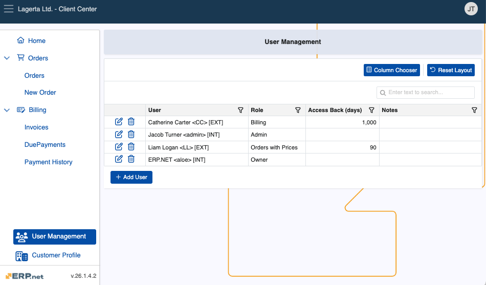
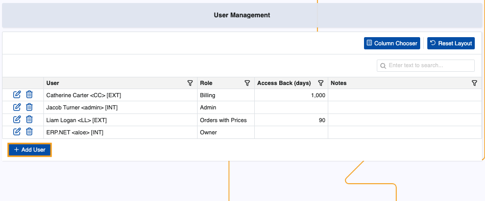
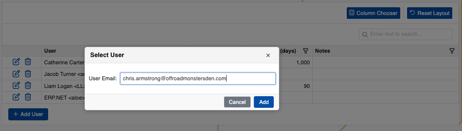
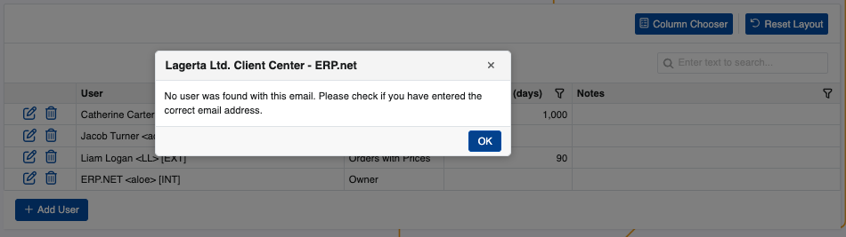
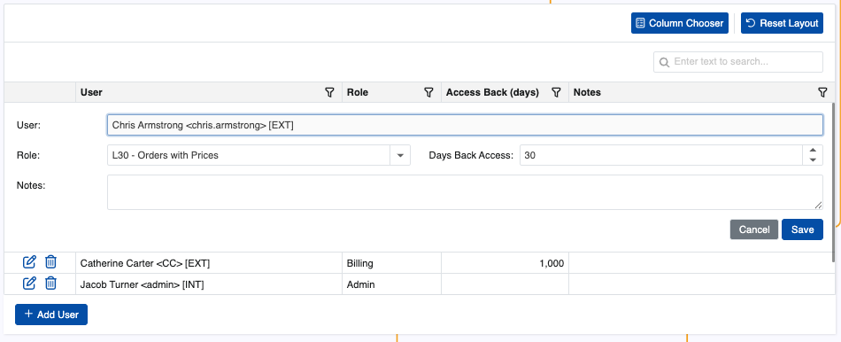
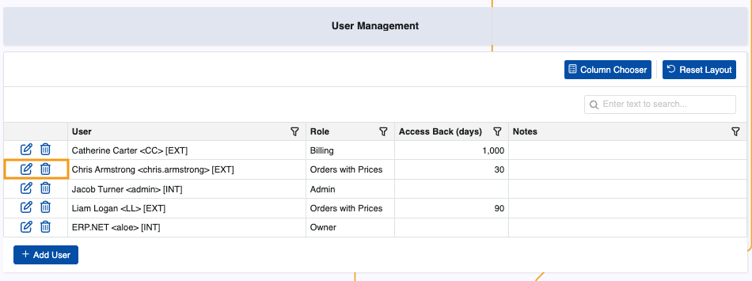
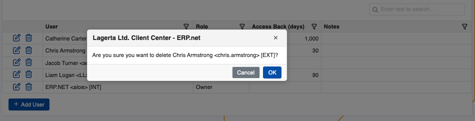

# User Management 

The User Management page is an administrative hub for a customers' users in the **Client Center**. It is an alternative to the **[standard way of setting up external customer access](/modules/crm/sales/customers/external-access.md)** and allows customers' individual users to see exactly what they need once they log into the platform.

The page is visible to all Client Center users with an **[external role](/modules/crm/sales/customers/external-access.md#roles)** **L80 - Admin** and above.

### Details

You can find the following information about each user in the table:

* **User** -  Name of the user in the format {Name} <{Login}> [{UserType:DB}] as defined in **[Systems.Security.Users](https://docs.erp.net/model/entities/Systems.Security.Users.html)**.
* **Role** - External access role of the user.
  
    - **L10 - Basic** - Allows basic rights, with mostly limited access.
    - **L20 - Orders** - Grants access to sales orders, excluding lines and price data.
    - **L30 - Orders with Prices** - Provides access to sales orders and all of their details.
    - **L40 - Billing** - Gives access to billing-related documents, such as due payments, invoices and payment history.
    - **L80 - Admin** - Ensures full access to all customer data.
    - **L90 - Owner** - The same as Admin. Once assigned, Owner access cannot be revoked by anyone, including Admins.
      
* **Access Back (days)** - The maximum number of past days the user is allowed to view data to which their role grants them access.
* **Notes** - Optional notes for the user.

## Add user

Admins and Owners can add any user from within their organization into the Client Center.

1. To begin, click **Add User**.
   
   
   
2. This will trigger a window where you need to provide the user's registered email address.

   

   If no email record is found, you will get an **error**.

   

3. Proceed to fill out necessary **Days Back Access** and **Role** fields. 

   When done, click **Save**.

   

   The new user will be added to the table.

### Actions

You can change any of the details of an existing user with the help of the **Edit button**.

Alternatively, you may **remove** a user's access to the Client Center with the **Delete button**.

This action will only revoke the external access, not delete the actual user.

