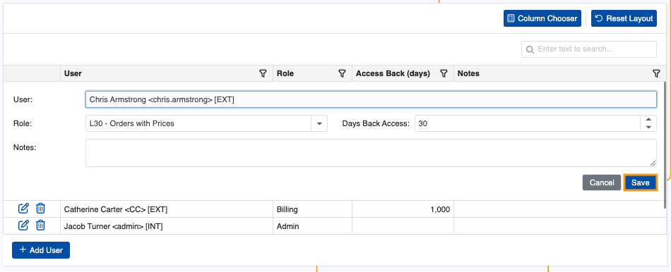

# User Management 

The User Management page is an administrative hub for a customer's users in the **Client Center**. It also allows registered users to be **added** into the Client Center with a specific access role, and existing ones to be **modified** or **removed** from it entirely.

The page is only visible to Client Center users with **[external access role](https://docs.erp.net/tech/modules/crm/sales/customers/external-access.html#roles)** **L80 - Admin** and above.

> [!NOTE]
> User-to-customer relationships are sourced from the **[@@ name External Access table](https://docs.erp.net/tech/modules/crm/sales/customers/external-access.html)**.

### Details

You can find the following information about each user in the table:

* **User** -  Name of the user in the format {Name} <{Login}> [{UserType:DB}] as defined in **[Systems.Security.Users](https://docs.erp.net/model/entities/Systems.Security.Users.html)**.
* **Role** - **[External access role](../index.md#role-based-access)** of the user. Each superior role includes the rights granted by roles with fewer permissions.
* **Access Back (days)** - The maximum number of past days the user is allowed to view data to which their role grants them access.
* **Notes** - Optional notes for the user.

## Add user

Admins and Owners can add any **already registered** user from within their customer's organization into the Client Center.

To learn how a new user account is registered and defined for a Client Center, read the **[following guide](https://docs.erp.net/tech/modules/crm/clientcenter/how-to/setup-a-new-user-account-v26.html)**.

1. Click the **Add User** buttom.
   
   
   
2. This will trigger a window where you need to provide the user's exact **email address**.

   

   If no email record is found, you will get an **error**.

   

3. Proceed to fill out necessary **Days Back Access** and **Role** fields. The name will be filled out automatically.

   When done, click **Save**.

   

   The new user will be added for the respective customer.

> [!TIP]
> 
> To expand a user's access to **more** customers within the same Client Center, you must have Admin access to **at least two** customer environments. Then, you only need to switch to the customer profile of your choice and follow the same steps as described above.  
> This will essentially enable a **[multi-customer login](https://docs.erp.net/tech/modules/crm/clientcenter/index.html#multi-customer-login)** for the user's account.

### Actions

You can change any of the details of an existing user with the help of the **Edit button**.

This includes their external access role days back access setting.

Alternatively, you may **remove** a user's access to the Client Center with the **trash bin**.

Note that this action will only revoke the user's external access to the Client Center, not delete the actual user.

> [!NOTE]
> 
> The screenshots taken for this article are from v26 of the platform.
