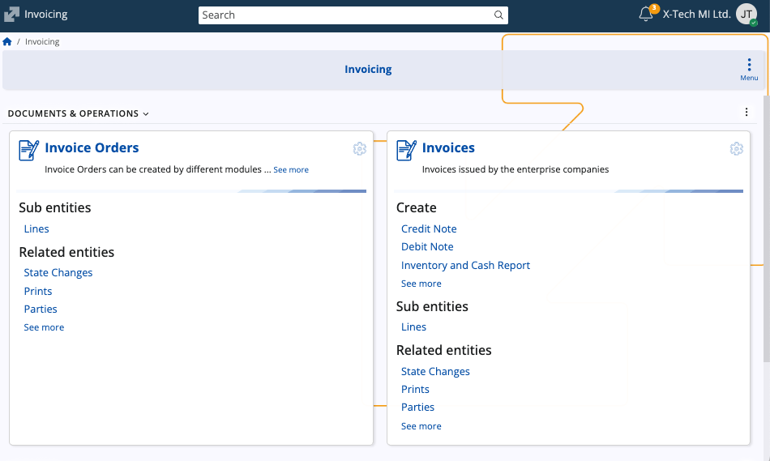
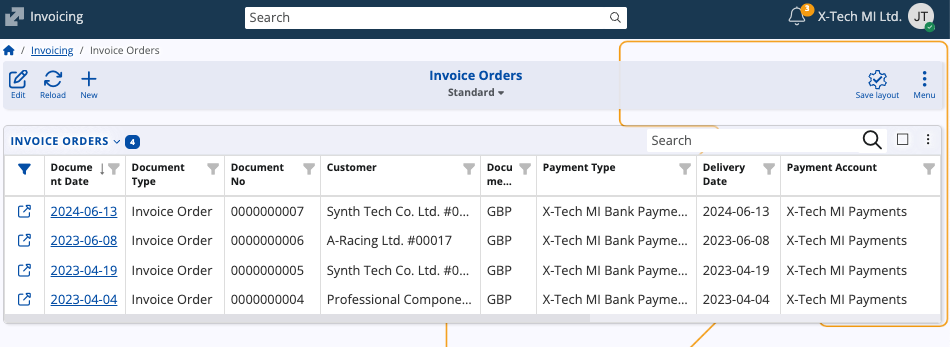
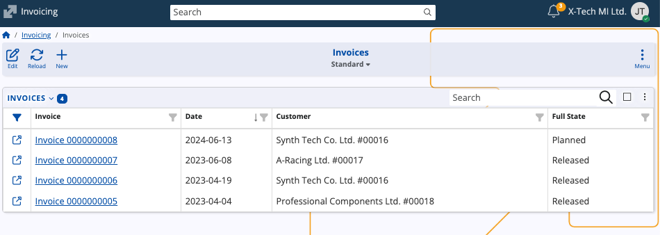
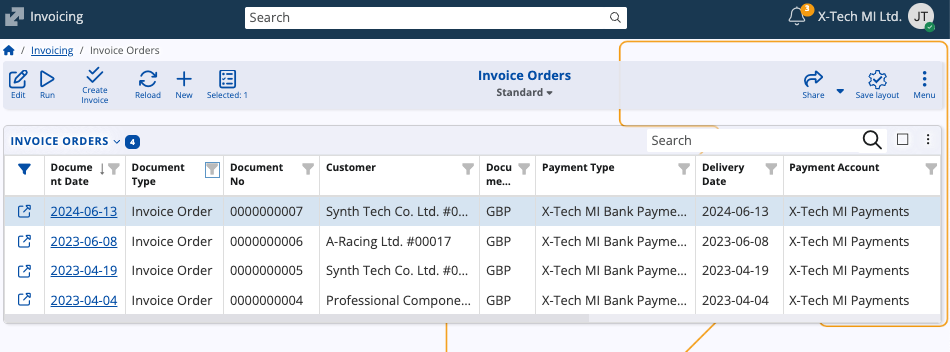

# Invoicing

The **Invoicing** submodule manages the billing process by transforming preliminary invoice orders into finalized invoices. It forms a key part of the order-to-cash flow, connecting all sorts of documents such as offers, sales orders, and shipment orders with their respective issued invoices.

Invoicing provides the tools for creating, reviewing, and managing invoice documents and their related entities such as lines, parties, and state changes. It also ensures traceability between the original sales transactions and the resulting invoices.

## Structure

The page consists of three main sections: **Invoice orders**, **Invoices**, and **Invoicing** (under the Functions area).

### Invoice orders

Contains preliminary billing documents generated from other modules, such as Sales. These documents define the lines, quantities, and prices that will later be invoiced. You can view and manage invoice orders before converting them into invoices. 

### Invoices

Lists the finalized billing documents. These represent official customer invoices created from one or more invoice orders. You can review document details, lines, and related entities, as well as track the document’s state and history.

### Invoicing (function)

The Invoicing function allows you to create one or multiple invoices from selected invoice orders. It completes the billing workflow by generating finalized invoices and linking them to their source invoice orders, ensuring that each order document is properly accounted for in the invoicing process.

> [!NOTE]
> 
> The screenshots taken for this article are from v.26 of the platform.
