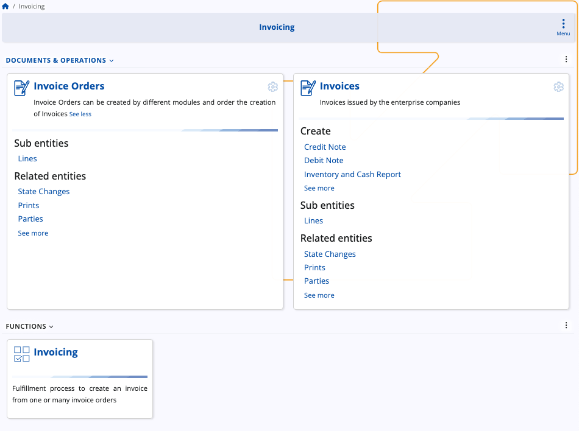

# Invoicing

The **Invoicing** module manages the billing process by transforming preliminary invoice orders into finalized invoices. It forms a key part of the order-to-cash flow, connecting sales orders with issued invoices.

The module provides tools for creating, reviewing, and managing invoice documents and their related entities such as lines, parties, and state changes. Through its integrated process, it ensures traceability between the original sales transactions and the resulting invoices.

## Structure

The Invoicing module interface consists of three main sections: **Invoice orders**, **Invoices**, and **Invoicing** (under the Functions area).

### Invoice orders

The Invoice orders section contains preliminary billing documents generated from other modules, such as Sales. These documents define the items, quantities, and prices that will later be invoiced. Users can view and manage invoice orders before converting them into invoices. Each invoice order may include line details and related entities such as state changes, prints, and parties.

### Invoices

The Invoices section lists the finalized billing documents issued by the enterprise. These represent official customer invoices created from one or more invoice orders. Users can review document details, lines, and related entities, as well as track the document’s state and history.

### Invoicing (function)

The Invoicing function allows users to create one or multiple invoices from selected invoice orders. This function completes the billing workflow by generating finalized invoices and linking them to their source invoice orders. It ensures that each order item is properly accounted for in the invoicing process.

> [!NOTE]
> 
> The screenshots taken for this article are from v.26 of the platform.
