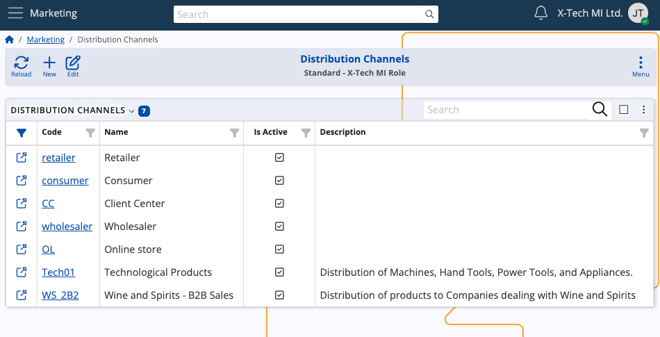
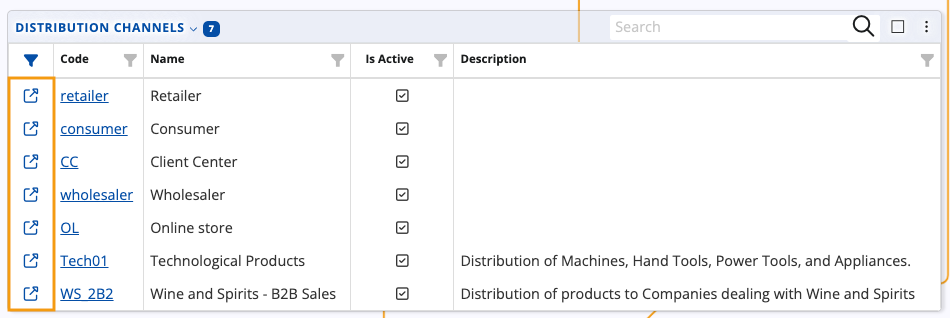
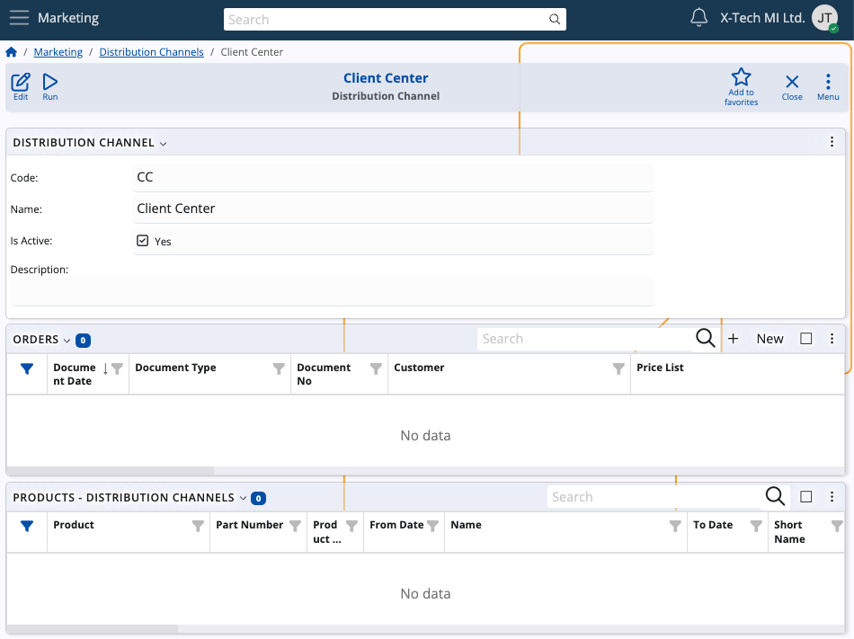
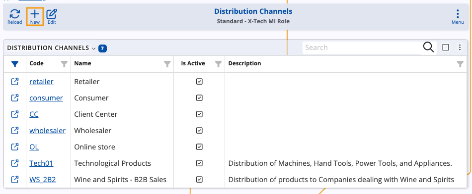
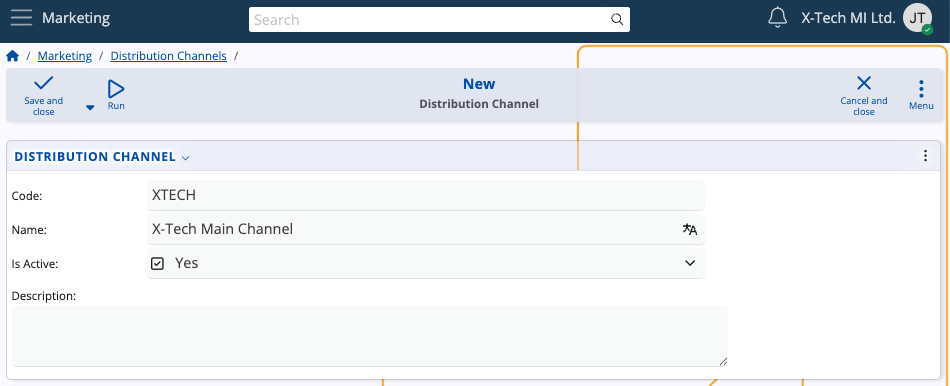
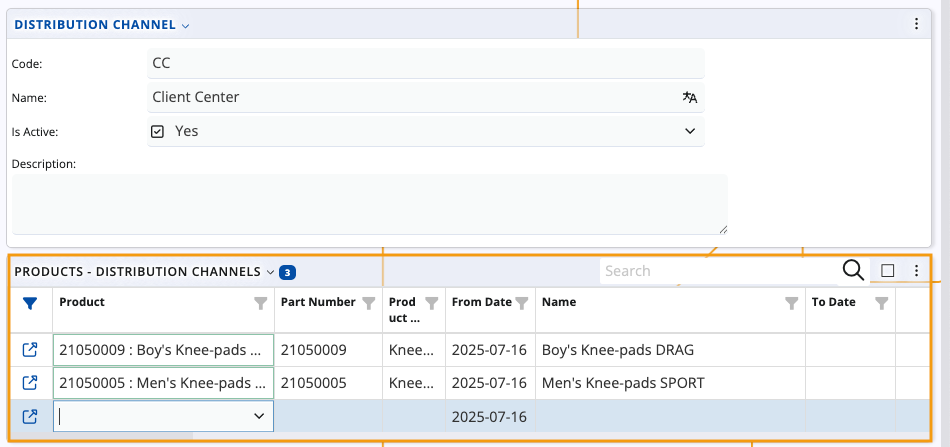

# Distribution channels

A distribution channel can be defined as a distinct pathway through which goods or services are delivered. In ERP.net, it represents a configurable entity through which a company (or customer) offers and sells its products or services. 

### Details

The **Distribution Channels** table provides a structured overview of all defined distribution channels within your organization. For every channel record, you can see its unique **Code** and descriptive **Name** that indicates its business purpose (e.g. Retailer, Client Center). The **Is Active** column shows whether the channel is currently enabled for operational use. 

If you click on the **name** of a channel or the **blue arrow button** on the left of its row, you can expand it to see more details.

This includes any **orders** and **products** tied to it.

## Create a new distribution channel

You can easily create a new channel on-demand. 

1. To begin, click the **New** button.

  

2. Enter a short, unique **Code** identifier for the channel (e.g., OL, CC). 

3. Fill in the **Name** field with a user-friendly label for the channel.

4. Use the **Is Active** checkbox to indicate whether the distribution channel should be immediately available for use.

5. Add an optional **Description** to provide additional context.

  

### Link products

Once you fill in the main details, you can associate specific **products** with the new channel. 

This step ensures that products are available for sale through that channel, optionally marked with a **From Date** and **To Date** indicating when the product is listed and de-listed.

> [!Tip]
>
> The ERP.net **[Client Center](/modules/crm/clientcenter/index.md)** makes use of distribution channels. In the website definition, there is a **Default Distribution Channel** with code "CC" and name "Client Center", ensuring that products have a pathway through which they can be delivered.    
> If products are associated with this channel, they can be added directly into a sales order while it is being created in the **Client Center**.    
> ERP.net **[customers](/modules/crm/sales/customers/index.md)** also work with distribution channels. A customer entity can have a preferred **Default Distribution Channel** they can use for listing products.    
> If products are associated with this channel, they can be added directly into a sales order in the **Client Center**. 

  
