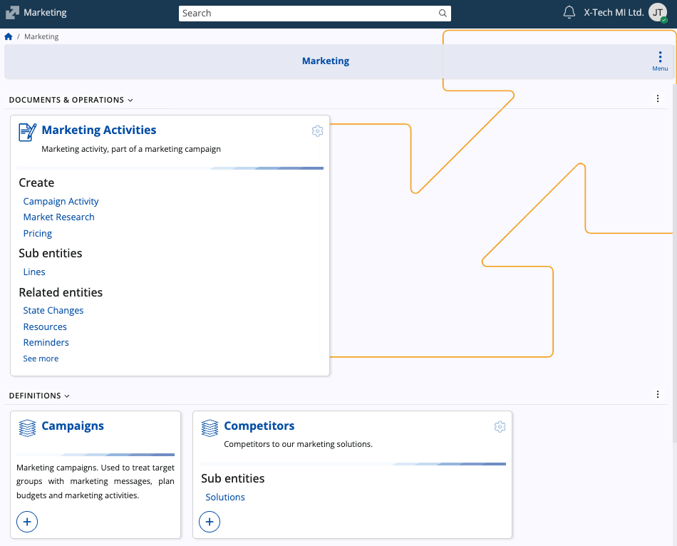

# Marketing

The **Marketing** submodule manages the promotional side of the customer lifecycle, dedicated to the planning, execution, and analysis of all marketing initiatives. It is centered around defining **target groups**, organizing **activities**, tracking **competitors**, and linking efforts directly to the generation of **leads** and **opportunities**.

## Structure 

### Documents & Operations

This section outlines the core transactional document used to plan and execute all **marketing activities**.

Here are three different types of marketing activities you can create:

| Document Type | Purpose |
| :--- | :--- |
| **Campaign Activity** | Used to plan and record specific marketing actions such as promotions, events, or demonstrations. It allows linking the activity to a campaign, target group, and responsible party, as well as entering product-related details and competitor comparisons. |
| **Market Research** | Used to document market observations and competitive data collected through research. It enables recording findings such as product availability, in-store pricing, and competitor information for analysis. |
| **Pricing** | Used to define and track pricing-related marketing initiatives, including pricing adjustments, reviews, or communications about pricing strategy within campaigns. |

### Definitions

This section provides the core master data used to define marketing segments, classifications, and external actors.

| Definition                   | Description                                                                                             |
| :--------------------------- | :------------------------------------------------------------------------------------------------------ |
| **Target Groups**            | Segments of customers or prospects that campaigns and activities are aimed at.                          |
| **Competitors**              | Records of competing organizations used for comparison, analysis, and intelligence.                     |
| **Marketing Activity Types** | Classification codes defining the nature of the activity (for example, *Promotion*, *Event*, *Survey*). |
| **Distribution Channels**    | The methods or intermediaries used to deliver products or services to end customers.                    |

### Setup

This section contains system-level configuration elements that control how marketing information is classified and managed.

| Setup                    | Description                                                                                               |
| :----------------------- | :-------------------------------------------------------------------------------------------------------- |
| **Industries**           | Standard classification list of economic sectors used for segmenting markets.                             |
| **Company Size Classes** | Market segmentation based on thresholds such as employee count or revenue.                                |
| **Marketing Solutions**  | Predefined bundles of products or services associated with particular industries or company size classes. |

## Learn more

For details on specific entities, refer to the following documentation:

* **[Bonus Programs](https://docs.erp.net/tech/modules/crm/marketing/bonus-programs/index.html)**

> [!NOTE]
>
> The screenshots taken for this article are from v.26 of the platform.
