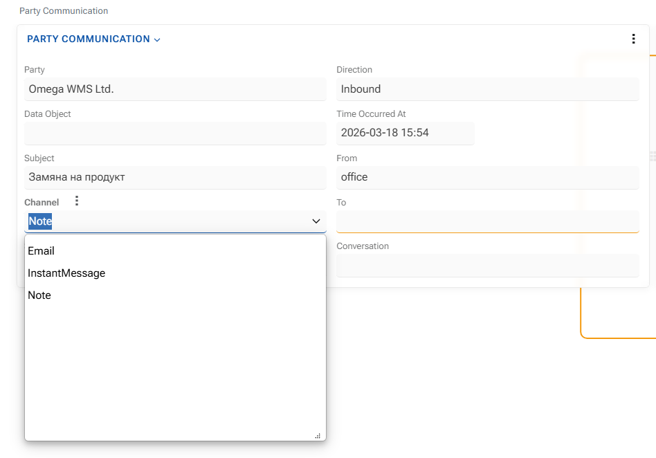

## Configuration 

 

Party Communications does not rely on a large standalone configuration surface. Its behavior is mainly determined by the related access model and by the integrations that create or synchronize communication records. 

Before using Party Communications, make sure that: 

 

- the related party exists in the system 

- the business object that provides the communication context exists 

- users have access rights to the related records 
 

### Source channel classification 

 

Communication records are classified by `Channel` and may be further specified by `SubChannel`. 

 

The main supported channel values are: 

 

- `Email` 

- `InstantMessage` 

- `Note`

- `SubChannel` can identify the specific origin of the communication, for example: 

 

- Outlook 

- Viber 

- WhatsApp 

 

This structure allows new integrations to be added without changing the main communication model. 

 

### Business context linking 

 

Each communication record must be linked to a `Party` and to a `DataObject`. 

 

This is not only a data requirement, but also a key part of the configuration and integration model. Without both links, communication cannot be reliably interpreted in context.
