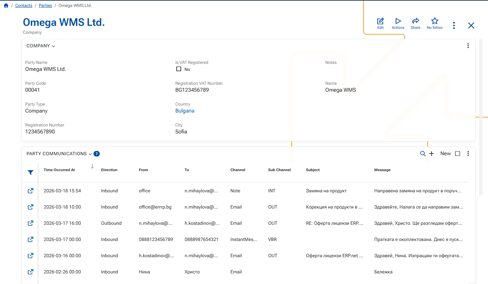

## Overview 

Party Communications provides a unified communication log for a business partner and its related business context. 

The purpose of the feature is to centralize communication that would otherwise remain scattered across different channels and locations. Instead of reviewing emails in one place, internal notes in another, and chat-based communication somewhere else, users can work with a single communication timeline. 

Party Communication records can originate from external systems through synchronization, or they can be entered manually by users directly in ERP.net. 

A Party Communication record can represent: 

- an email message 

- an instant message 

- an internal note 

Each record is linked to: 

- a `Party`, which identifies the main business partner involved in the communication 

- a `DataObject`, which identifies the related ERP.net business object 

 

This allows communication to be tracked not only by participant, but also by business context. For example, communication can be connected to a lead, opportunity, activity, offer, or another related object. 

 

Party Communications should be used when communication history must remain traceable, structured, and available in the context of the related business process.

