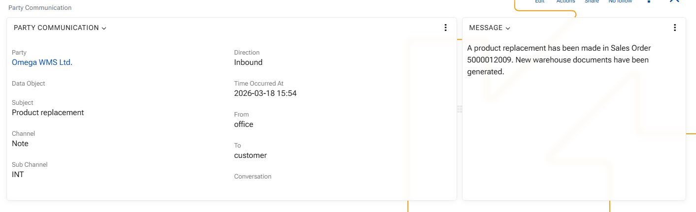

### Create communication record

Users can manually enter a Party Communication record when they need to record communication directly in ERP.net.

To do this:

1. Open the related party or business object.
2. Create a new communication record.
3. Select the communication channel.
4. Set whether the communication is inbound or outbound.
5. Enter the sender and the main recipient.
6. Enter the time when the communication occurred.
7. Enter the subject and message content, if applicable.
8. Make sure the record is linked to the correct party and business object.
9. Save the record.

Expected result: the manually entered communication is added to the communication history and can be reviewed together with synchronized records.

### Add an internal note 

 

A Party Communication record can also be used to store an internal note that should remain part of the communication history. 

 

Typical data for such a record includes: 

 

- the related `Party` 

- the related `DataObject` 

- `Channel` 

- `Direction` 

- `CommunicationFrom` 

- `CommunicationTo` 

- `Subject` 

- `Message` 

- `TimeOccurredAt` 

 

Expected result: the note becomes part of the same communication history as other records and can be reviewed together with emails and instant messages. 

 

### Review synchronized communication 

 

When communication is imported from an external source, users can review it in the same timeline as manually created records. 

Typical synchronized examples include: 

 

- email messages imported from a mail system 

- instant messages imported from chat-based integrations 

 

Expected result: communication from different channels is available in one place and remains linked to the correct party and business context. 
