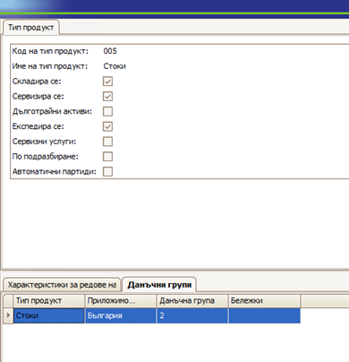
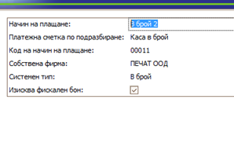

# Setting up the POS submodule

In order for POS to work correctly in @@name, initial settings are required.

### Define a POS location

A POS location defines a given **Enterpise Company Location** as a POS object. The Enterpise Company Location must be specified in advance. 

After determining the POS location, you can proceed to define POS operators and terminals for it.

### Define a POS terminal

Each location can have one or more **terminals** defined for it. A POS terminal is the place where a sale is registered and where various POS devices can be defined, such as fiscal devices, payment terminals, scales, and others.

One POS device can be specified by default and it will be loaded when creating a new sale on this terminal.

### Define a POS device

POS devices are defined for a specific POS terminal.

1. For enterprise companies working with **EnterpriseOne POS**, it is necessary to specify **"Applicable legislation" = "Bulgaria"**

   

2. You need to define a corresponding **POS location** for each branch that is a commercial entity.

   

   Once a POS location is set, it **cannot** be deleted or changed. It can only be **deactivated**.

3. For terminals, where necessary, fiscal devices are defined:

   

- **Device type**: Fiscal printer
- **Registration number**: Registration number of the fiscal printer - in capital letters, since some devices require strictly capital letters.
- **Communication protocol**: FP
- **The fiscal device email address** is set in the format: "http://Address:8001/printers/Printer Id".
- **The library** can be downloaded from **[here](https://github.com/erpnet/ErpNet.FP)**.

### Define a POS operator

In the definition of POS operators, a **user** who is associated with a person must be specified.

By default, the numbering of POS operators starts from **0001** for each location. However, if it is necessary to access fiscal devices from other locations, the operator numbers must be made unique within the enterprise company.

### Define POS roles

It is necessary to define **POS roles** - for example, Manager or Storekeeper.

## Additional configurations

1. A **POS series** must be defined for each fiscal device - a 7-digit number starting from the UNP.

   Example: 0000001.
   
   

2. A **tax group** must be specified in the product type definitions. If not specified, **tax group 2** is taken by default.

   

   The correspondence with the groups in fiscal devices in Bulgaria is:
    
   - Group A – Group 1
   - Group B – Group 2
   - Group C – Group 3
   - Group C – Group 4

3. In the payment methods that require printing of the fiscal device, "**Requires fiscal receipt**" and "**System payment method**" must be checked.

   

   Currently, the supported one-time payment methods for printing of a fiscal device are **In cash**, **By card**, and **By check**

   This setting is **one-time** and **cannot** be changed later.
    
4. For the return document type, in the sales settings, check **"Allowed directions" = "Sales return"**. This is the way by which it is recognized if a sale is a return or not.

5. For the NRA reports, the following preliminary settings must be made:

- Set up an **ID site**
- Set up a **Legal_BG site**
- Create an **external user** in the ID site - achieved through the site interface.
- Give this user access to **System rights** / Access to **reports in Legal_BG**
- Give the user rights to the enterprise company
- For reports inside the system, another **internal user** must be created with the appropriate rights - preferably to all modules, without Admin privileges or the right to edit documents.
    
Then:

1. Install **"EnterpriseOne POS"**.

   Your database must have a license to work with EnterpriseOne POS.

2. If you want to print from the Sales form, all documents in the document flow must be generated as **Released**. Otherwise, after printing, the program will terminate the flow.

   In the document flow, the generations of invoice orders and accounting vouchers from store transactions as **Next Documents** so they can remain Released upon completion of the flow. 

   This will allow for a correction of the warehouse cost and the creation of invoices subsequently. The generation of an accounting voucher must occur in the Completed status to be re-accounted upon correction.
