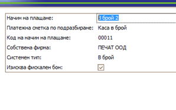

# Overview

Receipt templates can provide businesses with a customizable solution that enhances their fiscal printing process. They serve as pre-designed formats that you can easily modify and apply on a document type level.

By creating such templates, you gain the flexibility to incorporate personalized text in different places on the fiscal receipt itself. This includes the following sections:

* **Custom Header**
* **Custom Row Header**
* **Custom Row Footer**
* **Custom Footer**

## Creating a template

To craft a distinctive template tailored to our specifications, we begin by accessing the CRM panel at the top of the interface and selecting POS
 
This action directs us to a page where we can locate the Fiscal Receipt Templates panel.

Upon locating this panel, we click on the Plus button to initiate the creation of a new template.

This action navigates us to a new page specifically designed for customizing the printouts of fiscal receipts, providing us with a comprehensive set of options to personalize the template according to our preferences.

With these templates, users gain the flexibility to personalize every aspect of their receipts, including custom headers, row headers, row footers, and overall footers. This level of customization empowers businesses to craft receipts that precisely meet their unique requirements and branding preferences. By tailoring these elements to their specific needs, users can ensure that every receipt reflects the identity and values of their company, ultimately enhancing the customer experience and reinforcing brand consistency across all touch points.
The initial step in crafting a new template is selecting a distinctive name for it.
We can do that by using the field Template Name

Once we've designated a name for our new template, the subsequent step involves deciding whether we wish to include the Print the system header and Print the system row header options. These choices determine whether the default system headers and row headers will be included in our template's layout.

To select these options, simply press the check mark next to Print the system header and Print the system row header, marking them with a check mark. This action signifies that you want to include the default system headers and row headers in your template's layout.

The Custom Header refers to the text that will be printed at the top of the bill printouts. This typically includes details about the property, such as its name, address, and other relevant information. It serves as a prominent section that provides important context and branding for the receipt.

By selecting the three-dot button, you will access a new page offering several options. You can find one in every felt with the same options. 

Here, you can input your interpolated strings, enabling you to use them as suggestions when choosing that specific template.
 
You can use the search bar to locate a particular interpolated string among those you've inputted. This functionality helps for better organization, allowing you to quickly select specific strings for use within your template.
System Variables allows you to choose from the drop-down menu with variables such as date, time, or location of the current transaction that will be updated automatically.
 
The Custom Row Header feature offers the option to print specific text at certain rows within the middle section of the receipt.
 
The Custom Row Footer feature provides the option to print text at the low part of the receipt once it's been closed.
 
Custom Footer - the text will be printed at the bottom.
For instance, you could include a message like “Thank you for being our guests." This allows businesses to express appreciation to their customers and leave a positive impression after completing a transaction.

## How to use fiscal receipts templates

Now that we've created our templates, we are ready to put them into action. To do so, we navigate to the Sales panel and select Orders.
 
In this panel, we can select a document.
 
Once the document is opened, a new page will display all the relevant information. From there, we proceed by clicking on Document Type. 
 
This action will direct us to the Detail panel and from there we can open our document.

When we select the Printouts panel and click on the field labeled Fiscal Receipt Template, it opens the detailed panel associated with selecting the template for fiscal receipts. This panel allows us to choose from the available templates we have created.

Select open and the template will appear.

Selecting the Edit button grants you the ability to make desired modifications to the selected template. Each field within the editing interface provides the option to utilize interpolated strings, provided you've added them during the template creation process.

Once you have made the desired changes to your template, simply click on the Save and Reload button to apply your modifications.
screnshot
