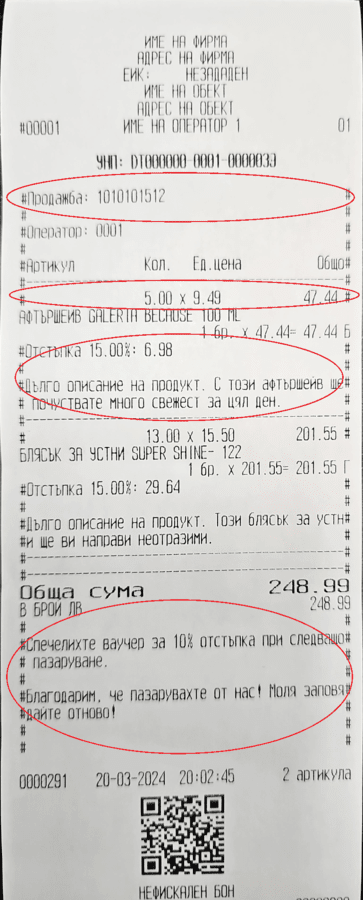

# Overview

Receipt templates can provide businesses with a customizable solution that enhances their fiscal printing process. They serve as pre-designed formats that you can easily modify and apply on a document type level.

By creating such templates, you gain the flexibility to incorporate personalized text using **[interpolated strings](https://docs.erp.net/tech/advanced/string-interpolation/index.html)** in different sections on the fiscal receipt itself. This includes the ability to define:

* **Custom Header** - refers to the text that will be printed at the top of the fiscal receipt, above the system header.
  
* **Custom Row Header** - refers to the text that will be printed before certain rows of the fiscal receipt.
  
* **Custom Row Footer** - refers to the text that will be printed after certain rows of the fiscal receipt.
  
* **Custom Footer** - refers to the text that will be printed at the bottom of the fiscal receipt, next to the system footer.

It's possible to take fiscal receipt customization even further by defining interpolated strings:

* **Before/after a sale**

* **Before/after a discount**

* **Before/after a subtotal**

* **Before/after payment**

By tailoring these elements to their specific needs, users can ensure that every receipt reflects the identity and values of their company, sending the right messages and ultimately enhancing customer experience.

## Creating a template

To craft a distinctive template tailored to your business needs, you need to follow a specific set of steps.

1. Locate the **Fiscal Receipt Templates** panel within the **POS** section of the **CRM** module.

   

2. Click on the panel's **Plus** button to initiate the creation of a new template.

   This takes you to a new page specifically designed for customizing the printouts of fiscal receipts, providing you with a comprehensive set of options to personalize a template according to your preferences.

   

3. The first required step in crafting a new template is providing a distinctive **name** for it.
   
   You can do that by using the **Template Name** field.

4. Decide whether to include the **Print System Header** and **Print System Row Header** options.

   This determines if custom headers and row headers will be printed as part of a fiscal receipt.

   To select these options, simply press on their respective **check boxes**.

   

5. Click the **three-dot button** on any **Custom** field to open a separate window with several customization options.

   

   It is here that you can provide text as well as **[interpolated strings](https://docs.erp.net/tech/advanced/string-interpolation/index.html)** for defining what exactly will be written in each respective section.

   You can also locate and directly add **system variables** such as date, time, or location.

   

   Keep in mind that writing interpolated strings comes with a few rules and limitations:

   * The width of a row is considered a unique parameter for each cash register. Therefore, certain symbols need to be added when you want to align or fill out receipt rows.

   * You should use the following operators to transfer interpolated strings to another row:
   
     "\r\n", "\\n", "'\\r", "\n", "\r".

     The string will be transfered into two or more rows as long as it contains symbols such as <CR> <LF>, <CR>, <LF> or it contains a sequence of "\n" or "\r" symbols.

   * Text will be automatically trasferred on a new line as long as identical symbols are present to fill the rest of the previous line. In that case, the identical symbols will be scrapped and whatever follows them is moved to a new line.
     
     **Example:**
     
     "This is  
       text\+++++++++++++++++++++++++++++++++++ 
     ++++++++++++++++++++++++++ more text"

     **This will result in two lines:**

     "This is text" 
     "+++++++++++++more text"

     And the length of each row depends on the cash register's capabilities.

6. When you're ready, click **Save and reload**.

   

> [!NOTE] 
>
> Interpolated strings can include text, domain attributes, and system variables available in the respective document type (e.g. sales order) for which you are creating a fiscal receipt template.    You can also import user-defined calculated attributes, which allow for various calculations of prices, amounts, discounts, and more, all of which are printed on the receipt.
 
## How to use fiscal receipts templates

Now that we've created our templates, we are ready to put them into action. To do so, we navigate to the Sales panel and select Orders.
 
In this panel, we can select a document.
 
Once the document is opened, a new page will display all the relevant information. From there, we proceed by clicking on Document Type. 
 
This action will direct us to the Detail panel and from there we can open our document.

When we select the Printouts panel and click on the field labeled Fiscal Receipt Template, it opens the detailed panel associated with selecting the template for fiscal receipts. This panel allows us to choose from the available templates we have created.

Select open and the template will appear.

Selecting the Edit button grants you the ability to make desired modifications to the selected template. Each field within the editing interface provides the option to utilize interpolated strings, provided you've added them during the template creation process.

Once you have made the desired changes to your template, simply click on the Save and Reload button to apply your modifications.
screnshot

> [!NOTE]
> 
> The screenshots taken for this article are from v24 of the platform.
