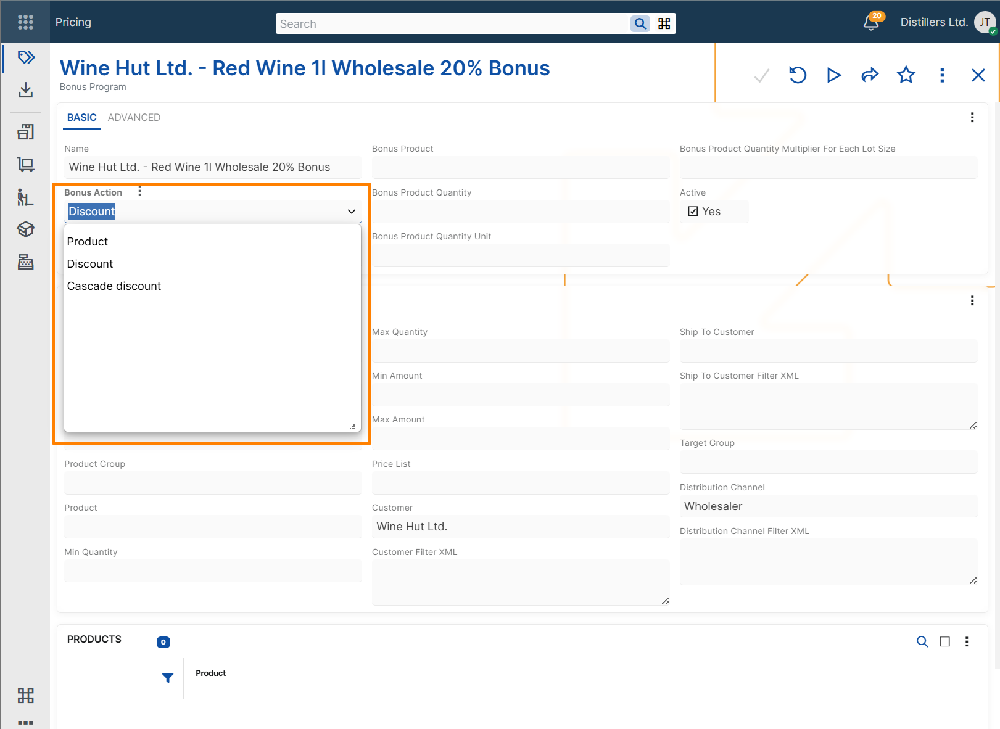
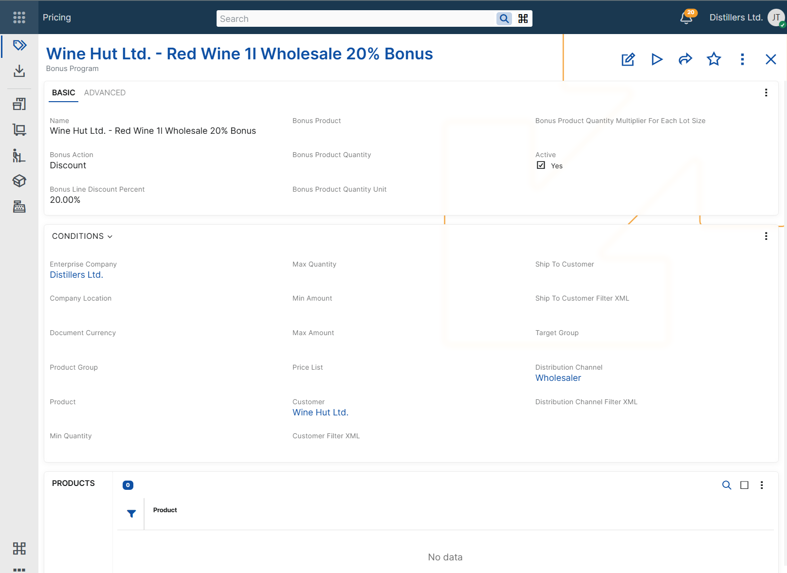
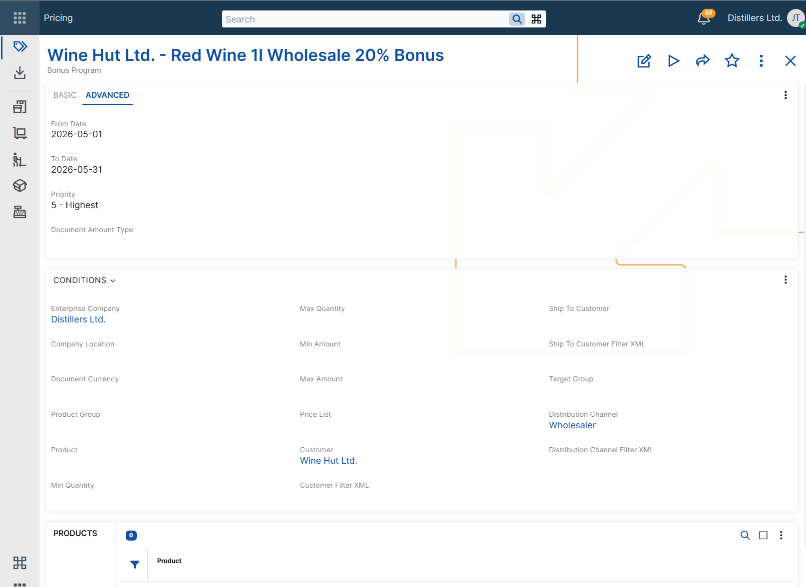

# Configuring bonus programs

Bonus programs are configured by defining:

- the bonus that @@name should apply, and
- the conditions under which the bonus program becomes eligible in a sales order.

A bonus program record can grant a free product, a discount, or a cascade discount. The configured conditions determine when the program can participate during sales order processing.

## Define the bonus action

Every bonus program requires a **Bonus Action**.

@@name supports three bonus actions:

- **Product** - adds a sales order line with a bonus product.
- **Discount** - applies a line discount percent that replaces any previously calculated standard line discount percent.
- **Cascade discount** - applies an additional discount percent after the standard line discount percent.

The selected bonus action determines which additional settings are required.

### Product bonus

Use a product bonus when the customer should receive a free product after the configured conditions are met.

To configure a product bonus, set:

- **Bonus Product**
- **Bonus Product Quantity**
- **Bonus Product Quantity Unit**

Use **Bonus Product Quantity Multiplier For Each Lot Size** when the rewarded quantity must repeat for each lot size of the triggering quantity.

This supports scenarios such as **Buy X, get Y free**.

For example, if the bonus program rewards 1 bonus product for each 10 units of the triggering product, ordering 30 units results in 3 bonus units.

### Discount bonus

Use a discount bonus when the matching sales order lines should receive a configured discount percent.

To configure a discount bonus, set:

- **Bonus Line Discount Percent**

When the bonus program is applied, the configured percent replaces any previously calculated standard line discount percent on the eligible sales order lines. The resulting value is reflected in the **Line Standard Discount Percent** field.

### Cascade discount bonus

Use a cascade discount bonus when an additional discount must be applied after the standard line discount percent.

To configure a cascade discount bonus, set:

- **Bonus Line Discount Percent**

A cascade discount bonus is calculated after the other line discounts. The resulting discount percent is reflected in the **Line Standard Discount Percent** field of the eligible sales order lines.

 So, the standard discount percent is calculated as follows: Line Standard Discount Percent = 1 - (1 – Line Standard Discount Percent) * (1 - Bonus Line Discount Percent). 

> [!NOTE]
> Cascade discount bonuses are calculated cumulatively, not by simple addition. For example, if the current line standard discount is 10% and the bonus line discount is 5%, the resulting **Line Standard Discount Percent** becomes 14.5%.

> [!NOTE]
> Discount and cascade discount bonus programs do not apply to sales order lines with zero quantity.

## Applicability conditions

In addition to the bonus action fields, a bonus program can include applicability conditions. These conditions determine in which sales order context the program can be considered.

### Product context

Use these conditions when the bonus depends on the product being sold.

- **Condition Product** - limits the bonus program to a specific product. If set, the bonus program is evaluated only for the sales order lines that contain that product.
- **Condition Product Group** - limits the bonus program to products in a specific product group or its subgroups.
- **Condition Min Quantity** - sets the minimum ordered quantity required for the bonus program to be considered.
- **Condition Max Quantity** - sets the maximum ordered quantity for which the bonus program can be considered.

Additional triggering products can be configured in the **Products** panel of the bonus program. When quantity conditions are used, @@name evaluates the total quantity of all configured triggering products together.

> [!IMPORTANT]
> When additional triggering products are added in the **Products** panel, all of them must use the same base measurement unit. Otherwise, @@name cannot evaluate the quantity conditions correctly.

> [!IMPORTANT]
> **Condition Min Quantity** and **Condition Max Quantity** can be used only when **Condition Product** is defined.

> [!IMPORTANT]
> **Condition Product Group** should not be combined with **Condition Min Quantity** or **Condition Max Quantity**. Quantity-based evaluation requires a consistent base measurement unit, which cannot be guaranteed for all products in a group.

### Amount context

Use these conditions when the bonus depends on the total amount of the relevant sales order context.

- **Condition Min Amount** - sets the minimum amount required for the bonus program to be considered.
- **Condition Max Amount** - sets the maximum amount for which the bonus program can be considered.
- **Condition Document Currency** - limits the bonus program to sales orders in a specific document currency.

**Condition Document Currency** is required when either **Condition Min Amount** or **Condition Max Amount** is set.

### Customer context

Use these conditions when the bonus depends on customer-related information in the sales order.

- **Condition Customer** - limits the bonus program to a specific customer.
- **Condition Ship To Customer** - limits the bonus program to a specific ship-to customer.
- **Condition Target Group** - limits the bonus program to customers in a specific target group.
- **Condition Customer Filter XML** - applies the bonus program only when the customer matches the specified filter criteria.
- **Condition Ship To Customer Filter XML** - applies the bonus program only when the ship-to customer matches the specified filter criteria.

### Commercial context

Use these conditions when the bonus depends on the commercial setup of the sales order.

- **Condition Price List** - limits the bonus program to sales orders that use a specific price list.
- **Condition Distribution Channel** - limits the bonus program to sales orders in a specific distribution channel.
- **Condition Distribution Channel Filter XML** - applies the bonus program only when the distribution channel matches the specified filter criteria.

### Validity context

Use these conditions when the bonus program must be available only during a specific period or only while the record is enabled.

- **Active** - indicates whether the bonus program is enabled for use.
- **Condition From Date** - limits the bonus program to sales orders for which the context **Date** is on or after this date.
- **Condition To Date** - limits the bonus program to sales orders for which the context **Date** is on or before this date.

## Priority

The **Priority** field ranks bonus programs relative to other applicable bonus programs during bonus evaluation in sales orders.

@@name supports priority values from **1** to **5**, where:

- **1** is the lowest priority
- **5** is the highest priority

When multiple bonus programs match the current sales order context, the **Priority** field is used to compare them.

## Document amount categorization

The **Document Amount Type** field specifies the document amount category for the bonus program.

When a discount or cascade discount bonus program with a specified **Document Amount Type** is applied in a sales order, @@name records the corresponding discount amount as a document amount and distributes it to the eligible sales order lines. 
This enables separate tracking of bonus-program discount amounts for reporting and posting purposes.

The field is used only for categorization and recording of the applied discount amount. It does not affect the applicability conditions of the bonus program.

Only document amount types with **Distributed By = Bonus Program** can be selected.

For more information about document amounts, see [Additional amounts](~/advanced/document-amounts/index.md) and [Additional amounts determination and recording](~/advanced/document-amounts/determination-and-recording.md).

## Matching configured conditions

A bonus program can be considered only when the values in the sales order match the configured applicability conditions.

If a bonus program contains multiple applicability conditions, all of them must match for the program to be considered.

If **Condition Product** is not specified, the configured conditions are matched in the context of the whole sales order. If **Condition Product** is specified, the configured conditions are matched only for the sales order lines that contain that product.

For example, a bonus program configured for a specific product and customer is considered only when both the product and the customer in the sales order match the configured values.

For more information about how @@name selects the final bonus program when multiple bonus programs are applicable, see [Determine bonus program](../concepts/determine-bonus-program.md).

## Example scenarios

The following examples show how bonus programs can be configured for different business needs and how the configured conditions affect the sales order.

> [!NOTE]
> The following examples assume that no other applicable bonus program with higher priority exists.

> [!NOTE]
> In the following examples, the values in **Sales order context** refer to the sales order or to the eligible sales order lines, depending on the configured applicability conditions. For product bonuses, the result can add a new sales order line. For discount and cascade discount bonuses, the result is reflected in the eligible sales order lines.

### Product bonus for a specific product

Use this scenario when ordering a specific product should add a bonus product to the sales order.

**Example configuration**

**Bonus Program: Bonus Program A**  
Bonus Action: Product  
Condition Product: Product A  
Condition Min Quantity: 10  
Bonus Product: Product B  
Bonus Product Quantity: 1  
Bonus Product Quantity Unit: pcs  
Bonus Product Quantity Multiplier For Each Lot Size: 10  

**Sales order context**  
Line No: 10  
Product: Product A  
Quantity: 30  
Quantity Unit: pcs  

**Result**  
Bonus Program: Bonus Program A  
An additional sales order line is added.  
Line No: 20  
Product: Product B  
Quantity: 3  
Quantity Unit: pcs  

### Discount bonus for a specific customer

Use this scenario when a specific customer should receive a promotional line discount.

**Example configuration**

**Bonus Program: Bonus Program A**  
Bonus Action: Discount  
Condition Customer: Customer A  
Bonus Line Discount Percent: 12%  

**Sales order context**  
Customer: Customer A  

**Result**  
Bonus Program: Bonus Program A  
Line Standard Discount Percent: 12%  

### Cascade discount on top of the standard line discount

Use this scenario when an additional discount should be applied after the other line discounts.

**Example configuration**

**Bonus Program: Bonus Program A**  
Bonus Action: Cascade discount  
Condition Product: Product A  
Bonus Line Discount Percent: 5%  

**Sales order context**  
Product: Product A  
Line Standard Discount Percent before the bonus program: 10%  

**Result**  
Bonus Program: Bonus Program A  
Line Standard Discount Percent: 14.5%  

### Time-limited bonus program

Use this scenario when a bonus program must be valid only during a specific period.

**Example configuration**

**Bonus Program: Bonus Program A**  
Bonus Action: Discount  
Condition From Date: 2026-06-01  
Condition To Date: 2026-06-30  
Bonus Line Discount Percent: 15%  

**Sales order context**  
Required Delivery Date: 2026-06-15  

**Result**  
Bonus Program: Bonus Program A  
Line Standard Discount Percent: 15%  

### Bonus program for multiple triggering products

Use this scenario when the same bonus should apply to more than one triggering product.

**Example configuration**

**Bonus Program: Bonus Program A**  
Bonus Action: Product  
Condition Product: Product A    
Condition Min Quantity: 5  
Bonus Product: Product C  
Bonus Product Quantity: 1  
Bonus Product Quantity Unit: pcs  

Products panel: 
Product: Product B

**Sales order context**  
Line No: 10  
Product: Product A  
Quantity: 2  
Quantity Unit: pcs  

Line No: 20  
Product: Product B  
Quantity: 3  
Quantity Unit: pcs  

**Result**  
Bonus Program: Bonus Program A  
An additional sales order line is added.  
Line No: 30  
Product: Product C  
Quantity: 1  
Quantity Unit: pcs  

## Negative examples

The following examples show cases in which a bonus program is not considered because the sales order context does not match the configured applicability conditions.

### Product mismatch

Use this scenario to show that a product-specific bonus program is not considered for a different product.

**Example configuration**

**Bonus Program: Bonus Program A**  
Bonus Action: Product  
Condition Product: Product A  
Bonus Product: Product B  
Bonus Product Quantity: 1  
Bonus Product Quantity Unit: pcs  

**Sales order context**  
Line No: 10  
Product: Product C  
Quantity: 30  
Quantity Unit: pcs  

**Result**  
This bonus program is not considered.  

### Quantity below minimum

Use this scenario to show that a quantity-based bonus program is not considered when the ordered quantity is below the configured minimum.

**Example configuration**

**Bonus Program: Bonus Program A**  
Bonus Action: Product  
Condition Product: Product A  
Condition Min Quantity: 10  
Bonus Product: Product B  
Bonus Product Quantity: 1  
Bonus Product Quantity Unit: pcs  

**Sales order context**  
Line No: 10  
Product: Product A  
Quantity: 5  
Quantity Unit: pcs  

**Result**  
This bonus program is not considered.  

### Date outside validity period

Use this scenario to show that a time-limited bonus program is not considered outside its configured validity period.

**Example configuration**

**Bonus Program: Bonus Program A**  
Bonus Action: Discount  
Condition From Date: 2026-06-01  
Condition To Date: 2026-06-30  
Bonus Line Discount Percent: 15%  

**Sales order context**  
Required Delivery Date: 2026-07-05  

**Result**  
This bonus program is not considered.  

### Zero-quantity line for discount bonus

Use this scenario to show that a discount bonus program is not applied to a sales order line with zero quantity.

**Example configuration**

**Bonus Program: Bonus Program A**  
Bonus Action: Discount  
Condition Product: Product A  
Bonus Line Discount Percent: 10%  

**Sales order context**  
Line No: 10  
Product: Product A  
Quantity: 0  
Quantity Unit: pcs  

**Result**  
This bonus program is not considered for the sales order line.  
  
