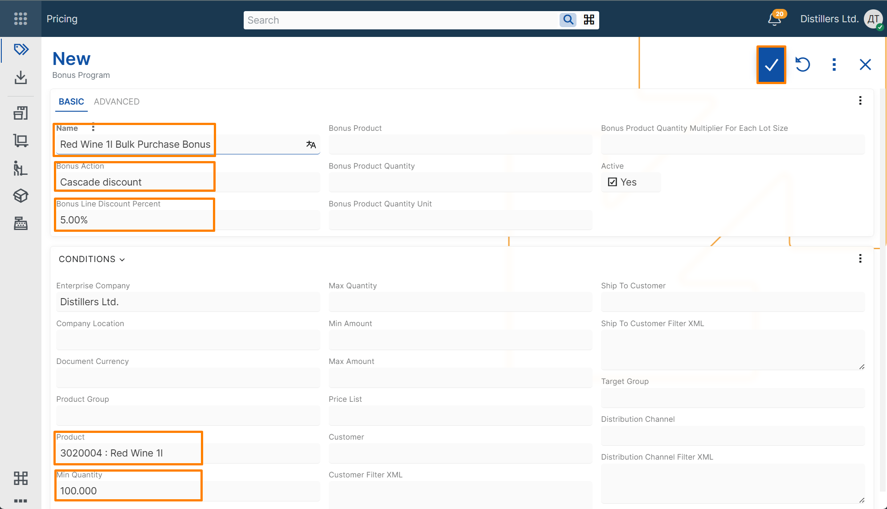
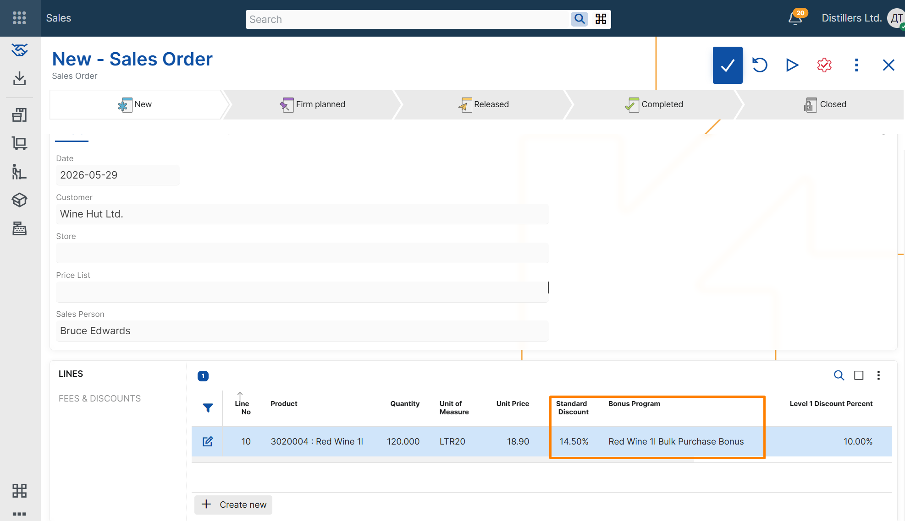

# Create a basic cascade discount bonus program

This example shows how to create a cascade discount bonus program and verify that it is applied in a sales order.

> [!NOTE]
> Cascade discount bonuses are applied after the standard discount percent on the sales order line. To test this example, use a product that already has an active line discount.

For an example of how to create a line discount, see [Create a basic line discount](https://docs.erp.net/tech/modules/crm/pricing/line-discounts/create-basic-line-discount.html).

## Steps

1. Open the **Pricing** module.
2. In the **Bonus Programs** tile, select **+** button.

3. In the new bonus program record, enter the following:

- **Name** – text that identifies the bonus program
- **Bonus Action** –  select **Cascade discount** to create a bonus program that adds an additional discount after the standard discount percent
- **Bonus Line Discount Percent** - the cascade discount percentage to apply
- **Product** – the product that activates the bonus
- **Min Quantity** – the minimum ordered quantity required for the bonus to apply

4. Save the record.

> [!NOTE]
> **Enterprise Company** is filled in automatically with the current enterprise company.

## Verify the result

1. Create a new **Sales Order**.
2. Select a customer.
3. Add a line for the same product with a quantity that fulfills the bonus program condition.
4. Review the values in the **Bonus Program** and **Line Standard Discount Percent** fields.

The **Bonus Program** field should contain a reference to the bonus program that was just created.  
The **Line Standard Discount Percent** field should contain the final discount percent, calculated cumulatively from the existing line discount and the cascade discount bonus. 

