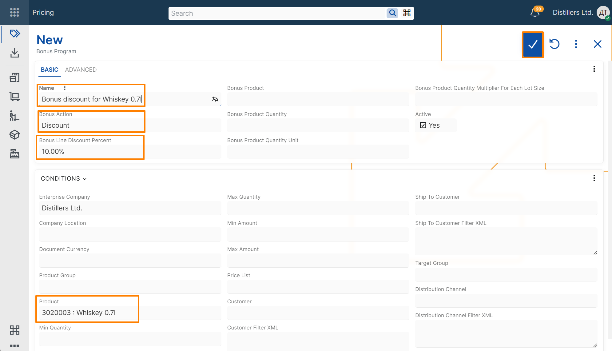
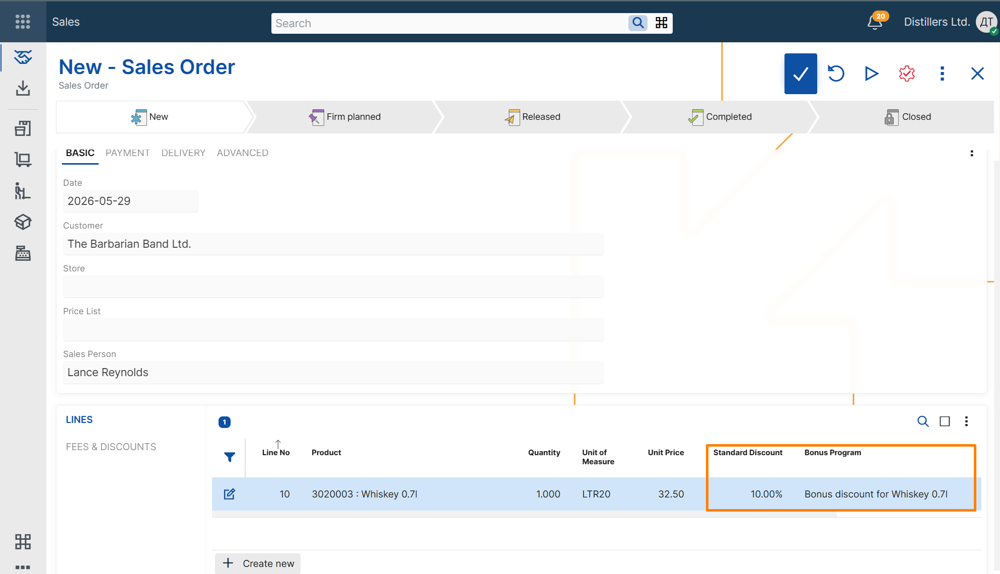

# Create a basic discount bonus program

This example shows how to create a basic discount bonus program and verify that it is applied in a sales order.

## Steps

1. Open the **Pricing** module.
2. In the **Bonus Programs** tile, select **+** button.

3. In the new bonus program record, enter the following:

- **Name** – text that identifies the bonus program
- **Bonus Action** – select Discount to create a discount bonus program
- **Bonus Line Discount Percent** - the discount percentage to apply
- **Product** – the product that activates the bonus

4. Save the record.

> [!NOTE]
> **Enterprise Company** is filled in automatically with the current enterprise company.

## Verify the result

1. Create a new **Sales Order**.  
2. Select a customer.  
3. Add a line for the same product.  
4. Review the sales order lines and verify that an additional line is added for the bonus product.
4. Review the values in the **Bonus program** and **Line Standard Discount Percent** fields.

The **Bonus Program** should contain a reference to the bonus program that was just created.  
The **Line Standard Discount Percent** field should contain the discount percent from the selected bonus program.

