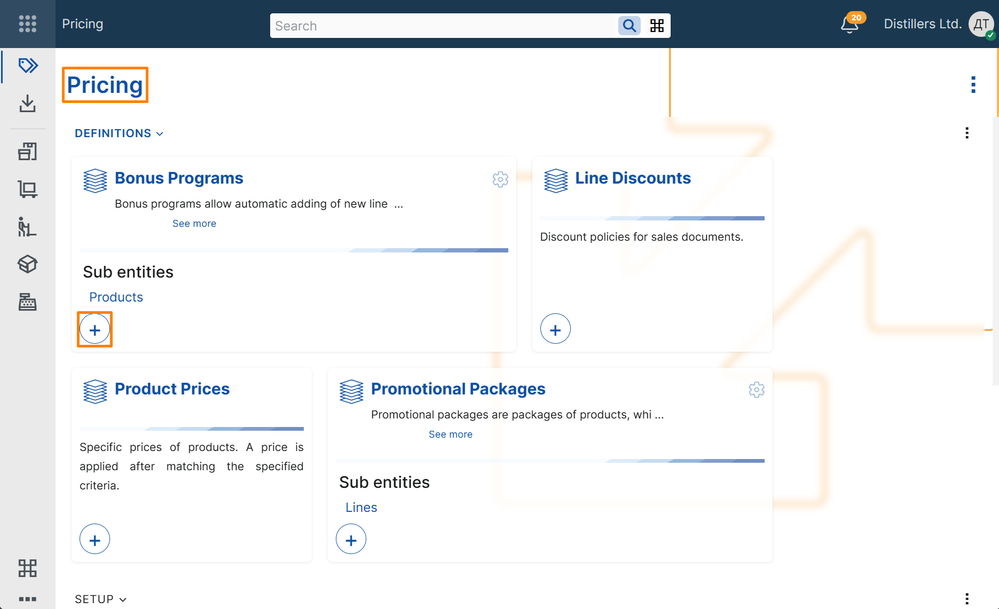
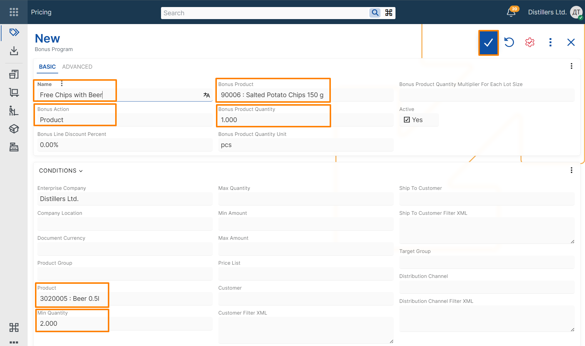
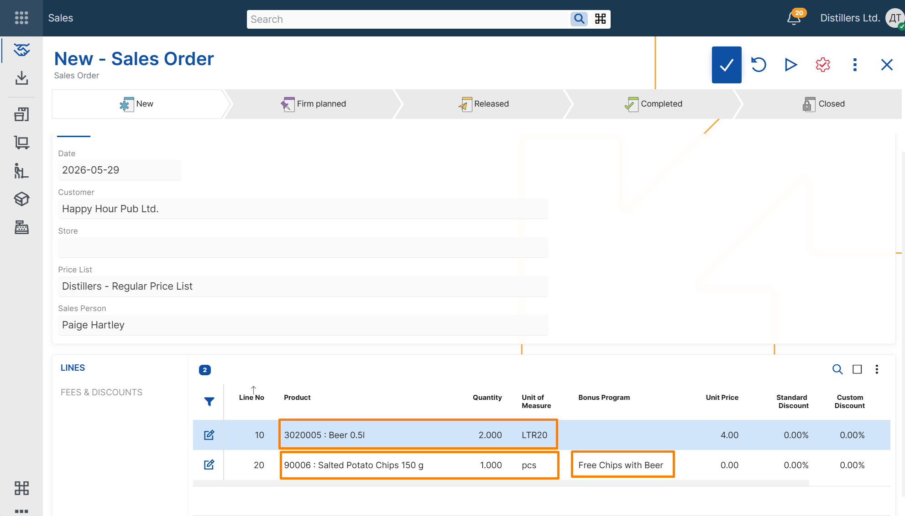

# Create a basic product bonus program

This example shows how to create a basic product bonus program and verify that it is applied in a sales order.

## Steps

1. Open the **Pricing** module.
2. In the **Bonus Programs** tile, select **+** button.

3. In the new bonus program record, enter the following:

- **Name** – text that identifies the bonus program
- **Bonus Action** – select Product to create a product bonus program
- **Bonus Product** – the product that is added as a bonus
- **Bonus Product Quantity** – the quantity of the bonus product
- **Bonus Product Quantity Unit** – the measurement unit of the bonus quantity
- **Product** – the product that activates the bonus
- **Min Quantity** – the minimum ordered quantity required for the bonus to apply

4. Save the record.

> [!NOTE]
> **Enterprise Company** is filled in automatically with the current enterprise company.

## Verify the result

1. Create a new **Sales Order**.  
2. Select a customer.  
3. Add a line for the same product with a quantity that fulfills the bonus program condition.  
4. Review the sales order lines and verify that an additional line is added for the bonus product.

The **Product** field in the additional line should contain the bonus product from the bonus program.  
The **Quantity** field in the additional line should contain the bonus quantity defined in the bonus program.  
The **Bonus Program** field in the additional line should contain a reference to the bonus program that was just created.  

