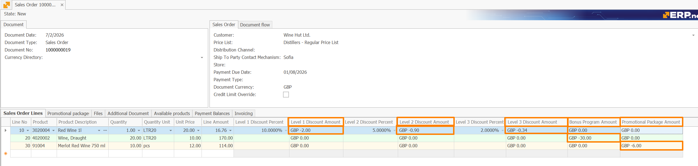
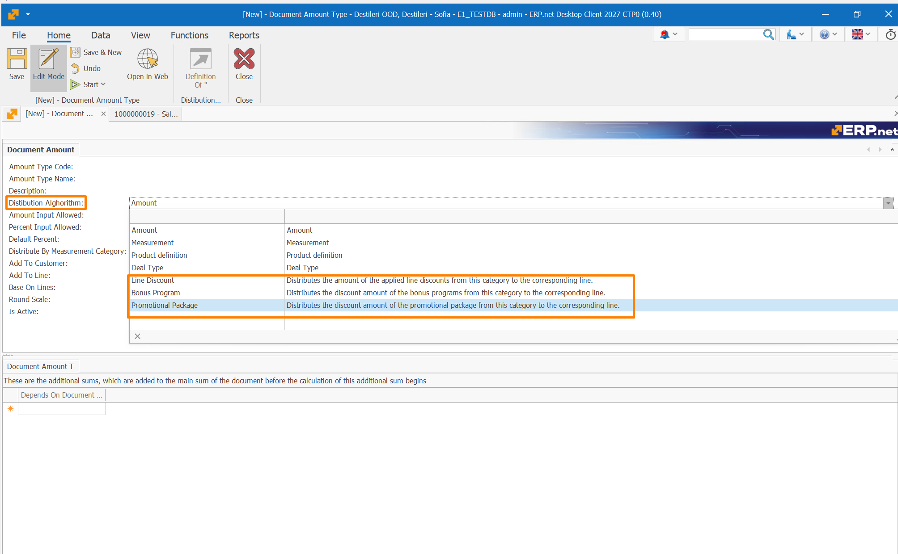
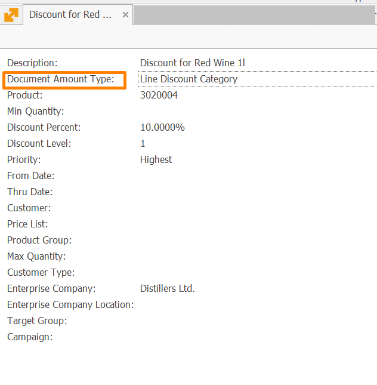
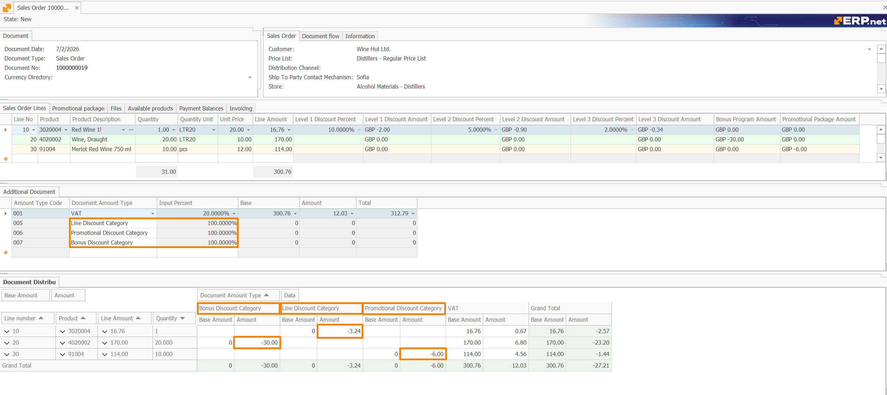
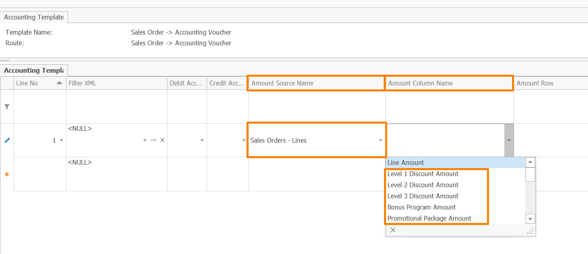
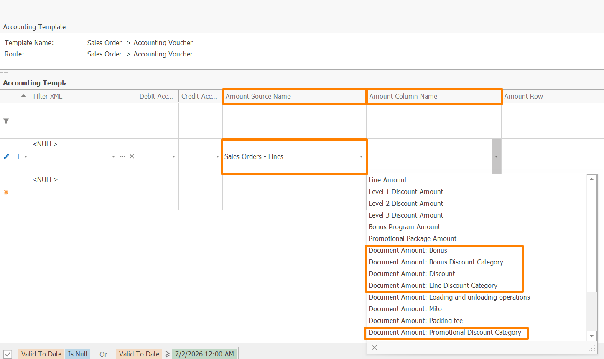
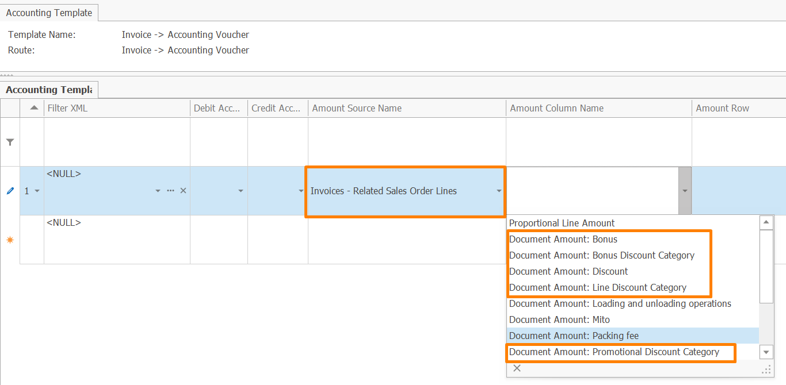

# Configuration

Discount management can be used at three different levels:

- visualizing discount amounts in sales orders;
- recording discount amounts as categorized additional amounts;
- posting discount amounts in accounting.

The required setup depends on which of these goals you want to achieve.

## Showing discount amounts in the sales order

If the goal is only to visualize discount amounts in sales orders, no additional configuration is required.

Sales order lines provide five system-calculated attributes:

- **Level 1 Discount Amount**
- **Level 2 Discount Amount**
- **Level 3 Discount Amount**
- **Bonus Program Amount**
- **Promotional Package Amount**

These attributes are calculated automatically from the applied discount sources in the sales order line.

They can be added to the sales order lines layout and used directly for reporting and analytics.

## Recording discount amounts as categorized additional amounts

If discount amounts must be categorized and recorded as additional amounts, the setup has two steps:

1. define the required **Document Amount Types**;
2. assign them to the corresponding discount sources.

### Step 1. Define document amount types

First, create the **Document Amount Types** that will be used for discount management.

In this scenario, document amount types act as discount categories.  
They determine under which category the calculated discount amount is recorded, grouped, and later distributed to the affected sales order lines.

For each discount source type, the document amount type must have the matching **Distributed By** value:

- **Line Discount** for line discounts;
- **Bonus Program** for bonus programs;
- **Promotional Package** for promotional packages.

Multiple document amount types can be defined within the same discount source type.  
For example, several promotional package categories can be used when different package discounts must be tracked, reported, or posted separately.

### Step 2. Assign document amount types to discount sources

After the required document amount types are created, assign them to the corresponding discount sources through the **Document Amount Type** field.

This field is available in:

- line discounts;
- bonus programs;
- promotional packages.

In each source, the field lists only document amount types with the matching **Distributed By** value.

Each discount definition can be assigned to one document amount type of the corresponding distribution type.

> [!NOTE]
> If no **Document Amount Type** is assigned, the discount source still applies normally, but its discount amount is not recorded and categorized through this mechanism.

This assignment does not affect whether the discount source is applicable or how the discount is calculated.  
Instead, it enables the calculated discount amount to be:

- recorded as a categorized additional amount in the document;
- grouped by discount category for reporting, analytics, and posting;
- distributed to the affected sales order lines.

For bonus programs, this configuration is relevant when **Bonus Action** is set to **Discount** or **Cascade discount**.

For promotional packages, this configuration is relevant for promotional package lines that define a discount through **Standard Discount Percent Adjust**.

For source-specific setup, see:

- [Line Discounts](https://docs.erp.net/tech/modules/crm/pricing/line-discounts/index.html)
- [Bonus programs](https://docs.erp.net/tech/modules/crm/pricing/bonus-programs/configuration.html)
- [Promotional packages](https://docs.erp.net/tech/modules/crm/pricing/promotional-packages.html)

### Result

After this setup is complete and the sales order is saved, the applied discount amounts are created automatically as categorized additional amounts.

They appear in the **Additional Document Amounts** panel with:

- **Input Amount** = `null`
- **Input Percent** = `100%`

Their line-level distribution can be reviewed in the **Document Distributed Amounts** panel.

## Posting discounts

Discount amounts can be posted in two different ways, depending on the required accounting result.

#### Option 1. Post the calculated discount attributes directly

If discount categorization is not required, configure the accounting template to post the system-calculated discount amounts directly from the sales order lines.

In the accounting template line, set:

- **Amount Source Name** = **Sales Orders - Lines**
- **Amount Column Name** = one of the available discount amount attributes:
  - **Level 1 Discount Amount**
  - **Level 2 Discount Amount**
  - **Level 3 Discount Amount**
  - **Bonus Program Amount**
  - **Promotional Package Amount**

This option is appropriate when the goal is to post the discount amounts themselves, without grouping them by discount category.

#### Option 2. Post discount amounts by category through distributed amounts

If discounts must be posted by category, first configure discount categorization through **Document Amount Types** and assign them to the corresponding discount sources.

Then configure the accounting template to use the distributed amounts posting mechanism for the selected discount category.

This option is appropriate when accounting and reporting must distinguish between categories such as turnover discounts, volume discounts, or promotional discounts.

### Configure distributed amounts posting in accounting templates

If discounts must be posted by category, use the distributed amounts posting mechanism.

#### Sales Orders

In sales order accounting templates, configure the template line to post the required discount category directly from the sales order lines.

Set:

- **Amount Source Name** = **Sales Orders - Lines**
- **Amount Column Name** = **Document Amount: _[discount category]_**

#### Invoices

In invoice accounting templates, discount categories can be posted from the related sales order lines.

Set:

- **Amount Source Name** = **Invoices - Related Sales Order Lines**
- **Amount Column Name** = **Document Amount: _[discount category]_**

This setup allows the invoice posting to use the discount category from the related sales order line while keeping the accounting context of the invoice.

If the invoice covers only part of the original sales order quantity, the system posts a proportional part of the related discount amount according to the invoiced quantity.

