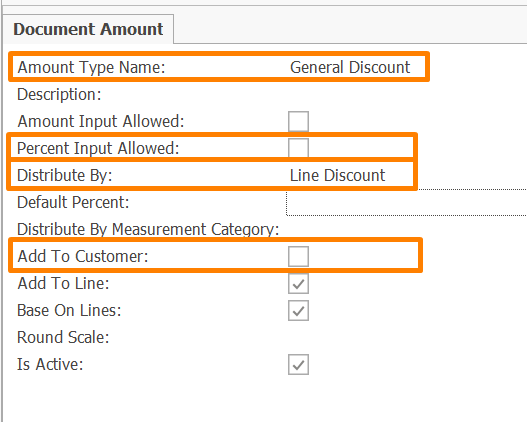
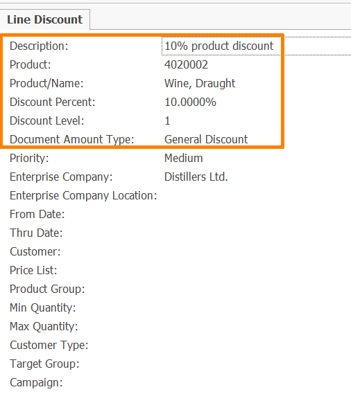
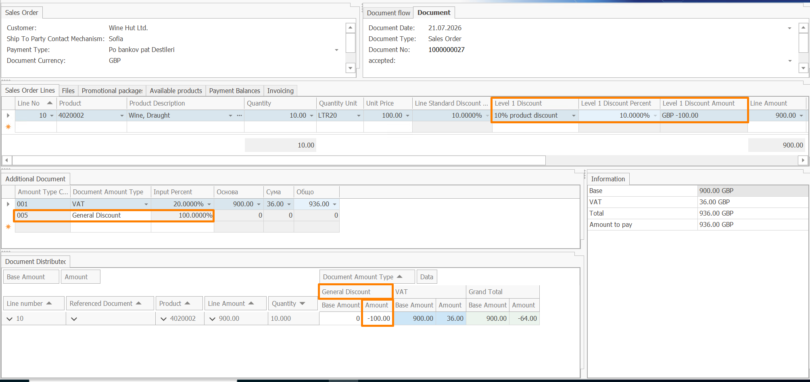

# Set up line discount categorization

This guide shows how to categorize a line discount and verify the resulting discount amount in a sales order.

You will:

- create a discount category;
- assign the category to a line discount;
- apply the discount in a sales order;
- verify the calculated, categorized, and distributed discount amounts.

## Step 1: Create a discount category

1. Create a new **Document Amount Type** record.
  
2. Enter the following:

- **Amount Type Name** - a recognizable name, such as `General Discount`.
- **Distribute By** - select **Line Discount**
- **Percent Input Allowed** - set to False
- **Add To Customer** - set to False

3. Leave the remaining fields with their default values and save the record.

The document amount type defines the category under which the calculated discount amount will be recorded.



## Step 2: Create and categorize a line discount

1. Create a new **Line Discount** record.

2. Enter the following:

- **Description** – a meaningful description, such as `10% product discount`  
- **Discount Percent** – `10%`
- **Product** – select the product that will be used in the example
- **Document Amount Type** – select the `General Discount` category created in the previous step

3. Leave the remaining fields with their default values and save the record.



## Step 3: Create a sales order that meets the line discount conditions

1. Create a new **Sales Order**.

2. Select the **Customer** and **Document Currency**.

3. Add a line with the product specified in the line discount definition.

4. For an easily verifiable example, enter:

- **Quantity** – `10`
- **Unit Price** – `100.00`

5. Save the sales order.

The original amount of the sales order line is:

```text
10 × 100.00 = 1,000.00
```

## Verify the result

After saving the sales order, verify that the discount is calculated, categorized, and distributed correctly.

### Verify the calculated discount

In the **Sales Order Lines** panel, review the following fields:

- **Level 1 Discount** – `10% product discount`
- **Level 1 Discount Percent** – `10%`
- **Level 1 Discount Amount** – `-100.00`
- **Line Amount** – `900.00`

The line discount reduces the original line amount by 10%:

```text
Discount amount = 1,000.00 × 10% = 100.00
Line amount = 1,000.00 - 100.00 = 900.00
```

The **Level 1 Discount Amount** is displayed as `-100.00` because the discount reduces the value of the sales order line.

### Verify the discount category

In the **Additional Document Amounts** panel, verify that a record was created automatically with:

- **Document Amount Type** – `General Discount`
- **Input Percent** – `100%`

The `100%` input percent means that the entire calculated discount amount is assigned to the selected category. It is not the discount percent applied to the sales order line.

### Verify the distributed amount

In the **Document Distributed Amounts** panel, locate the sales order line and review the `General Discount` column.

The distributed amount should be:

```text
-100.00
```

This confirms that the complete discount amount recorded under the `General Discount` category is assigned to the affected sales order line.

## Expected result

The sales order contains the discount in three related forms:

1. The calculated discount amount of `-100.00` is displayed in **Level 1 Discount Amount**.
2. A record for the `General Discount` category is created in **Additional Document Amounts**.
3. The amount of `-100.00` is assigned to the affected sales order line in **Document Distributed Amounts**.



The same approach can be used to categorize discounts from bonus programs and promotional packages. For each discount source, use a document amount type with the corresponding **Distribute By** value.

For the complete setup options, see [Configuration](configuration.md).

For information about calculation, rounding, and distribution, see [Concepts](concepts.md).
