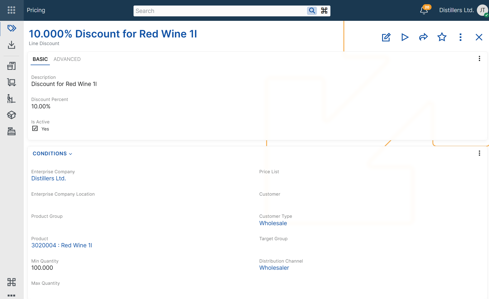
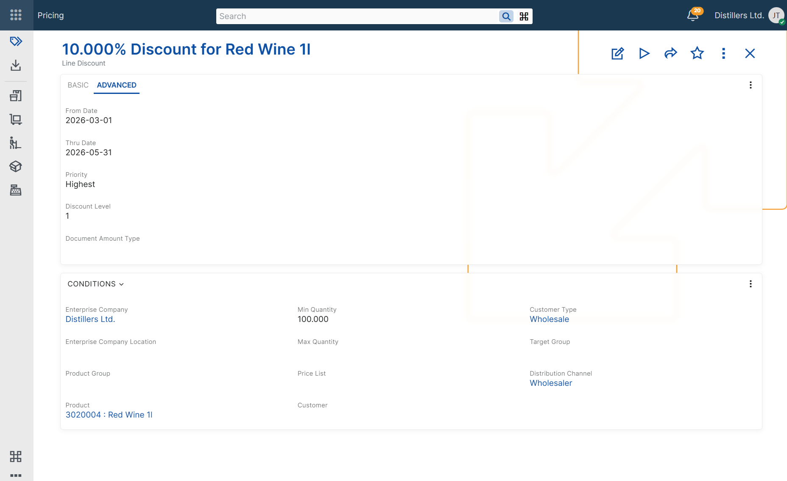

# Configuring line discounts

Line discounts are configured by defining a line discount record and the conditions under which it can be applied.

Multiple line discount records can be defined, each with its own applicability conditions. When more than one line discount matches the current context, @@name determines the final discount for each discount level according to the [line discount determination algorithm](concepts/determine-line-discount.md).

When a sales document line is processed, the system automatically populates the corresponding **Level 1 Discount**, **Level 2 Discount**, or **Level 3 Discount** field with the selected line discount record, loads its discount percent into the corresponding discount percent field, and includes the result in the calculated *Line Standard Discount Percent** field.

## Discount definition

A line discount record includes the following basic fields:

- **Description**  
- **Discount Percent**  
- **Discount Level**  

These fields define how the discount is identified, what percentage is applied, and on which discount level it participates.

The **Description** field helps users recognize the discount when reviewing or selecting discount records.

The **Discount Percent** field stores the discount percentage that is applied when all configured conditions are matched.

The **Discount Level** field specifies the cascade level on which the discount is applied. ERP.net supports three discount levels. Each level is determined separately and can populate a different discount field in the sales document.

## Applicability conditions

In addition to the base discount definition fields, a line discount record can include applicability condition fields. These fields limit when the discount can be considered during sales document processing.

If a line discount record contains multiple applicability conditions, all of them must match for the discount to be considered.

### Product context

Use these conditions when the discount depends on the product being sold.

- **Product** – limits the discount to a specific product.  
- **Product Group** – limits the discount to products in a specific product group.
- **Min Quantity** – the minimum product quantity in the sales document line for which the discount can be considered.  
- **Max Quantity** – the maximum product quantity in the sales document line for which the discount can be considered.

### Customer context

Use these conditions when the discount depends on customer-related information in the sales document.

- **Customer** – limits the discount to sales documents for a specific customer.  
- **Customer Type** – limits the discount to sales documents for customers of a specific type.  
- **Target Group** – limits the discount to sales documents for customers in a specific target group.

### Commercial context

Use these conditions when the discount depends on the commercial setup of the sales document.

- **Price List** – limits the discount to sales documents that use a specific price list.  
- **Distribution Channel** – limits the discount to sales documents in a specific distribution channel.  

### Organizational context

Use these conditions when the discount depends on the organizational context of the sales document.

- **Enterprise Company** – limits the discount to sales documents issued from a specific enterprise company.  
- **Enterprise Company Location** – limits the discount to sales documents issued from a specific enterprise company location.

### Validity context

Use these conditions when the discount must be available only during a specific period or only while the record is enabled.

- **From Date** – limits the discount to sales documents whose required delivery date is on or after this date.  
- **Thru Date** – limits the discount to sales documents whose required delivery date is on or before this date.  
- **Active** – indicates whether the line discount record is enabled for use.

## Priority and discount level

When more than one line discount is applicable for the same discount level, ERP.net selects the matching policy with the highest priority.

These fields control that behavior:

- **Priority** – ranks applicable line discounts for the same level.  
- **Discount Level** – determines which discount field in the sales order line is affected.

A line discount with **Discount Level = 1** can populate the **Level 1 Discount** field.  
A line discount with **Discount Level = 2** can populate the **Level 2 Discount** field.  
A line discount with **Discount Level = 3** can populate the **Level 3 Discount** field.

The selected line discount also provides the value for the corresponding discount percent field. The final calculated result is reflected in the **Line Standard Discount Percent** field of the sales order line.

For more information about applying discounts from multiple levels and how the final standard discount is accumulated, see [Multi-level line discounts](concepts/multi-level-line-discounts.md).

> [!NOTE]
> A line discount record must be unique for its combination of discount level and applicability context fields, such as product, product group, customer, customer type, price list, target group, distribution channel, validity period, quantity range, enterprise company, and enterprise company location. As a result, @@name does not allow duplicate line discount records for the same discount level and applicability context.

## Document amount categorization

The **Document Amount Type** field specifies the document amount category for the line discount.

When a line discount with a specified **Document Amount Type** is applied in a sales order, @@name records the corresponding discount amount as a document amount and distributes it to the affected sales order line. This enables separate tracking of discount amounts for reporting and posting purposes.

This field does not participate in the line discount determination algorithm and does not affect discount applicability.

For more information about document amounts, see [Additional amounts](~/advanced/document-amounts/index.md) and [Additional amounts determination and recording](~/advanced/document-amounts/determination-and-recording.md).

## Matching configured conditions

A line discount can be considered only when the values in the sales document match the configured applicability conditions.

If a line discount record contains multiple applicability conditions, all of them must match for the discount to be applied.	

For example, a line discount configured for a specific product and customer is considered only when both the product and the customer in the sales document line match the configured values.

For more information about how @@name selects the final discount when multiple line discounts are applicable for the same discount level, see [Determine line discount](../concepts/determine-line-discount.md).

## Example scenarios

The following examples show how line discounts can be configured for different business needs and how the configured conditions affect the discount values loaded in the sales document line.

> [!NOTE]
> The following examples assume that no other applicable line discount with higher priority exists for the same discount level.

### Discount for a specific product

Use this scenario when a product should always receive a specific line discount.

**Example configuration**

**Line Discount: Line Discount A**  
Description: Product A discount  
Product: Product A  
Discount Percent: 10%  
Discount Level: 1  

**Sales document context**  
Product: Product A  

**Result**  
Level 1 Discount: Line Discount A  
Level 1 Discount Percent: 10  
Line Standard Discount Percent: 10%

### Discount for a specific customer

Use this scenario when one customer has negotiated line discount terms.

**Example configuration**

**Line Discount: Line Discount A**  
Description: Customer A discount  
Customer: Customer A  
Discount Percent: 12%  
Discount Level: 1  

**Sales document context**  
Customer: Customer A  

**Result**  
Level 1 Discount: Line Discount A  
Level 1 Discount Percent: 12%  
Line Standard Discount Percent: 12%

### Discount by quantity range

Use this scenario when the discount depends on the ordered quantity of a specific product.

**Example configuration**

**Line Discount: Line Discount A**  
Description:Product A - quantity-based discount  
Product: Product A  
Min Quantity: 10  
Max Quantity: 50  
Discount Percent: 8%  
Discount Level: 1  

**Sales document context**  
Product: Product A  
Quantity: 12  

**Result**  
Level 1 Discount: Line Discount A  
Level 1 Discount Percent: 8%  
Line Standard Discount Percent: 8%

### Time-limited discount

Use this scenario when a line discount must be valid only during a specific period.

**Example configuration**

**Line Discount: Line Discount A**  
Description: June promotion  
From Date: 2026-06-01  
Thru Date: 2026-06-30  
Discount Percent: 15%  
Discount Level: 1  

**Sales document context**  
Document Date: 2026-06-15  

**Result**  
Level 1 Discount: Line Discount A  
Level 1 Discount Percent: 15%  
Line Standard Discount Percent: 15%

## Negative examples

The following examples show cases in which a line discount is not considered because the sales order context does not match the configured applicability conditions.

### Product mismatch

Use this scenario to show that a product-specific line discount is not considered for a different product.

**Example configuration**

**Line Discount: Line Discount A**  
Product: Product A  
Discount Percent: 10%  
Discount Level: 1  

**Sales document context**  
Product: Product B  

**Result**  
This line discount is not considered.

### Quantity outside range

Use this scenario to show that a quantity-based line discount is not considered when the sold quantity is outside the configured range.

**Example configuration**

**Line Discount: Line Discount A**  
Product: Product A  
Min Quantity: 10  
Max Quantity: 50  
Line Standard Discount Percent: 8%  
Discount Level: 1  

**Sales document context**  
Product: Product A  
Quantity: 5  

**Result**  
This line discount is not considered.
