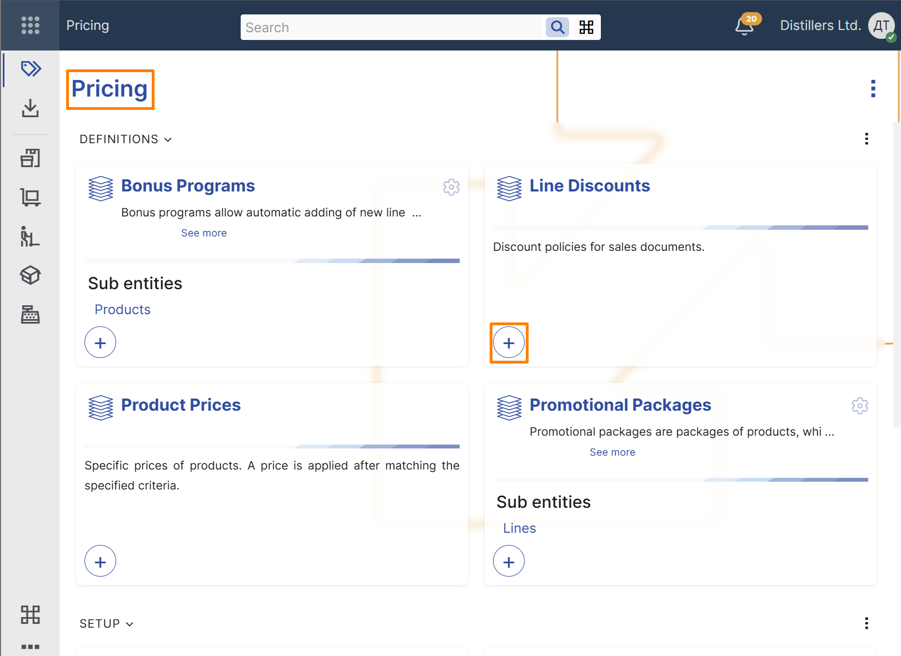
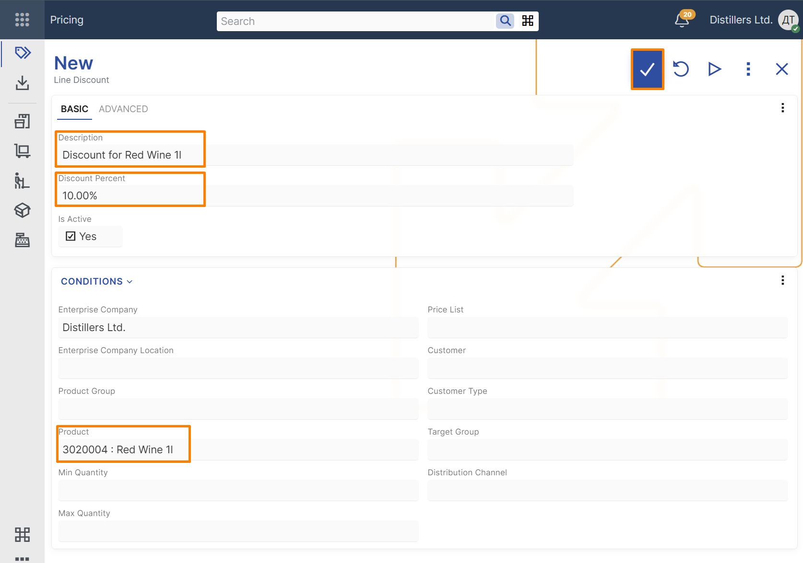
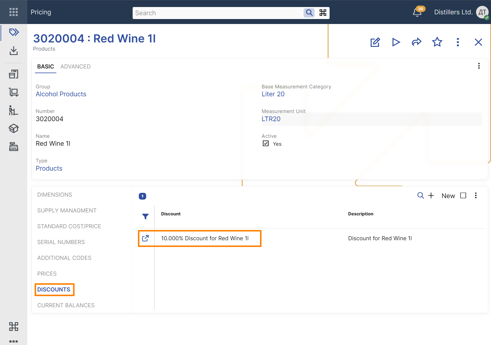
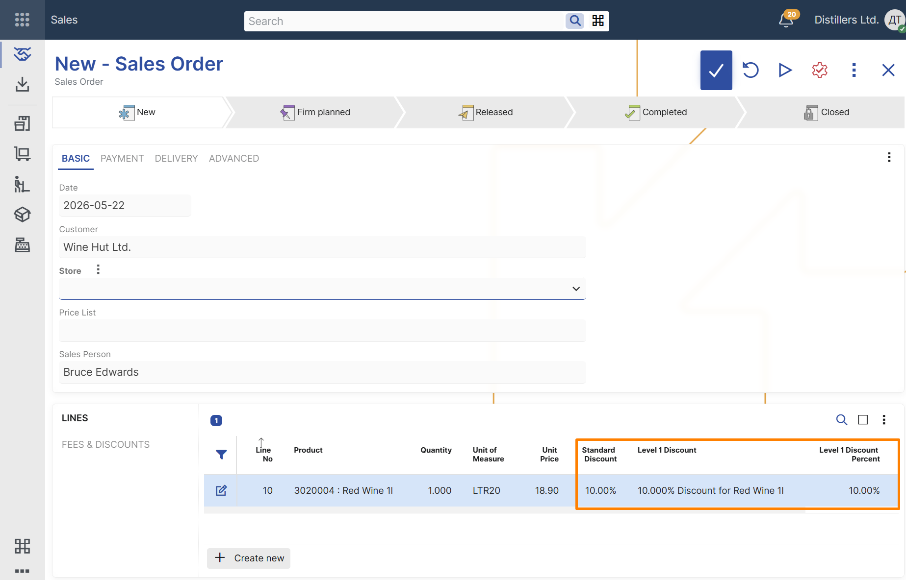

# Create a basic line discount

This example shows how to create a basic line discount and verify that it is applied in a sales order.

## Steps

1. Open the **Pricing** module.  
2. In the **Line Discounts** tile, select the **+** button.

3. In the new line discount record, enter the following:

- **Description** – text that identifies the discount
- **Discount Percent** – the discount percentage to apply
- **Product** – the product for which the discount is defined

4. Save the record.

> [!NOTE]
> **Enterprise Company** is filled in automatically with the current enterprise company.

> [!TIP]
> You can also open the product definition and review the created discount in the **Discounts** panel.

## Verify the result

1. Create a new **Sales Order**.  
2. Select a customer.  
3. Add a line for the same product.  
4. Review the values in the **Level 1 Discount**, **Level 1 Discount Percent**, and **Standard Discount** fields.

The **Level 1 Discount** field should contain a reference to the line discount that was just created.  
The **Level 1 Discount Percent** field should contain the discount percent from the selected line discount.  
The **Standard Discount** field should contain the calculated discount applied to the sales order line.

