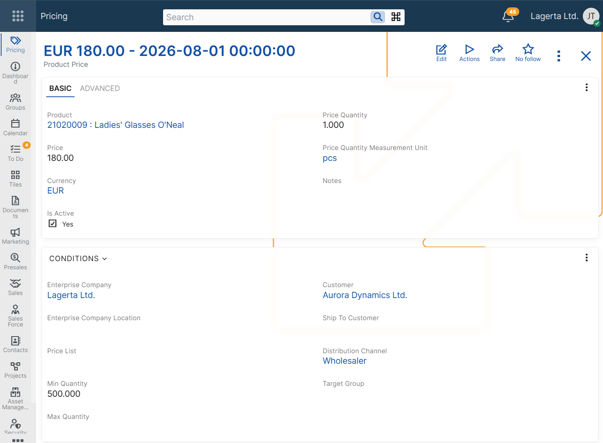
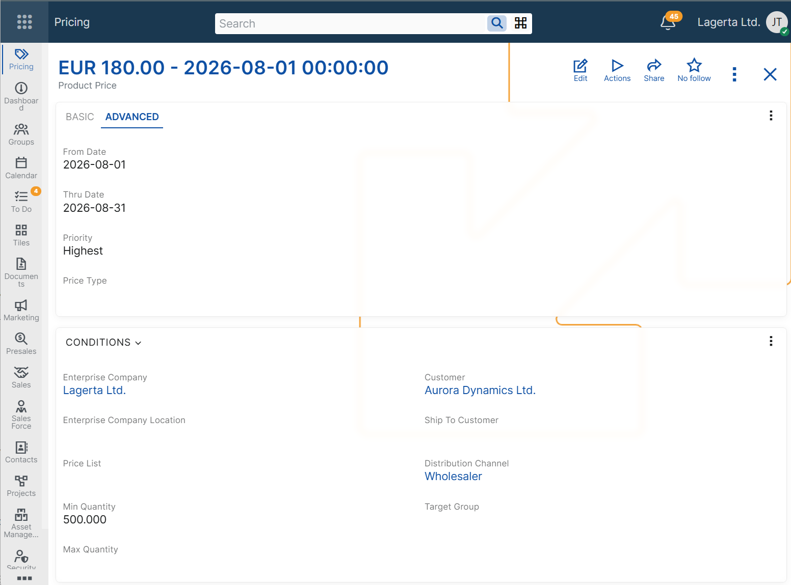

# Configuring product prices

Product prices are configured by defining a product price record and the conditions under which it can be applied.

A product can have multiple product price records at the same time, each with its own applicability conditions. When more than one product price matches the current context, @@name determines the final price according to the [product price determination algorithm](../concepts/determine-product-price.md).

When a sales document line is processed, the system automatically populates the **Product Price** field with the applicable product price record and calculates the **Unit Price** based on it.

## Price definition

A product price record includes the following basic fields:

- **Product**
- **Price**
- **Currency**
- **Price Quantity**
- **Price Quantity Measurement Unit**

These fields define the product being priced, the price amount, the currency, and the quantity and measurement unit for which the price is valid.

The **Price** field stores the price for the configured **Price Quantity** and **Price Quantity Measurement Unit**. When the product price is applied in a sales document line, ERP.net calculates the corresponding **Unit Price** value according to the quantity base defined in the product price and the quantity measurement unit used in the line.

Different product price records can specify, for example:

- 5.00 USD for 1 piece
- 10.00 EUR for 3 packs

If a product price record defines 50.00 EUR for 10 pieces, the resulting **Unit Price** in the sales document line is 5.00 EUR per piece.

## Applicability conditions

In addition to the base price definition fields, a product price record can include applicability condition fields. These fields limit when the price can be considered during sales document processing.

### Customer context

Use these conditions when the price depends on customer-related information in the sales document.

- **Customer** – limits the price to sales documents for a specific customer.
- **Customer Type** – limits the price to sales documents for customers of a specific type.
- **Ship To Customer** – limits the price to sales documents with a specific ship-to customer.
- **Target Group** – limits the price to sales documents for customers in a specific target group.

### Commercial context

Use these conditions when the price depends on the commercial setup of the sales document.

- **Price List** – limits the price to sales documents that use a specific price list.
- **Distribution Channel** – limits the price to sales documents in a specific distribution channel.

### Quantity context

Use these conditions when the price depends on the ordered quantity.

- **Min Quantity** – the minimum quantity in the sales document line for which the price can be considered.
- **Max Quantity** – the maximum quantity in the sales document line for which the price can be considered.

### Organizational context

Use these conditions when the price depends on the organizational context of the sales document.

- **Enterprise Company** – limits the price to sales documents made from a specific enterprise company.
- **Enterprise Company Location** – limits the price to sales documents made from a specific enterprise company location.

### Validity context

Use these conditions when the price must be available only during a specific period or only while the record is enabled.

- **From Date** – limits the price to sales documents whose document date is on or after this date.
- **Thru Date** – limits the price to sales documents whose document date is on or before this date.
- **Active** – indicates whether the product price record is enabled for use.

> [!NOTE]
> A product price record must be unique for its combination of product and pricing context fields, such as price list, customer, ship-to customer, target group, validity period, quantity range, price type, and enterprise company. As a result, ERP.net does not allow duplicate product price records for the same pricing context.

## Priority and price types

When multiple product prices are applicable, @@name uses priority rules to determine which price is selected. Some of these rules are controlled by fields in the product price record.

These fields include:

- **Priority** – ranks applicable prices.
- **Price Type** – adds an additional priority condition.

If a product price record has a defined **Price Type**, it takes precedence over applicable prices without a price type. If more than one applicable price has a defined price type, the product price with the lower **Ordinal Position** of its price type has higher priority.

For more information, see [Price Types](price-types.md) and [Determine product price](../concepts/determine-product-price.md).

## Matching configured conditions

A product price can be considered only when the values in the sales document match the configured applicability conditions.

If a product price record contains multiple applicability conditions, all of them must match for the price to be considered.

For more information about how @@name selects the final price when multiple product prices are applicable, see [Determine product price](../concepts/determine-product-price.html).

## Example scenarios

The following examples show how product prices can be configured for different business needs and how the configured conditions affect the values loaded in the Product Price and Unit Price fields of a sales document line.

> [!NOTE]
> The following examples assume that no other applicable product price with higher precedence exists.

### Price for a specific customer

Use this scenario when a product has a negotiated price for one customer only.

**Example configuration**

**Product Price: Product Price A**  
Product: Product A  
Customer: Customer A  
Price: 48.00  
Currency: EUR  
Price Quantity: 1  
Price Quantity Measurement Unit: pieces  

**Sales document context**  
Customer: Customer A  
Product: Product A  
Quantity: 1  
Quantity Unit: pieces  

**Result**  
Unit Price: 48.00 EUR  
Product Price: Product Price A

### Price by price list

Use this scenario when the same product must have different prices in different price lists.

**Example configuration**

**Product Price: Product Price A**  
Product: Product A  
Price List: Price List A  
Price: 52.00  
Currency: EUR  
Price Quantity: 1  
Price Quantity Measurement Unit: pieces  

**Sales document context**  
Price List: Price List A  
Product: Product A  
Quantity: 1  
Quantity Unit: pieces  

**Result**  
Unit Price: 52.00 EUR  
Product Price: Product Price A

### Price by distribution channel

Use this scenario when the product price depends on the channel through which the sale is made.

**Example configuration**

**Product Price: Product Price A**  
Product: Product A  
Distribution Channel: Distribution Channel A  
Price: 50.00  
Currency: EUR  
Price Quantity: 1  
Price Quantity Measurement Unit: pieces   

**Sales document context**  
Distribution Channel: Distribution Channel A  
Product: Product A  
Quantity: 1  
Quantity Unit: pieces

**Result**  
Unit Price: 50.00 EUR  
Product Price: Product Price A

### Price by quantity range

Use this scenario when the product price depends on the ordered quantity.

**Example configuration**

**Product Price: Product Price A**  
Product: Product A  
Min Quantity: 10  
Max Quantity: 50  
Price: 45.00  
Currency: EUR  
Price Quantity: 1  
Price Quantity Measurement Unit: pieces  

**Sales document context**  
Product: Product A  
Quantity: 12  
Quantity Unit: pieces  

**Result**  
Unit Price: 45.00 EUR  
Product Price: Product Price A

### Price defined for a specific quantity and measurement unit

Use this scenario when the product price is defined for a specific quantity and measurement unit.

**Example configuration**

**Product Price: Product Price A**  
Product: Product A  
Price: 50.00  
Currency: EUR  
Price Quantity: 10  
Price Quantity Measurement Unit: pieces  

**Sales document context**  
Product: Product A  
Quantity: 20  
Quantity Unit: pieces  

**Result**  
Unit Price: 5.00 EUR  
Product Price: Product Price A

### Time-limited price

Use this scenario when a product price must be valid only during a specific period.

**Example configuration**

**Product Price: Product Price A**  
Product: Product A  
From Date: 2026-06-01  
Thru Date: 2026-06-30  
Price: 47.00  
Currency: EUR  
Price Quantity: 1  
Price Quantity Measurement Unit: pieces  

**Sales document context**  
Document Date: 2026-06-15  
Product: Product A  
Quantity: 1  
Quantity Unit: pieces  

**Result**  
Unit Price: 47.00 EUR  
Product Price: Product Price A

### Price with combined conditions

Use this scenario when a product price must apply in a more specific business context.

**Example configuration**

**Product Price: Product Price A**  
Product: Product A  
Customer: Customer A  
Distribution Channel: Distribution Channel A  
Min Quantity: 10  
Price: 44.00  
Currency: EUR  
Price Quantity: 1  
Price Quantity Measurement Unit: pieces  

**Sales document context**  
Customer: Customer A  
Distribution Channel: Distribution Channel A  
Product: Product A  
Quantity: 12  
Quantity Unit: pieces  

**Result**  
Unit Price: 44.00 EUR  
Product Price: Product Price A

## Negative examples

The following examples show cases in which a product price is not considered because the sales order context does not match the configured applicability conditions.

### Customer mismatch

This scenario shows that a customer-specific product price is not considered for a different customer.

**Example configuration**

**Product Price: Product Price A**  
Product: Product A  
Customer: Customer A  
Price: 48.00  
Currency: EUR  
Price Quantity: 1  
Price Quantity Measurement Unit: pieces  

**Sales document context**  
Customer: Customer B  
Product: Product A  
Quantity: 1  
Quantity Unit: pieces  

**Result**  
This product price is not considered.

### Quantity outside range

This scenario shows that a quantity-based product price is not considered when the ordered quantity is outside the configured range.

**Example configuration**

**Product Price: Product Price A**  
Product: Product A  
Min Quantity: 10  
Max Quantity: 50  
Price: 45.00  
Currency: EUR  
Price Quantity: 1  
Price Quantity Measurement Unit: pieces  

**Sales document context**  
Product: Product A  
Quantity: 5  
Quantity Unit: pieces  

**Result**  
This product price is not considered.

## Related configuration

In addition to the product price record itself, product price configuration can also depend on related pricing components.

- **[Price Types](price-types.md)** – define an additional priority condition used when more than one product price is applicable.
- **[Price Lists](price-lists.md)** – define reusable pricing groupings for different commercial contexts.
