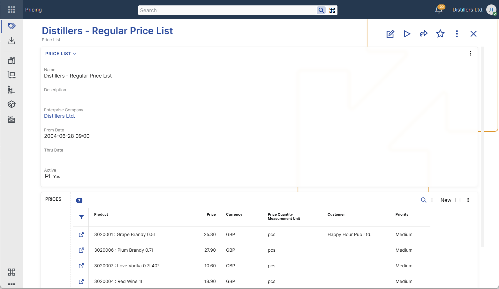

# Price Lists

Price lists are defined in **Pricing** → **Price Lists** in the **Set Up** section.

A price list is used as an applicability condition for product prices in sales documents.  
A product price can reference a specific price list, and that price can then be considered only when the same price list is used in the sales document.

The main settings of a price list define:
- its name and description;
- whether it is active;
- the period in which it is valid;
- whether it is limited to a specific enterprise company.

The configuration of a price list defines when it is available for use in sales documents. A price list is available for selection in the **Price List** field only when it is active, valid for the document date, and assigned to the same enterprise company as the sales document.

A price list can also be used to maintain related product prices.  
In the **Prices** panel, users can add, review, and edit the product prices assigned to the list without opening each product price record separately.

> [!note]
> The **Prices** panel is convenient for quick maintenance and review. For larger sets of records, it is usually more practical to use the **Product Prices** navigator filtered by price list.

For an overview of product price applicability conditions, including price lists, see [Configuring product prices](../index.md).

For more information about how ERP.net selects the final price when multiple product prices are applicable, see [Determine product price](../concepts/determine-product-price.md).

