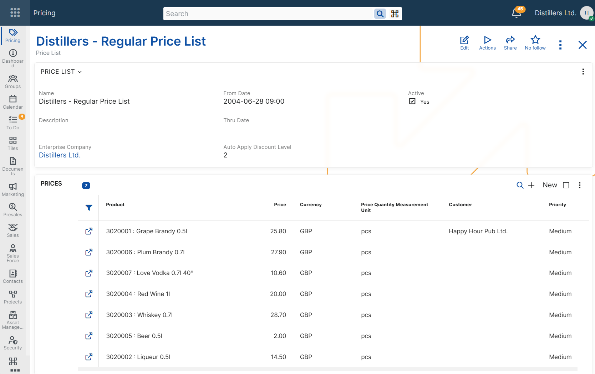

# Price Lists

Price lists are defined in **Pricing** → **Price Lists** in the **Set Up** section.

A product price can reference a specific price list, which is then used as an applicability condition during price determination.

**For example**:  
*A company can define separate price lists for **Retail**, **Wholesale**, or **Seasonal Campaigns** to organize product prices for different commercial conditions.*

The main settings of a price list define:
- its name and description;
- whether it is active;
- the period in which it is valid;
- whether it is limited to a specific enterprise company
- the maximum line discount level that @@name applies automatically in sales orders.
  
## Availability in sales documents

The configuration of a price list defines when it is available for use in sales documents. 

A price list is available for selection in the **Price List** field only when it is active, valid for the document date, and assigned to the same enterprise company as the sales document.

## Automatic line discount application

A price list also controls how many line discount levels @@name can apply automatically in sales orders.

The **Auto Apply Discount Level** setting defines the maximum discount level that @@name can apply automatically when this price list is selected in a sales order.

Level 1 discounts are always calculated. Level 2 and level 3 discounts can be applied automatically only when the selected price list allows this.

For more information about how discount levels work together, see [Multi-level line discounts](../../line-discounts/concepts/multi-level-line-discounts.md).

## Maintaining related product prices

A price list can also be used to maintain related product prices.  
In the **Prices** panel, users can add, review, and edit the product prices assigned to the list without opening each product price record separately.

> [!note]
> The **Prices** panel is convenient for quick maintenance and review. For larger sets of records, it is usually more practical to use the **Product Prices** navigator filtered by price list.

For an overview of product price applicability conditions, including price lists, see [Configuring product prices](../index.md).

For more information about how @@name selects the final price when multiple product prices are applicable, see [Determine product price](../concepts/determine-product-price.md).

