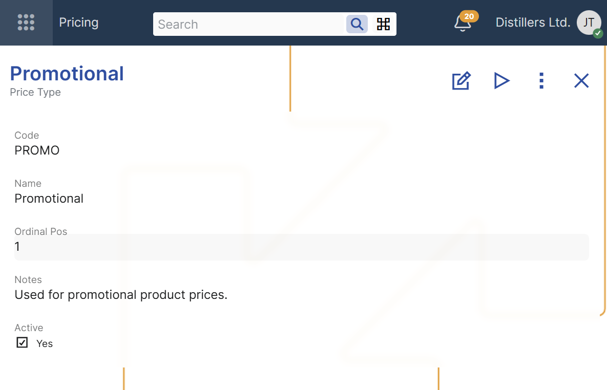

# Price Types

Price types are defined in **Pricing** → **Price Types** in the **Set Up** section.

A price type is used to add an additional priority layer to product prices.  
When multiple product prices are applicable in the same sales context, the price type helps determine which one has higher priority.

The main settings of a price type define:
- its code and name;
- its position relative to other price types;
- whether it is active.

The **Ordinal Position** field defines the priority of the price type relative to the other price types.  
A lower value means a higher priority.

When applicable product prices have different price types, the price with the higher-priority price type is preferred.

**For example**:
A company can define price types such as Regular, Promotional, and Special, and assign different Ordinal Positions to distinguish which type of price should take precedence in a given commercial context.

For an overview of product price applicability conditions, including price types, see [Configuring product prices](../index.md).

For more information about how ERP.net selects the final price when multiple product prices are applicable, see [Determine product price](../concepts/determine-product-price.md).

