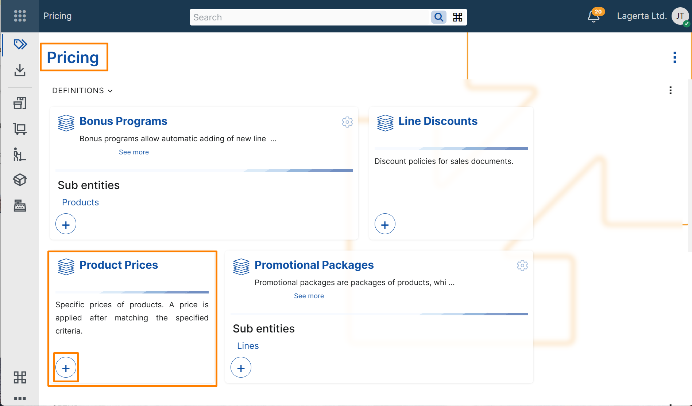
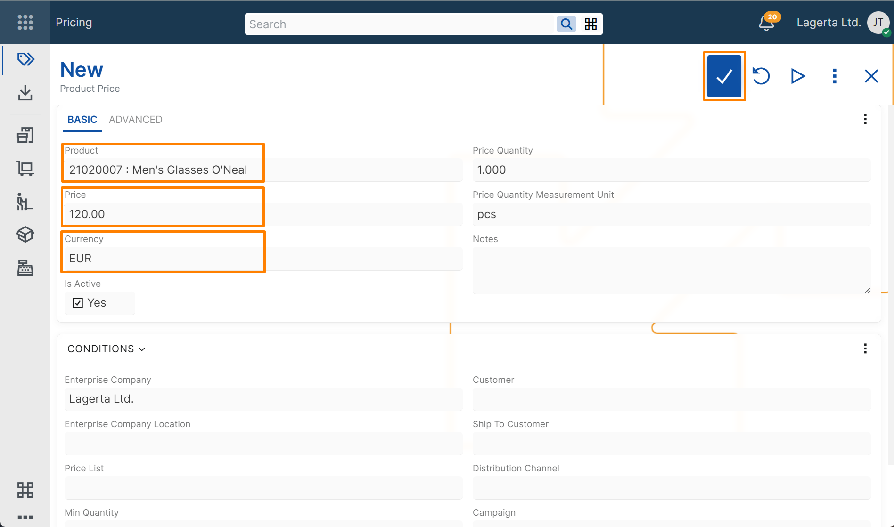
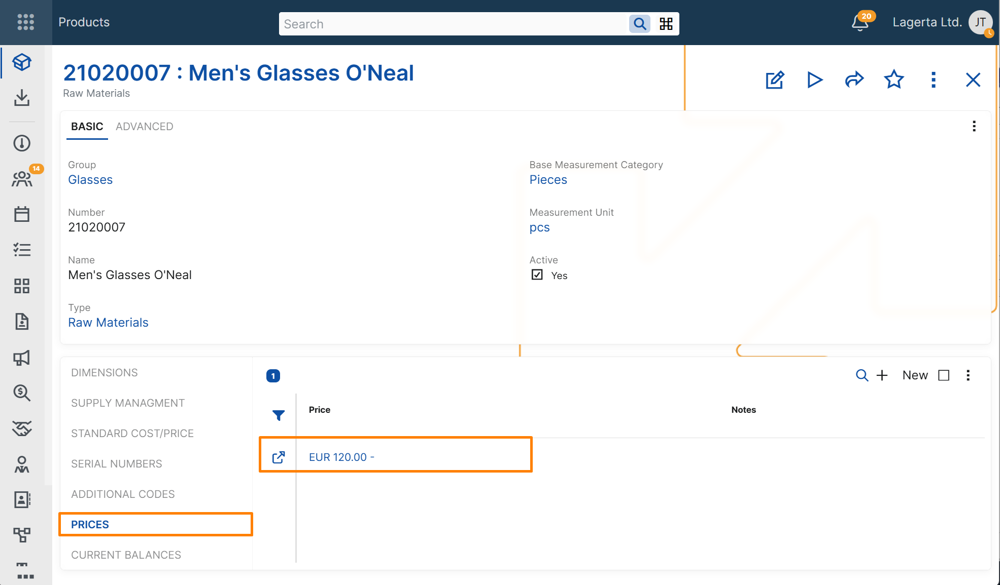
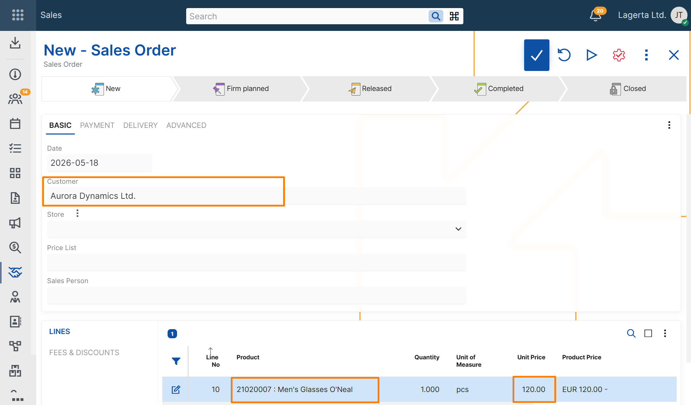

# Create a basic product price

This example shows how to create a basic product price and verify that it is applied in a sales order.

## Steps

1. Open the **Pricing** module.
2. In the **Product Prices** tile, select **+** button.

4. In the new product price record, enter the following:
   - **Product** – the product to which the price applies
   - **Price** – the sales price amount
   - **Currency** – the currency in which the price is defined

> [!NOTE]
> By default, the product price is defined for a quantity of `1` in the product's default measurement unit. **Enterprise Company** is filled in automatically with the current enterprise company.

4. Save the record.

> [!TIP]
> You can also open the product definition and review the created price in the **Prices** panel.

## Verify the result

1. Create a new **Sales Order**.
2. Select a customer.
3. Add a line for the same product.
4. Review the value in **Unit Price** field.

The **Unit Price** should be filled in with the price from the product price record.

> [!TIP]
> In the sales order line, the price loaded in **Unit Price** can also be traced through the **Product Price** field. This field refers to the product price definition from which the value was loaded.

