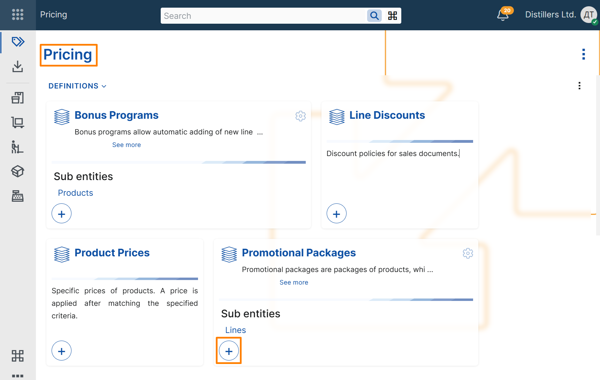
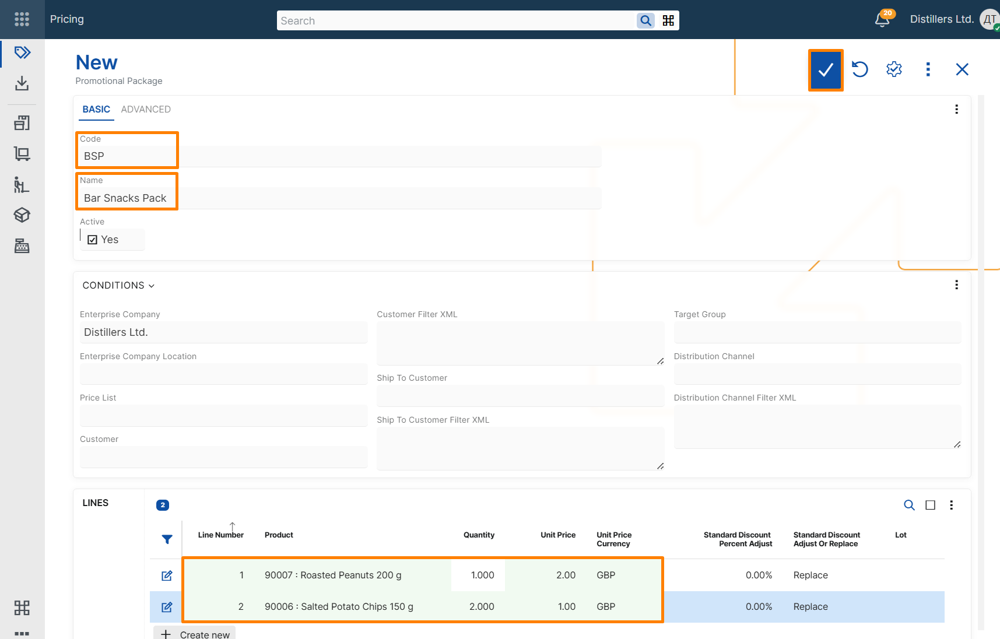
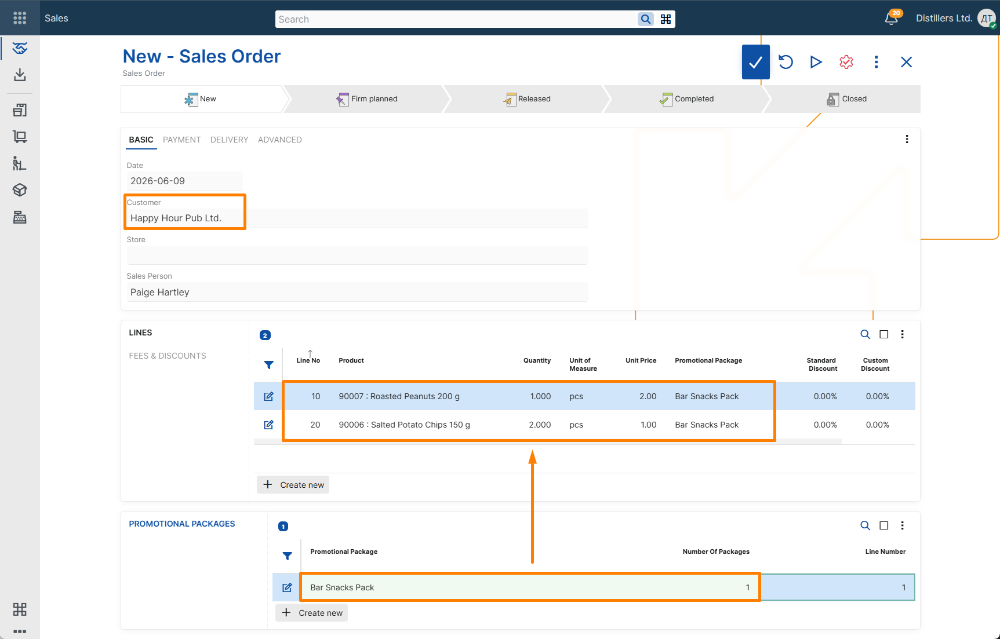

# Create a basic promotional package

This example shows how to create a basic promotional package and verify that its products, quantities, and unit prices are applied in a sales order.

When the package is applied in a sales order, @@name adds the package products as separate sales order lines.

## Steps

1. Open the **Pricing** module.  
2. In the **Promotional Packages** tile, select the **+** button.

3. In the header of the new promotional package record, enter the following:

- **Code** – unique identifier of the promotional package.
- **Name** – descriptive name of the promotional package.

> [!NOTE]
> **Enterprise Company** is filled in automatically with the current enterprise company.

4. Add two package lines.

For each line, specify:

- **Product** – product included in the promotional package.
- **Quantity** – quantity of the product included in one package.
- **Unit Price** – unit price to be applied for the product.
- **Unit Price Currency** – currency of the specified unit price.

5. Save the record.

The package is now ready to be applied in a sales order where its conditions are met.

## Apply the package in a sales order

1. Create a new **Sales Order**.  
2. Select a customer.  
3. In the **Promotional Packages** panel:
   - in the **Promotional Package** field, select the newly created promotional package;
   - in the **Number Of Packages** field, specify how many times the package must be applied in the document.

## Verify the result

When the package is applied:

- the package products are added as separate sales order lines;
- the quantity in each generated line is calculated according to the package line quantity and the number of packages;
- the unit price in each generated line is taken from the corresponding package line.

The **Promotional Package** field in the generated lines contains a reference to the promotional package.

