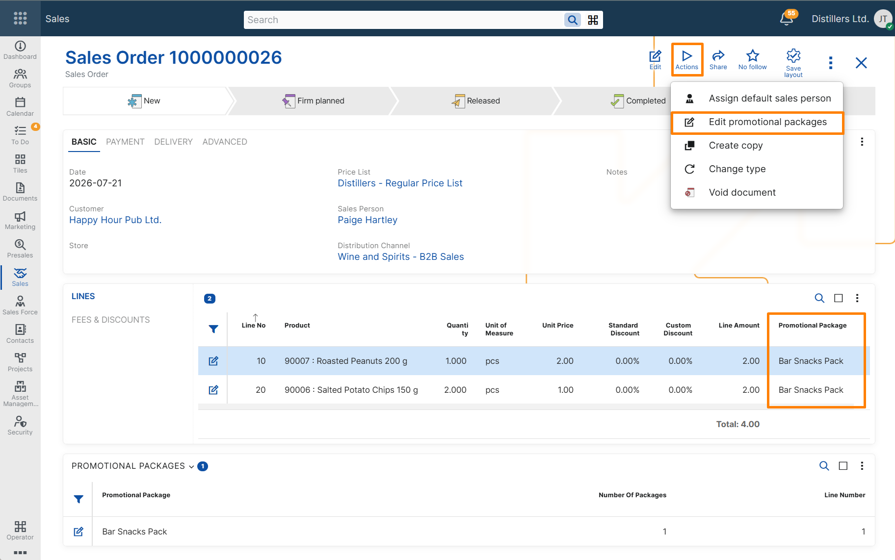

# Edit promotional packages

The **Edit promotional packages** function removes the association between sales order lines added from promotional packages and their package definitions.

The products and quantities remain in the sales order, but the resulting lines are no longer controlled by the promotional packages. They can then be edited as regular sales order lines.

Use the function when a promotional package provides a suitable initial combination of products and quantities, but the customer wants to modify that combination — for example, by replacing a product, changing a quantity, removing a product, or adding other products.

> [!IMPORTANT]
> The function processes all promotional packages represented in the sales order lines. It cannot be used to detach only one selected promotional package.
>

## Run the Edit promotional packages function

1. Open the sales order containing the promotional package lines.
2. Run the **Edit promotional packages** function.
3. Confirm the operation.
4. Edit the resulting sales order lines as required.
5. Review the recalculated prices, discounts, and document totals.
6. Save the sales order.

## Result

After the function is executed:

- the products and quantities originating from the promotional packages remain unchanged in the sales order;
- the **Promotional Package** references are removed from the sales order lines;
- the **Number Of Packages** value is set to `0` for the promotional packages represented in the sales order lines;
- the promotional package prices and discount adjustments no longer apply;
- product prices and unit prices are redetermined for all sales order lines according to the current sales order context;
- applicable line discounts are redetermined according to the current sales order conditions;
- the entire sales order is recalculated, including its line amounts and document totals;
- the detached lines can be edited as regular sales order lines.

> [!IMPORTANT]
> Product prices and unit prices are redetermined for all sales order lines, including lines that did not originate from a promotional package. Review the recalculated prices, discounts, and document totals before saving the sales order.

## Example

A customer selects a promotional package containing:

| Product   | Quantity | Promotional package |
|---------  |---------:|---------------------|
| Product A | 1        | Package A           |
| Product B | 2        | Package A           |

The customer then asks to replace Product B with Product C.

The existing package lines cannot be freely changed while they remain linked to Package A because @@name keeps them synchronized with the promotional package definition.

After **Edit promotional packages** is executed:

| Product       | Quantity | Promotional package |
|-------------- |--------: |-------------------- |
| Product A     | 1        | Not set             |
| Product B     | 2        | Not set             |

The products and quantities initially remain unchanged, but the package references are removed. The user can then:

1. remove Product B;
2. add Product C;
3. change the required quantities;
4. review the newly determined standard prices and discounts;
5. save the sales order.

The resulting lines are regular sales order lines and no longer represent Package A.

## When not to use the function

Do not use the function when:

- the promotional package must remain identifiable in the sales order;
- the package-defined prices and discount adjustments must remain in effect;
- the sales order lines must continue to follow the promotional package definition;
- only one of several promotional packages in the sales order must be detached.

## Related topics

- [Apply promotional packages](../concepts/apply-promotional-packages.md)
- [Determine product price](../../product-prices/concepts/determine-product-price.md)
- [Determine line discount](../../line-discounts/concepts/determine-line-discount.md)
- [Create a basic promotional package](../create-basic-promotional-package.md)
