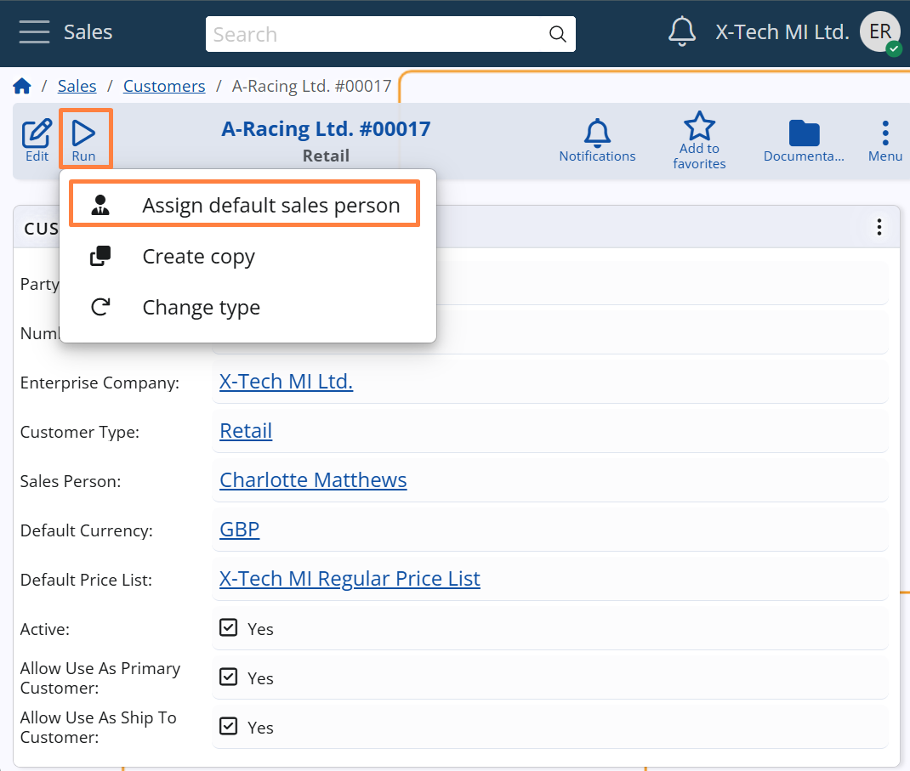

# Customers  

## Assignment logic  
Sales Person assignment is automatically triggered whenever a **Customer** record is saved, and the *Sales Person* field is empty.  
This allows the system to assign each customer to the most appropriate sales representative based on key customer attributes.  

The logic follows these main steps:  

### 1. Triggering rule evaluation  
Assignment Rules are automatically evaluated when the Customer is saved and the following condition is met:  

- The *Sales Person* field is empty  

### 2. Rule evaluation  
The system evaluates all **active Sales Person Assignment Rules** that are configured to **apply to customers**, based on the following conditions:  

- The rule must be active on the current date (i.e., today must fall between the rule’s *From Date* and *To Date*, if defined).  
- The *Enterprise Company* specified in the rule must be the same as in the customer record.  
- The following fields in the rule must either match the values related to the customer or be left unspecified:  
  - *Customer Type* – as defined in the Customer (*Customer Type* field)   
  - *Sales Area* – as defined in the Customer’s Party (*Area* field)  

If multiple rules match:  
- The one with the **highest Priority** is selected.  
- If multiple rules share the same priority, the rule with the **highest Rule No** takes precedence.  

### 3. Assignment execution  
Once the best-matching rule is identified, the system automatically assigns the corresponding **Sales Person** to the customer record.  

If a *Sales Person* is already assigned, the assignment remains unchanged.

## Manual assignment via UI function  

The Customer form includes a UI function called **Assign Default Sales Person**, available from the **Run** button menu.   

This function allows users to manually apply the same assignment logic described above, even when a *Sales Person* is already selected.  
It evaluates the current customer data and, if a matching rule is found, replaces the existing Sales Person with the one specified in the rule.  

This is particularly useful when assignment rules are introduced or modified after customer records have been created, allowing users to align existing assignments with the updated logic.  

> [!NOTE]  
> The function is disabled while the customer is in edit mode.

