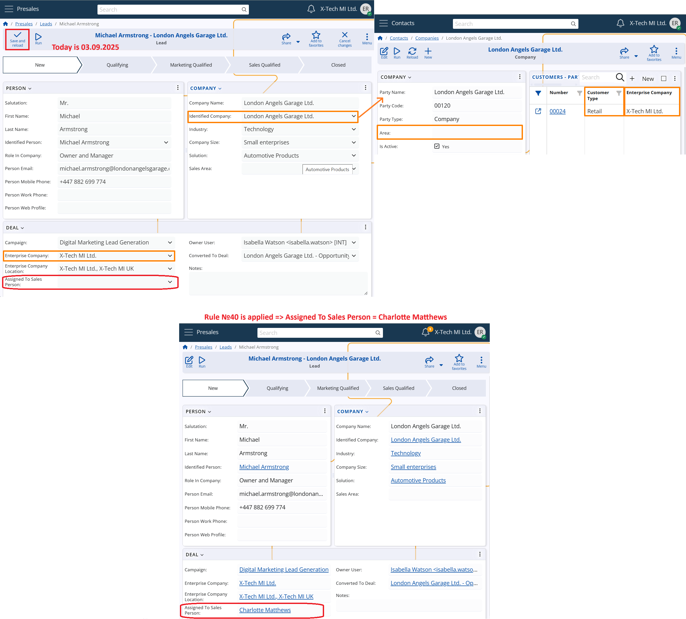
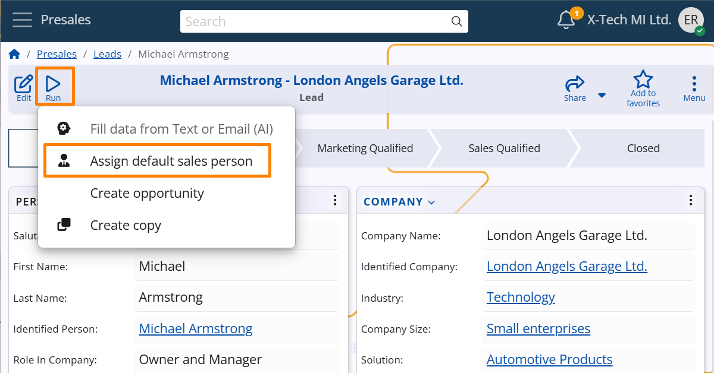

# Leads  

## Assignment logic 
Sales Person assignment is automatically triggered whenever a **Lead** is saved and the *Assigned To Sales Person* field is empty.  
This allows the system to assign each lead to the most appropriate sales representative, based on the relationship with a known company and its customer profile.  

The logic follows these main steps:  

### 1. Triggering rule evaluation  
Assignment Rules are automatically evaluated when the Lead is saved and **all** of the following conditions are met:  

- The *Assigned To Sales Person* field is empty  
- An *Identified Company* is selected in the Lead  
- The *Identified Company* has a defined Customer record for the same Enterprise Company as the Lead  

### 2. Rule evaluation  
The system evaluates all **active Sales Person Assignment Rules** that are configured to **apply to customers**, based on the following conditions:  

- The rule must be active on the current date (i.e., today must fall between the rule’s *From Date* and *To Date*, if defined).  
- The *Enterprise Company* specified in the rule must be the same as in the Lead.  
- The following fields in the rule must either match the values defined in the related Customer record or be left unspecified:  
  - *Customer Type* – as defined in the Customer (*Customer Type* field)   
  - *Sales Area* – as defined in the Customer’s Party (*Area* field)    

If multiple rules match:  
- The one with the **highest Priority** is selected.  
- If multiple rules share the same priority, the rule with the **highest Rule No** takes precedence.  

### 3. Assignment execution  
Once the best-matching rule is identified, the system automatically assigns the corresponding **Sales Person** to the Lead.  

If a *Sales Person* has already been entered in the *Assigned To Sales Person* field, no automatic assignment is performed.  

## Manual assignment via UI function  

The Lead form includes a UI function called **Assign Default Sales Person**, available from the **Run** menu of the record.  

This function allows users to manually apply the same assignment logic described above, even when a *Sales Person* is already selected.  

It performs the following validation before proceeding:  

- It checks that an *Identified Company* is selected.  
- It confirms that this company has a defined Customer record for the same Enterprise Company as the Lead.  

If these conditions are met, the user is prompted to confirm the reassignment. Upon confirmation, the system evaluates the applicable rules and updates the *Assigned To Sales Person* field accordingly.  

This is useful when rules are introduced or changed after the lead has been created, allowing updates to reflect current logic.  

> [!NOTE]  
> The function is disabled while the lead is in edit mode or when it is already closed.
>

