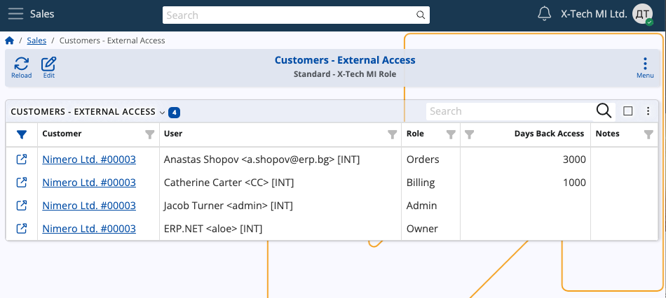
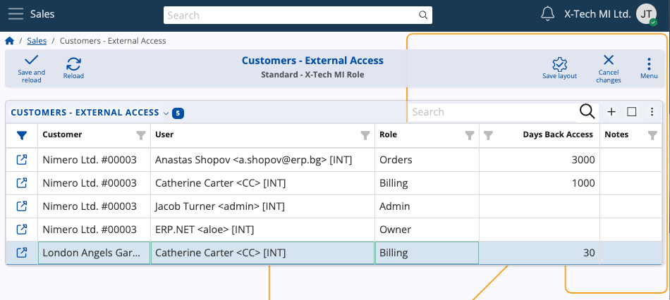

# External Access

The External Access table is responsible for granting external and internal users permissions to **specific customer data**.

In the case of the **[Client Center](../crm/clientcenter/index.md)**, it allows customers' users to see exactly what they need once they log into the platform. 

### Columns

The table consists of the following columns:

- **Customer** - The **[customer](index.md)** whose data will be accessed.
- **User** - The user to whom the access will be granted.
- **Role** - The role of the user, which defines the granted access.
- **Days Back Access** - The maximum number of past days the user is allowed to view the data.
  
  If left empty, it assumes unlimited.

- **Notes** - Optional notes for the external access.

### Roles

A user can be assigned one of 6 different roles for external customer access:

1. **L10 - Basic** - Allows basic rights, with mostly limited access.
2. **L20 - Orders** - Grants access to sales orders, excluding lines and price data.
3. **L30 - Orders with Prices** - Provides access to sales orders and all of their details.
4. **L40 - Billing** - Gives access to billing-related documents, such as due payments, invoices and payment history.
5. **L80 - Admin** - Ensures full access to all customer data. 
6. **L90 - Owner** - The same as Admin. Once assigned, Owner access cannot be revoked by anyone, including Admins.

## Grant access

To give permissions to a user, you need to insert a new entry into the table and fill out the respective fields.

Once saved, these settings can always be changed later.
