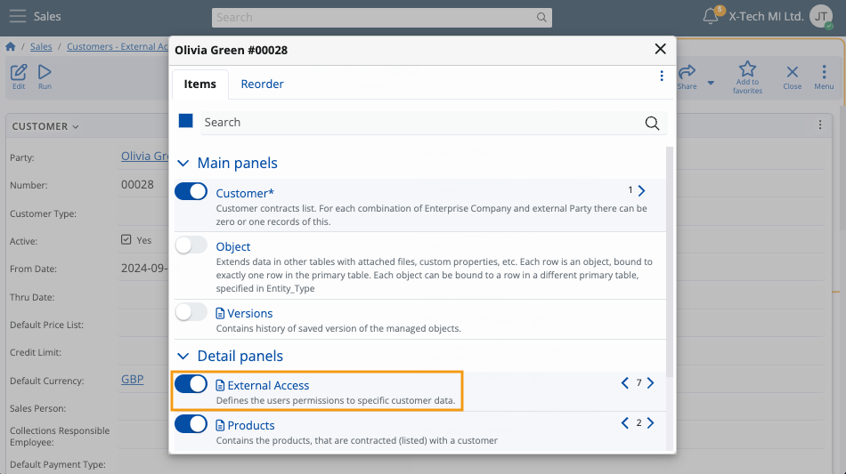
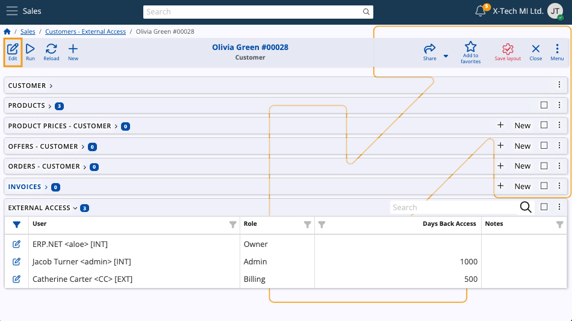
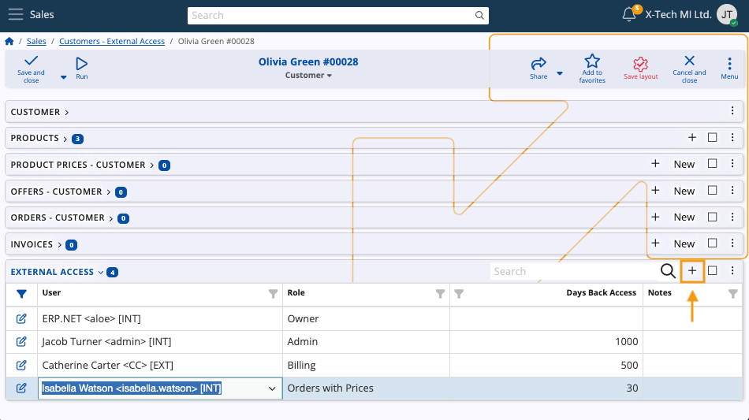
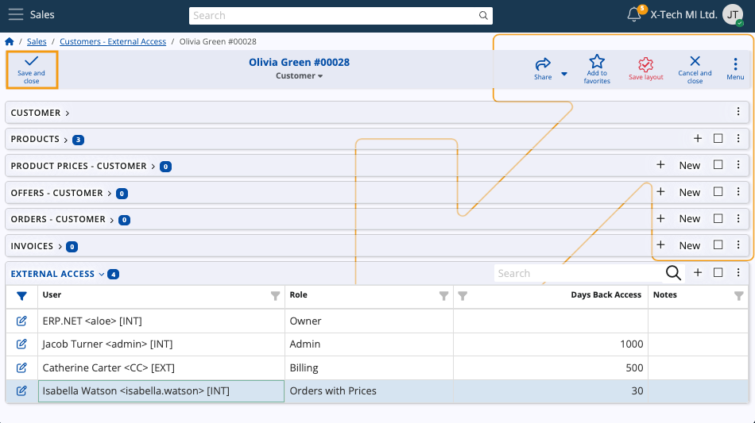

# External Access

The **External Access** table lists all users who have access to specific **[customers](https://docs.erp.net/tech/modules/crm/sales/customers/index.html)** in the **[Client Center](https://docs.erp.net/tech/modules/crm/clientcenter/index.html)**.

It also offers a way of setting up new users and defining their access for different customers in the Client Center.

### Interface

The table consists of the following columns:

- **Customer** - The customer whose data is accessible to the user.
- **User** - The user account to whom the access is granted.
- **Role** - The **[external access role](https://docs.erp.net/tech/modules/crm/clientcenter/index.html#role-based-access)** of the user, which defines the level of granted access.
- **Days Back Access** - The maximum number of past days the user is allowed to view data (e.g. sales order records).
  
  If left empty, it assumes unlimited.

- **Notes** - Optional notes for the external access.

### Roles

A user can have one of 6 different roles for external customer access. 

Each subsequent role in the list below also includes the rights granted by the previous.

1. **L10 - Basic** - Provides basic access.
2. **L20 - Orders** - Grants access to sales orders, excluding Price, Discount and Amount. 
3. **L30 - Orders with Prices** - Provides access to sales orders and all of their details.
4. **L40 - Billing** - Gives access to billing-related documents, such as due payments, invoices and payment history.
5. **L80 - Admin** - Ensures full access to all customer data. 
6. **L90 - Owner** - The same as Admin. Once assigned, Owner access cannot be revoked by anyone, including Admins.

> [!NOTE]
>
> A tabular breakdown of external access roles can be found in the **[Client Center documentation](https://docs.erp.net/tech/modules/crm/clientcenter/index.html#role-based-access)**.

## Grant and edit access

The External Access table allows you to define new users, as well as modify and remove existing ones.

To do so:

1. Select a customer from the table and reveal the **External Access** panel from the **Customize Form** option of the main customer form.

   

2. Click the **Edit button** of the form to enable editing within the **External Access** panel.

   

3. To add a new user for the customer, click the **+ button** and fill out the respective **User**, **Role** and **Days Back Access** fields.

   

4. To change the details of an existing user, simply click the **pen button** to the left of their name and proceed to insert your edits.

   

5. Clicking **Save and close** will apply all changes and/or additions for the customer.

    

   To enable **[multi-customer login in the Client Center](https://docs.erp.net/tech/modules/crm/clientcenter/index.html#multi-customer-login)** for the same user, repeat all steps above for another customer of your choice.

> [!TIP]
> 
> A faster way of adding new users and defining their access level to a Client Center is described **[in the following guide](https://docs.erp.net/tech/modules/crm/clientcenter/how-to/setup-a-new-user-account-v26.html)**.

> [!NOTE]
> 
> The screenshots taken for this article are from v26 of the platform.
