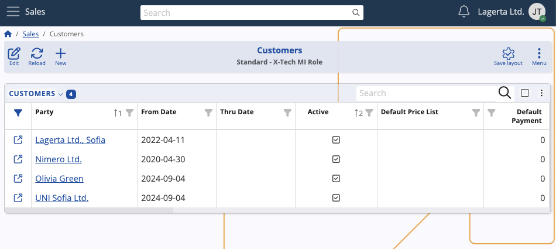
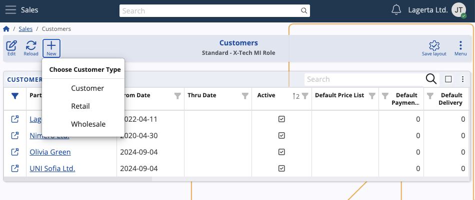
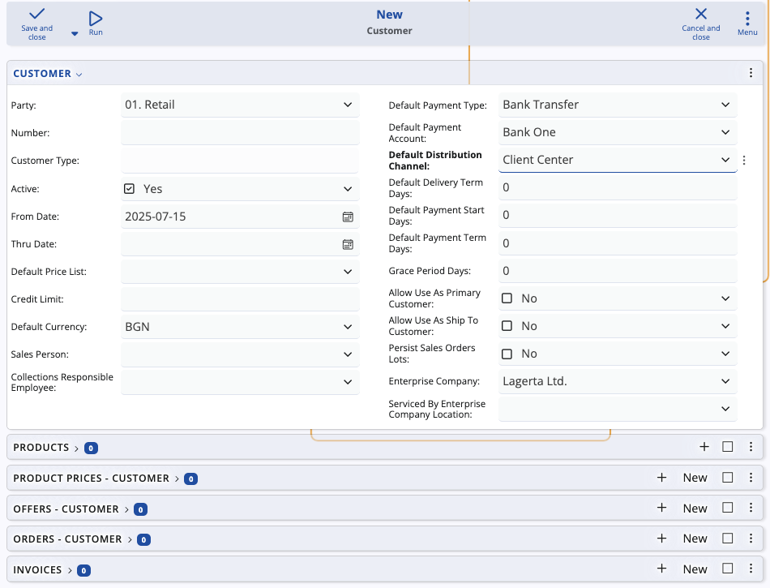

# Customers

A customer is considered an external party that purchases goods or services from an organization. Each customer record plays a central role in sales, invoicing, fulfillment, and financial reporting processes.

In ERP.net, the **Customers table** displays all of your customer records in a structured format. 

### Details

The table provides a comprehensive view of each customer's profile in your organization. 

For every customer record, you can see their **financial setup**, including which default price list they use, their standard payment method and account, and their assigned currency for transactions. 

The table also displays **operational details** such as default delivery terms, **distribution channels**, credit limits, and which sales person and collections employee are responsible for managing their account.

## Create a new customer

To add a new customer, click the **New** button. 

The system allows you to select a customer type directly from here: **Customer**, **Retail**, and **Wholesale**.

Creating a new customer involves setting up their identification, financial and operational defaults, system permissions, and enterprise assignments for immediate use in sales processing.

It also involves adding **products**, **prices** and other entities contracted with them.

For more information, please refer to **[How to define a customer](modules/crm/sales/definitions/define-customers.md)**.

