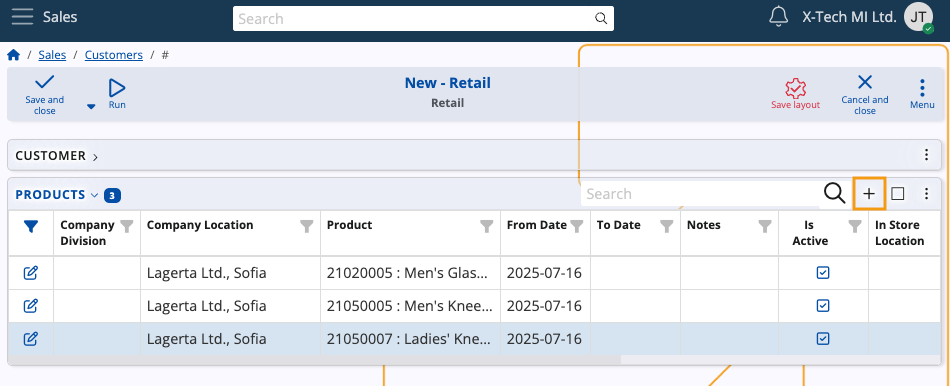

# Customer definition

For the purposes of creating a sales order, you must define and manage **Customers** to whom you'll be selling your products. 

This involves adding various details about them which you can later make use of while creating the order.

Below is a step-by-step guide on how to define Customers and configure their settings.

### Navigation

From the **[CRM](https://docs.erp.net/tech/modules/crm/index.html)** module, click on **[Common](https://docs.erp.net/tech/modules/crm/crm-common/index.html)**. 

There, you'll find the **Customers** panel, where you can view all of the Customers you have created, with details about each.

> [!NOTE]
> 
> As of ERP.net v.26, Customers can be found in the **[Sales](https://docs.erp.net/tech/modules/crm/sales/index.html)** module.
 
## Set up 

Before you can actually create a Customer, it's necessary to set up a **[party](https://docs.erp.net/tech/concepts/parties-concepts.html?q=party)**, representing an entity not yet designated as a Customer but recognized by the system as an entitiy that participates in business relations or transactions.

Prior to Customer creation, you can also consider adding a **Customer type**, which can help organize Customers based on common characteristics.

> [!NOTE]
> 
> The type you define can impact the Customer creation process, potentially adding different fields for you to fill out.

## Create a Customer 

There are **two** ways to create a Customer,  both ensuring consistency in the final result when selecting the same Customer type.

1. Navigate to the **Create** section within the **Customers** panel. Here, you'll find a list of various **Customer types**.

   Upon selecting the respective type, a separate window will open, automatically reflecting the chosen Customer type.

   You can proceed with the creation process by filling out the rest of the details.

 
2. Use the **New** button found above the **Customers** list. Upon clicking this button, you can select a **Customer type** from a dropdown menu.
  
   Then, you will be taken to the standard Customer creation form and proceed to add the necessary details.

### New Customer details
 
Once you access the **New Customer** window, you can start adding all the necessary details for your Customer, such as the price list they will use, the payment terms under which they will work, their credit limit, sales representative, and a preferred **[distribution channel](https://docs.erp.net/tech/modules/crm/marketing/distribution-channels/index.html)**.

Most of the fields are optional. However, the more you fill out now, the more will **automatically** be added in the sales order creation form where this Customer is selected.

 
The only mandatory field is **Party**. 

Once you've filled out all the desired fields, click the **Save and reload** button to complete the creation of the new Customer.

 
#### Most common fields 

Here's a list of commonly used fields:

-	**Active** – This checkbox allows you to **enable** or **disable** a Customer. When unchecked, the Customer will no longer be visible in various places on the platform.

-	**From Date/Thru Date** – You can specify the start and end dates of the sales contract.

-	**Credit Limit**– If a sale has been made for a certain amount but payment has not been issued, the system will notify you that the Customer has exceeded their credit limit.

- **Default Distribution Channel** - A Customer can have a preferred pathway through which their products will be delivered.

- **Customer Status** – You have two options for selling:

- If you're shipping directly to the Customer that placed the order, check the **Allow Use As Primary Customer** box. 

- If you've made a sale to one Customer but are shipping products to another, check the **Allow Use As Ship To Customer** box.

> [!NOTE]
> 
> The **Credit Limit** field value can be overridden by authorized users.

#### Assign defaults 

Fields starting with "Default" allow you to specify template information for Customers. 

For example, if the **Default Currency** is set to BGN, all sales with that Customer will be automatically conducted in that currency. 

You have the ability to **modify** each default value when creating the sales order itself.

## Customer products

A Customer can have products negotiated specifically for them. They can be added directly in the document lines of a sales order or through the dedicated **[Customer products](https://docs.erp.net/webclient/introduction/how-to/functional-panels/customer-products.html)** functional panel, as well as in the lines of a sales order created through the **[Client Center](https://docs.erp.net/tech/modules/crm/clientcenter/index.html)**.

To add products for a Customer, you need to enable the hidden **Products** detail panel through the **Customize form** feature.

Then, you can proceed to add as many products as needed.

> [!NOTE]
> 
> The screenshots taken for this article are from v24 and v26 of the platform.
