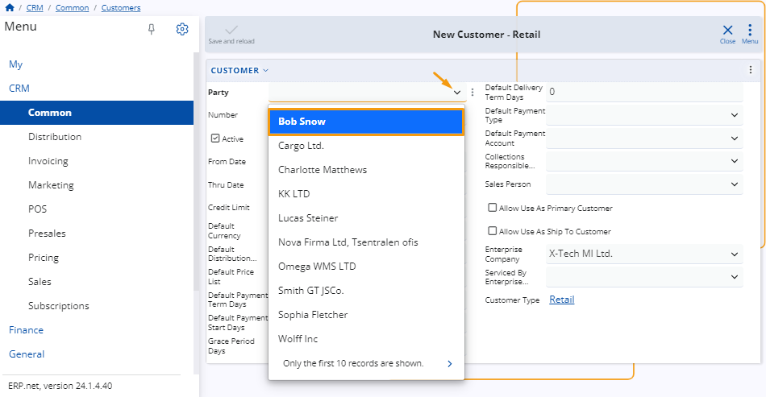
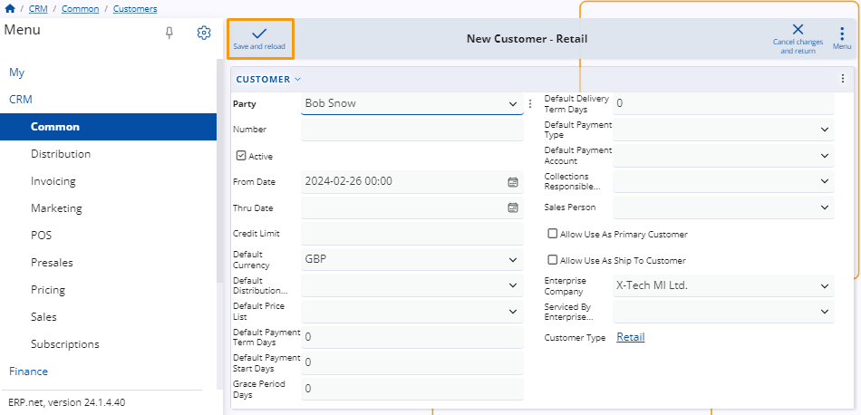

# Customer definition

For the purposes of creating a sales order, you must define and manage **customers** to whom you'll be selling your products. 

This involves adding various details about them which you can later make use of while creating the order.

Below is a step-by-step guide on how to define customers and configure their settings.

### Navigation

From the **CRM** module, click on **Common**. 

There, you'll find the **Customers** panel, where you can view all of the customers you have created, with details about each.

 
## Set up 

Before initiating the creation of a **Customer**, it's necessary to set up a **Party**, representing an entity not yet designated as a **Customer** but recognized as a company within the system.

Prior to customer creation, consider establishing a **Customer Type**. This classification helps organize customers based on their parameters.

> [!NOTE]
> The **Customer Type** you define can impact the customer creation process, potentially resulting in variations in the fields you can populate.

## Create a Customer 

There are two pathways available for creating a customer. Regardless of which path you choose, if you select the same **Customer Type**, the creation page will remain identical, ensuring consistency in the final result.

In the first method, you navigate to the **Create** section within the Customer panel, where you'll encounter a list of various **Document Types**. 

Upon selecting a **Document Type**, a window will open, which allows you to proceed with the creation process tailored to the chosen **Document Type**.

 
The second approach entails using the New button located on the **Customers** table. Clicking this button will display a menu containing various **Document Types**. 

After selecting a **Document** type from the menu, window will appear, enabling you to create this specific type of customer. 

 
Once you access the window, you can input the desired information into the fields and checkboxes. 

Filling out these fields now will streamline the process when executing a **Sales Order**, as the customer information you provide here will be automatically populated in the **Sales Order** form, saving you time.

 
The only mandatory field is **Party**. Once you select one from the list, you can create the new customer without filling out any other information.

Once you've filled out all the desired fields, click the **Save and Reload** button to complete the creation of a new customer.

 
#### Most common Fields 

Here's a brief overview highlighting the essential fields, which are frequently utilized, alongside the less common ones.

•	**Party** – In this field, select the previously created party that you wish to designate as a customer.

•	**Active** – This checkbox allows you to activate or deactivate a Customer. When unchecked, the customer will no longer be visible in various lists across the platform, such as in Sales.

•	**Date** – You can specify the start and end dates of the contract with this customer using the From Date and Thru Date fields.

•	**Credit Limit**– If sales have been made for a certain amount but payment has not yet been issued, the system will notify you that the customer has exceeded their credit limit.

•	**Customer Status** – You have two options for selling. You can either sell directly to a customer, or you can sell to one customer but ship the order to a different one. To accommodate this, there are two checkboxes. If you're shipping directly to the customer that placed the order, check the Allow Use as Primary Customer box. If you're shipping to another customer, check the Allow Use As Ship Customer box.

> [!NOTE]
> The **Credit Limit** can be overridden in the Sales Order by authorized personnel.

#### Assign Defaults 

The **Default** fields allow you to specify preset information for sales transactions. For example, if the **Default Currency** is set to **BGN**, all sales will be automatically conducted in that currency. 

Similarly, if the **Default Payment Term Days** are set to **30**, this term will be applied to every sale by default. This principle applies to all default fields within the creation window.

> [!NOTE]
> You have the flexibility to modify each default value when executing a **Sales Order**.
