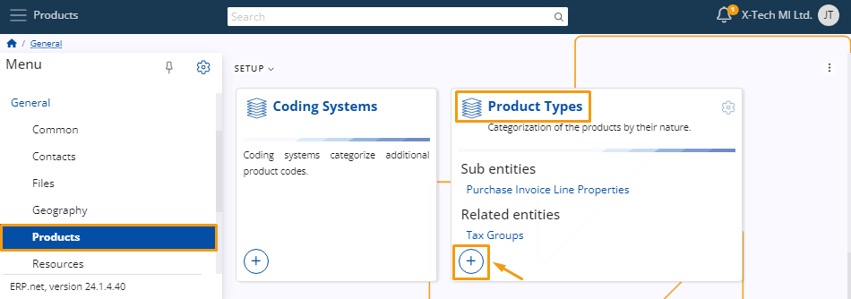
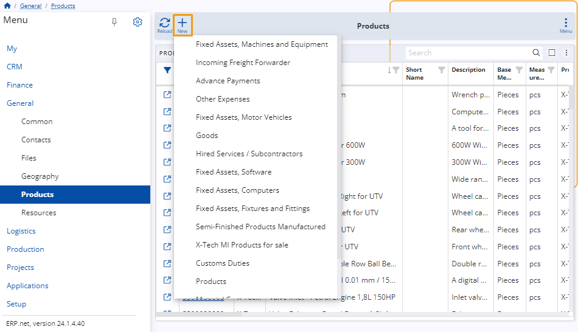

# Product definition

For the purposes of creating a sales order, you must define and manage **products** which you can sell to customers.

This involves adding various **details** about them which you can later make use of while creating the order.

Below is a step-by-step guide on how to define products and configure their settings.

### Navigation

From the **[General](https://docs.erp.net/tech/modules/general/index.html)** module, click on **[Products](https://docs.erp.net/tech/modules/general/products/index.html)**. There, you'll find the **Products** panel. 

This section enables you to access a comprehensive overview of all created products, create new ones as needed, and review detailed information about each product.

## Set up 

Before you can actually create a product, you need to define a **type** and a **group** for it.

### Product types 

Types allow you to differentiate one kind of a product from another. It is a characteristic that makes products unique and yet strictly related to something.

To create a new type, navigate to the **Product Types** panel and click on its **"+"** button to begin adding details about your new product type.

You'll be taken to a window where you need to add the **code** assigned to the product type. 

Additionally, you can also specify a **name** for it. 

Several **checkboxes** allow you to further define the characteristics of the product. 

This can determine the **type** of documents and invoices generated when a sales order is placed. 

By selecting the appropriate checkboxes, you ensure that the generated documents accurately reflect the nature of the product and meet regulatory requirements. 

> [!NOTE]
> 
> Products are not necessarily items; they can also be services.

### Product groups

The purpose of placing products in groups is to **categorize** them and make them part of something bigger, with other products that share the same or similar features.

To create a new group, navigate to the **Product Groups** panel and click on its **“+”** button.

You are required to provide a unique **name** for the group in order to create it.

The group's **code** will be created automatically, starting from 001, but you can always specify it manually.

Within each product group, you can assign attributes such as a **Next Part Number**, a **Next Serial Number**, or a **Default Measurement**. 

Additionally, you have the ability to add **notes** and easily activate or deactivate them as needed.

## Create a product 

There are **two** methods for creating a product, both ensuring consistency in the final result when selecting the same product type. 

1. Navigate to the **Create** section within the **Products** panel. Here, you'll find a list of various **product types**.

   Upon selecting the respective type, a separate window will open, automatically reflecting the chosen product type.

   You can proceed with the creation process by filling out the rest of the details.

2. Use the **New** button found above the **Products** list. Upon clicking this button, you can select a **product type** from a dropdown menu.

Then, you will be taken to the standard product creation form and proceed to add the necessary details.

### New product details

Once you access the **New Product** window, you can start adding all the necessary details for your product.

Most of the fields are optional. However, whatever information you provide at this point will simplify the process of creating a sales order document later, as it will **automatically** be added in the order creation form.

The mandatory fields for creating a new product include **Product Group**, **Part Number**, **Name**, **Base Measurement category**, and **Measurement Unit**. 

The **Measurement Unit** is especially important, as it will determine the standard unit of measuring the product in a warehouse, which is **not** the same as the measurement used for purchasing or selling purposes.
  

Once you've filled out all the desired fields, click the **Save and Reload** button to complete the creation of a new **Product**.

#### Most common fields 

Here's a summary of commonly used fields, along with those less frequently utilized:

* **Is Serialized** - Clicking this checkbox determines that a sales order **cannot** be fulfilled without a serial number.

* **Standard Price Per Lot** - This field allows you to define the standard price for one lot of the product. It is automatically applied during the sale.

* **Use Lots** - This option enables the product to be stored in lots. You can choose to **allow**, **not allow**, or even **require** this feature.

#### Customize view 

From the window settings, you have the option to include additional detail panels such as **Lots**, **Serial Numbers**, **Product Prices**, and more. 

This allows you to view existing information and add new options as necessary.
