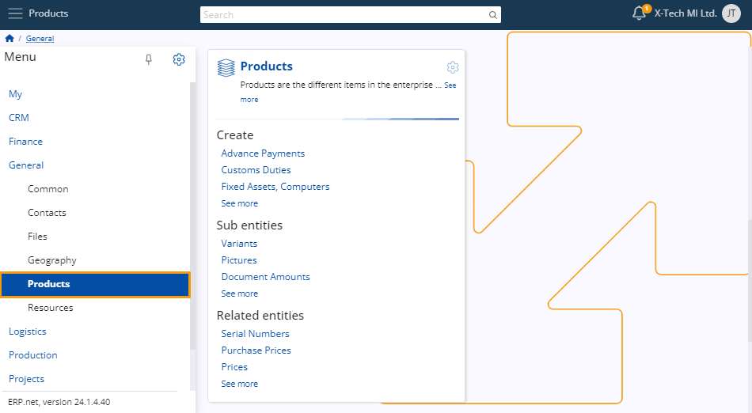

# Product definition

For the purposes of creating a sales order, you must define and manage **products** which you can sell to customers.

This involves adding various **details** about them which you can later make use of while creating the order.

Below is a step-by-step guide on how to define products and configure their settings.

### Navigation

From the **General** module, click on **Products**. There, you'll find the **Products** panel. 

This section enables you to access a comprehensive overview of all created products, create new ones as needed, and review detailed information about each product.

## Set up 

### Product types 

Before initiating the creation of a product, it's crucial to define a **Product Type**. This can be done by navigating to the **Product Types** panel. 

Click the **"+"** button to begin adding details about your new product.

You'll be taken to a window where you need to add the **code** assigned to the product type. 

Additionally, you can also specify a **name** for it. 

Several **checkboxes** allow you to further define the characteristics of the product. 

This can determine the **type** of documents and invoices generated when a sales order is placed. 

By selecting the appropriate checkboxes, you ensure that the generated documents accurately reflect the nature of the product and meet regulatory requirements. 

> [!NOTE]
> 
> Products are not necessarily items; they can also be services.

### Product groups

The purpose of placing products in groups is to **categorize** them and keep them in one place with others that share the same or similar features.

To create a new group, navigate to the **Product Groups** panel and click on its **“+”** button.

You are required to provide a unique **name** for the group in order to create it.

The group's **code** will be created automatically, starting from 001, but you can always specify it manually.

Within each product group, you can assign attributes such as a **Next Part Number**, a **Next Serial Number**, or a **Default Measurement**. 

Additionally, you have the ability to add **notes** and easily activate or deactivate them as needed.

## Create a product 

There are **two** methods for creating a product, both ensuring consistency in the final result when selecting the same product type. 

1. Navigate to the **Create** section within the **Products** panel. Here, you'll find a list of various **product types**.

   Upon selecting a **Product Type**, a window titled **New Product** will open, tailored to the chosen **Product Type**, allowing you to proceed with the creation process.

The second approach involves utilizing the New button situated on the **Products** table. Upon clicking this button, a menu will appear, presenting different **Product Types**. 

Following the selection of a **Product Type** from the menu, a **New Product** window will emerge, facilitating the creation of this particular type of product.

Upon accessing the **New Product** window, you have the opportunity to input the desired information into the fields and checkboxes. 

Completing these fields at this stage will streamline the process when executing a Sales Order, as the product information you provide here will automatically populate the **Sales Order** form, ultimately saving you time.

The mandatory fields for product creation include **Product Group**, **Part Number**, **Name**, **Base Measurement category**, and **Measurement Unit**. 

The **Measurement Unit** holds particular significance, as it dictates the standard unit of measurement for the product in the warehouse, regardless of the measurement used for purchasing or selling purposes.
  

Once you've filled out all the desired fields, click the **Save and Reload** button to complete the creation of a new **Product**.

#### Most common Fields 

Here's a succinct summary outlining the commonly used fields, along with those less frequently utilized:

•	**Is Serialized** - Activating this checkbox mandates that a Sales Order cannot be fulfilled without a serial number.

•	**Standard Price Per Lot** - This field allows you to designate the standard price for one lot of the product. This price is automatically applied during the sale of the product.

•	**Use Lots** - This option enables the product to be stored in Lots. You can choose to allow, not allow, or even require this feature.

#### Customize view 

From the window settings, you have the option to include additional detail panels such as **Lots**, **Serial Numbers**, **Product Prices**, and more. 

This allows you to view existing information and add new options as necessary.
