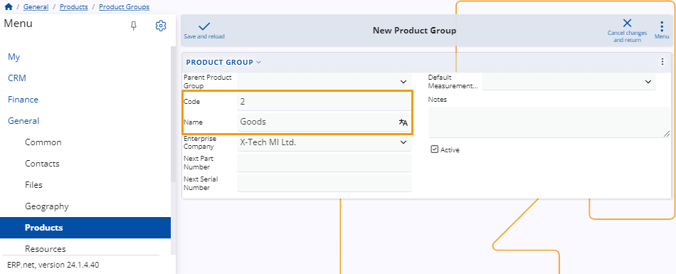

# Defining Products and their settings step-by-step guide 

In the **ERP Web Client**, you have the capability to create and manage products, which are the various items within the enterprise. 

These products can be purchased, stored, sold, and depreciated as needed. Managing products involves configuring details such as descriptions, pricing, inventory levels, and other relevant attributes. 

Additionally, the system facilitates seamless digital transactions involving these products, whether it's procurement from suppliers, sales to customers, or internal inventory management. 

Below is a step-by-step guide outlining how to define products and customize their settings.

## Navigation

In the **General** module's **Products** model, you'll encounter the **Products** panel. 

This section enables you to access a comprehensive overview of all created products, create new ones as needed, and review detailed information about each product.

## Set up 

### Product Types 

Before initiating the creation of a product, it's crucial to define a **Product Type**. This can be done by navigating to the **Products** section within the **General** module. 

Within the setup section of the module, locate the **Product Type** panel. Click the **"+"** button to open the **New Product Type** window.

In this window, you'll be prompted to add the code assigned to the **Product Type**. Additionally, you can specify a name for the it. 

Furthermore, you'll find checkboxes that allow you to define the characteristics of the product. 

These checkboxes play a significant role in determining the type of documents and invoices generated when a Sales Order is placed. 

By selecting the appropriate checkboxes, you ensure that the generated documents accurately reflect the nature of the product and meet regulatory requirements. 

This ensures seamless documentation and accounting processes within the system.

> [!NOTE]
> A product is not exclusively an item; it can also encompass services.

### Product Group

The purpose of product groups is to categorize products hierarchically. To create a new **Product Group**, navigate to the **Product Group** panel in the **Products Module**. 

Click on the **“+”** button to open the **New Product Group** window.

The required fields for a Product Group include Code and Name. Provide a unique code and a descriptive name for the group to create it.

Within the **Product Group**, you can assign attributes such as **Next Part Number**, **Next Serial Number**, or **Default Measurement**. 

Additionally, you have the flexibility to add **Notes** and easily **Activate** or **Deactivate** them as needed.

## Create a Product 

There are two methods for creating a product, both ensuring consistency in the final result when selecting the same **Product Type**. 

In the first method, you navigate to the **Create** section within the **Products** panel. Here, you'll find a list of various **Product Types**. 

Upon selecting a **Product Type**, a window titled **New Product** will open, tailored to the chosen **Product Type**, allowing you to proceed with the creation process.

The second approach involves utilizing the New button situated on the **Products** table. Upon clicking this button, a menu will appear, presenting different **Product Types**. 

Following the selection of a **Product Type** from the menu, a **New Product** window will emerge, facilitating the creation of this particular type of product.

Upon accessing the **New Product** window, you have the opportunity to input the desired information into the fields and checkboxes. 

Completing these fields at this stage will streamline the process when executing a Sales Order, as the product information you provide here will automatically populate the **Sales Order** form, ultimately saving you time.

The mandatory fields for product creation include **Product Group**, **Part Number**, **Name**, **Base Measurement category**, and **Measurement Unit**. 

The **Measurement Unit** holds particular significance, as it dictates the standard unit of measurement for the product in the warehouse, regardless of the measurement used for purchasing or selling purposes.
  

Once you've filled out all the desired fields, click the **Save and Reload** button to complete the creation of a new **Product**.

#### Most common Fields 

Here's a succinct summary outlining the commonly used fields, along with those less frequently utilized:

•	**Is Serialized** - Activating this checkbox mandates that a Sales Order cannot be fulfilled without a serial number.

•	**Standard Price Per Lot** - This field allows you to designate the standard price for one lot of the product. This price is automatically applied during the sale of the product.

•	**Use Lots** - This option enables the product to be stored in Lots. You can choose to allow, not allow, or even require this feature.

#### Customize view 

From the window settings, you have the option to include additional detail panels such as **Lots**, **Serial Numbers**, **Product Prices**, and more. 

This allows you to view existing information and add new options as necessary.
