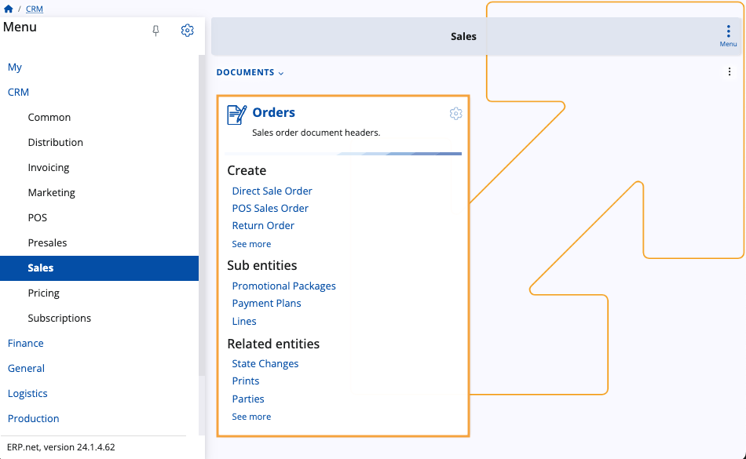
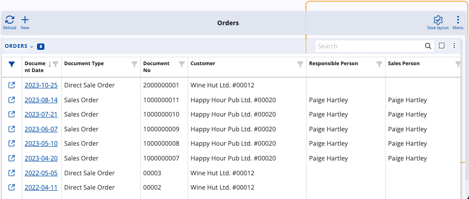

# Sales

The **Sales** module plays a pivotal role in documenting sales operations within **ERP.net**. It is through here that you can **preview**, **create** and **release** different kinds of sales orders.

Consisting of one panel, **Sales** consolidates essential functionalities for creating and managing sales orders and their related entities. 

It also makes use of previously specified sales order **[definitions](definitions/index.md)** that are necessary for the creation of the respective documents.

## Orders panel

This panel serves as the central hub of the **Sales** module, allowing you to **access** all of your existing sales orders as well as instantly begin **creating** new ones.

It consists of three main sections: **Create**, **Sub Entities**, and **Related Entities**. 

To see your sales order documents, simply click on the panel's **title**. 

This takes you to the **Orders** page containing all sales orders related to your enterprise company.

From here, you can **preview** each and every one of them, **filter** the table to show entries matching specific criteria, and **create** new orders on-demand.

### Create

You can use this section of the **Orders** panel to begin **creating** various types of sales orders.

Options include Direct Sale Orders, POS Sales Orders, Return Orders, and more.

### Sub entities

This section allows you to preview already created **definitions** that take part in the final sales order document. 

It includes seeing promotional packages, payment plans, and sales order lines.

### Related entities 

In this section, you can track various **operations** associated with sales orders. 

This includes monitoring state changes, prints, parties, line amounts, and order fulfillment. 

Learn more about **Sales** here:

* **[Common concepts](sales-concepts/index.md)**
* **[Definitions](definitions/index.md)**
