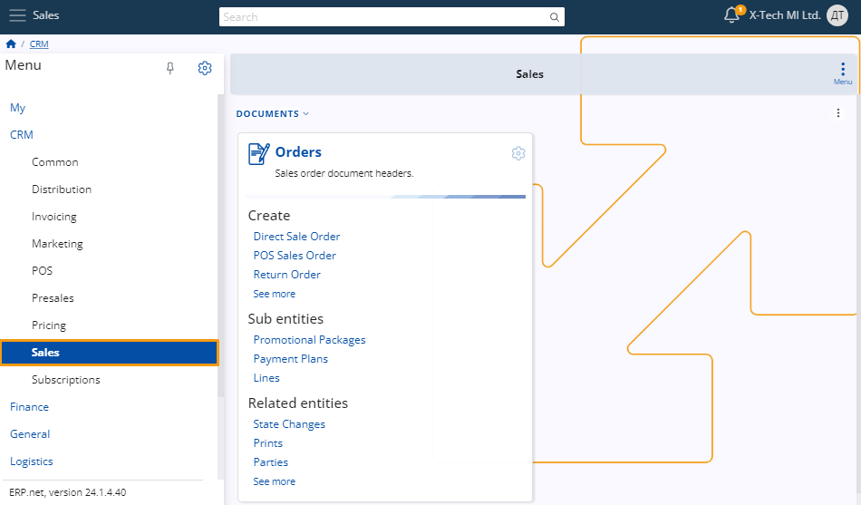
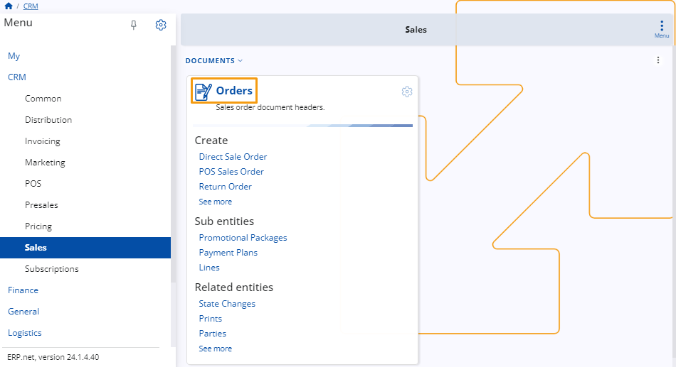
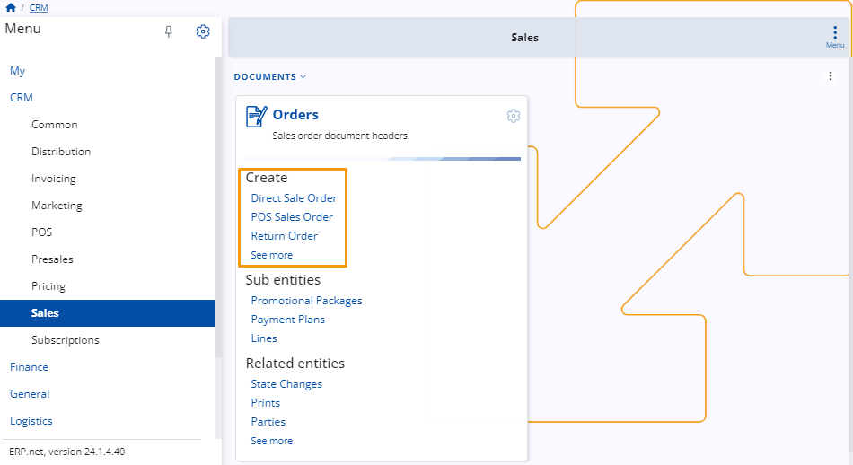
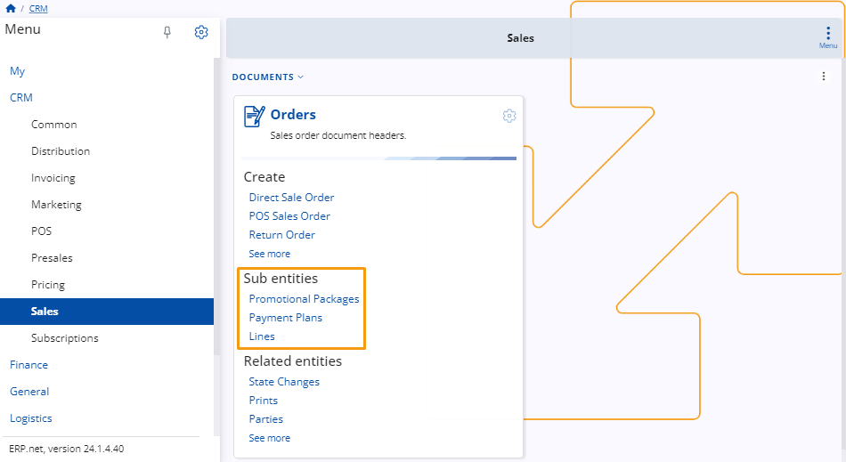

# Sales

The **Sales** module, focused around the Orders panel, plays a crucial role in managing sales operations within the **ERP system**. 

This panel consolidates essential functionalities for handling sales orders and related entities. 

Let's explore the distinct sections within the Orders panel to understand its comprehensive capabilities.

## Orders Panel

The **Orders** panel serves as the central hub within the **Sales** module, encompassing essential functionalities for managing sales operations. 

It consists of three main sections: **Create**, **Sub Entities**, and Related** Entities**. 

Additionally, users can view all **Sales Orders** by clicking on the **Orders**, providing a comprehensive overview of all active orders within the system.
 
 

### Create Section

Within the **Create** section, users can initiate various types of sales orders to accommodate different sales scenarios. 

This includes creating **Direct Sale Orders**, **POS Sales Orders**, **Return Orders**, and more.

 

### Sub Entities Section

The **Sub Entities** section allows users to configure specific details within each **Sales Order**. 

This includes setting up promotional packages, defining payment plans, and managing individual order lines with precision.

### Related Entities Section 

In the **Related Entities** section, users can seamlessly integrate and track various entities associated with **Sales Orders**. 

This includes monitoring state changes, managing prints, tracking parties involved, monitoring line amounts, and overseeing order fulfillment. 

Additionally, users can attach files, access document amounts, track references, and engage in collaborative discussions to ensure transparency and efficiency throughout the sales process.

> *Activity* → *Opportunity* → *Offer* → **Sales order** → *Invoice order* → *Invoice*

The sales module is used to manage the preparing and issuing of [sales orders](xref:Crm.Sales.SalesOrders) and the related master data. 

* **[Common concepts](sales-concepts/index.md)**
* **[Definitions](definitions/index.md)**
* **How to create a sales order**
