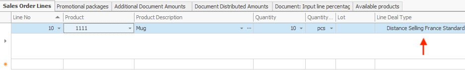
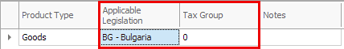
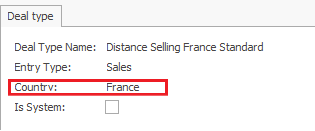

# Tax groups determining algorithm

This algorithm is used to define the tax group specified in a fiscal device print of a sale, invoice or payment document.

## How it works

The final tax group is set to depend not only on the tax group of the product type (default), but on the **deal type** specified in the sales lines.

To actually apply the effects of the algorithm, you need to configure the deal type's **TaxCode** field. 

As a result, one and the same product can now be assigned a foreign **or** a national tax group in accordance with the location its sale has been made in.



## Specifics

There are four scenarios you may stumble upon while using the tax group defining algorithm.

1. When the product type has a tax group equal to **zero** **(0)**, the tax group is based on the TaxCode field of the deal type.

Make use of the following code:

```
IF Product.ProductType.TaxGroups.TaxGroup (Where ApplicableLegislation = 'BG') <> 0 
THEN taxGroup = Product.ProductType.TaxGroups.TaxGroup (Where ApplicableLegislation = 'BG')
```



2. When the product type has a tax group **different** from zero and the applicable legislation is ''BG'', the tax group is going to be the same tax group.

Use the code:

```
IF Product.ProductType.TaxGroups.TaxGroup (Where ApplicableLegislation = 'BG') = 0 
AND LineDealType.Country = 'BG' 
THEN
```

3. When the product type has a tax group **equal** to zero and the applicable legislation is ''BG'', the tax group is defined by the tax code of the deal type.

Use the following scheme:

```
IF LineDealType.TaxCode = "STD" THEN taxGroup = 2 
IF LineDealType.TaxCode = "RED" THEN taxGroup = 4 
IF LineDealType.TaxCode = "SPR" THEN taxGroup = 1 
IF LineDealType.TaxCode = "INT" THEN taxGroup = 1 
IF LineDealType.TaxCode = "EXM" THEN taxGroup = 1 
IF LineDealType.TaxCode = "NS" THEN taxGroup = 1
```

In the previous three cases, expect a rate to be printed in accordance with the Bulgarian legislation.

```
IF Product.ProductType.TaxGroups.TaxGroup (Where ApplicableLegislation = 'BG') = 0 
AND LineDealType.Country <> 'BG' 
THEN
```

4. When the product type has a tax group equal to zero, the applicable legislation is ''BG'' and the country specified in the deal type of the sale lines is **different** from ''BG'', the tax group is once again based on the tax code of the deal type.

However, the scheme is different:

```
IF LineDealType.TaxCode = "STD" THEN taxGroup = 1
IF LineDealType.TaxCode = "RED" THEN taxGroup = 1
IF LineDealType.TaxCode = "SPR" THEN taxGroup = 1
IF LineDealType.TaxCode = "INT" THEN taxGroup = 1
IF LineDealType.TaxCode = "EXM" THEN taxGroup = 1 
IF LineDealType.TaxCode = "NS" THEN taxGroup = 1
```

In this scenario, expect a document to be printed for tax group 1 - export.


