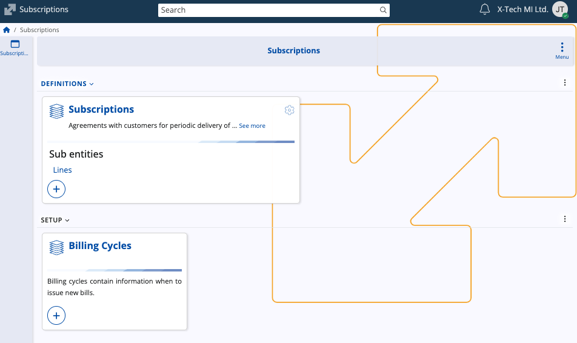
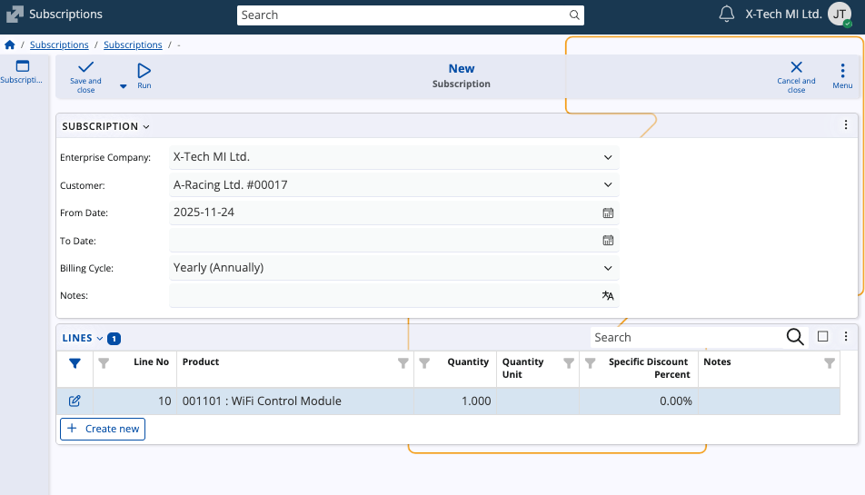

# Subscriptions

The **Subscriptions** submodule manages agreements for periodic delivery of products or services to **[customers](https://docs.erp.net/tech/modules/crm/sales/customers/index.html?q=customers)**. It supports long-term arrangements where billing and fulfillment can occur repeatedly over a predefined interval. 

In the larger CRM context, subscriptions extend the standard order-to-invoice flow by formalizing continuous customer commitments and ensuring that recurring charges are issued at the correct schedule.

## Structure

### Subscriptions

The **Subscriptions** panel contains the main records defining active or planned subscription agreements. 

Each subscription consists of:

* **Enterprise Company** – The company that issues the subscription.
* **Customer** – The party receiving the subscription. _This field is required_.
* **From Date / To Date** – Define the validity period of the subscription. 
* **Billing Cycle** – Determines how often billing documents will be generated (e.g., monthly, yearly). Leaving this blank means the subscription will not be auto-billed.
* **Notes** – Additional information relevant to the subscription.

The **Lines** panel lists **products** included in the subscription. These lines represent the chargeable components of the subscription. 

When billing occurs, each line becomes part of the generated billing document according to the assigned cycle.

### Billing Cycles 

The **Billing Cycles** panel defines billing schedules used by subscriptions. Each cycle describes when the system should issue new bills. 

A billing cycle contains:

* **Name** – The designation of the cycle (e.g., *Monthly*, *Yearly*).
* **Number of Months** – Number of months between billing.
* **Starting Day of Month** – The day when billing is issued.
* **Enterprise Company** – The company to which the billing cycle applies.
* **Notes** – Additional cycle-related information.

Billing cycles are custom and can be reused across multiple subscriptions. 

> [!NOTE]
> The screenshots taken for this article are from v.26 of the platform.
