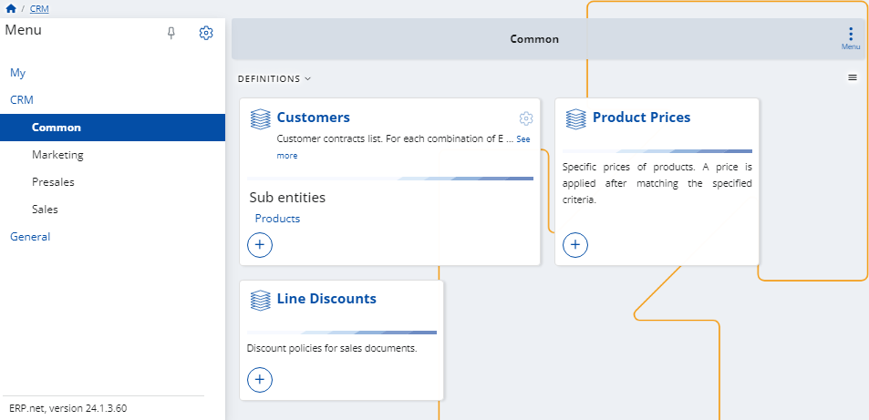

# CRM

The **Customer Relationship Management** module helps you manage and track your interactions with customers and prospects.

It is composed of the following sub-modules:

* **[Common](common.md)**
* **[Marketing](marketing.md)**
* **[Presales](presales.md)**
* **[Sales](sales.md)**

> [!NOTE]
> The screenshots taken for this article are from v24 of the platform.
